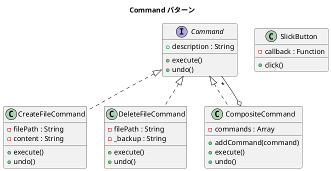

# 第 9 章: Command

## はじめに

ファイルの作成・削除操作を「やり直し（undo）」可能にしたい。操作そのものをオブジェクトとしてカプセル化すれば、実行・取り消し・記録が統一的に行えます。

**Command パターン**は、要求（操作）をオブジェクトとしてカプセル化し、実行・取り消しを可能にするパターンです。

---

## パターンの構造



**登場人物**:

- **Command**: `execute()` / `undo()` のインターフェース
- **ConcreteCommand（CreateFileCommand 等）**: 具体的な操作
- **CompositeCommand**: 複数コマンドの一括実行
- **SlickButton**: コールバック関数を使った軽量 Command

---

## TDD で作る

### Red: テストを書く

```javascript
import { describe, it, expect, afterEach } from '@jest/globals';
import { existsSync, readFileSync, unlinkSync } from 'fs';
import { join } from 'path';
import { tmpdir } from 'os';
import { CreateFileCommand, DeleteFileCommand } from '../src/command.js';

describe('Command パターン', () => {
  const testFile = join(tmpdir(), 'command-test-file.txt');

  afterEach(() => {
    if (existsSync(testFile)) unlinkSync(testFile);
  });

  it('CreateFileCommand でファイルを作成できる', () => {
    const cmd = new CreateFileCommand(testFile, 'hello');
    cmd.execute();
    expect(existsSync(testFile)).toBe(true);
    expect(readFileSync(testFile, 'utf-8')).toBe('hello');
  });

  it('CreateFileCommand の undo でファイルを削除できる', () => {
    const cmd = new CreateFileCommand(testFile, 'hello');
    cmd.execute();
    cmd.undo();
    expect(existsSync(testFile)).toBe(false);
  });
});
```

### Green: 実装する

```javascript
import { writeFileSync, unlinkSync, readFileSync, existsSync } from 'fs';

export class CreateFileCommand {
  constructor(filePath, content) {
    this.filePath = filePath;
    this.content = content;
    this.description = `ファイル作成: ${filePath}`;
  }

  execute() { writeFileSync(this.filePath, this.content, 'utf-8'); }
  undo() {
    if (existsSync(this.filePath)) unlinkSync(this.filePath);
  }
}
```

### Refactor: 振り返り

- `CompositeCommand` は Composite パターンとの組み合わせです。`undo()` は逆順に実行します。
- `SlickButton` は、JavaScript ではコマンドの代わりにコールバック関数を直接渡すことが多いことを示しています。

---

## Ruby / Java / Python との比較

| 観点 | Ruby | Java | Python | JavaScript |
|------|------|------|--------|------------|
| コマンド表現 | クラス or Proc | インターフェース + 実装 | クラス or callable | クラス or コールバック関数 |
| undo の実現 | インスタンス変数で状態保持 | Memento パターン併用 | インスタンス変数 | インスタンス変数 (`_backup`) |
| 軽量 Command | `Proc.new { }` | ラムダ式 | `lambda:` | `() => {}` |
| ファイル操作 | `File` クラス | `java.nio.file` | `pathlib` | `fs` モジュール |

**JavaScript の特徴**: コールバック関数が第一級オブジェクトなので、単純な Command は関数 1 つで表現できます（`SlickButton` の例）。undo が必要な場合はクラスベースの Command が適しています。

---

## まとめ

| 観点 | 内容 |
|------|------|
| **意図** | 要求をオブジェクトとしてカプセル化し、実行・取り消しを可能にする |
| **適用場面** | undo/redo、マクロ記録、キューイングが必要な場合 |
| **メリット** | 操作の実行タイミングと実行方法を分離できる |
| **注意点** | undo の正確な実装には状態の保存が必要 |
| **関連パターン** | Composite（コマンドの合成）、Memento（状態の保存・復元） |
