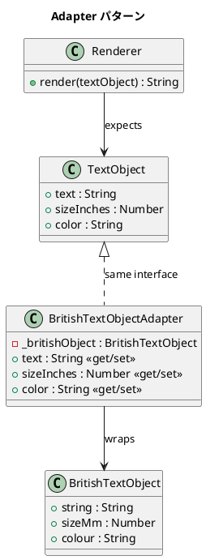

# 第 10 章: Adapter

## はじめに

`TextObject`（`text`, `sizeInches`, `color`）を期待するレンダラーに、英国式の `BritishTextObject`（`string`, `sizeMm`, `colour`）を渡したい。プロパティ名もサイズの単位も異なります。

**Adapter パターン**は、互換性のないインターフェースを変換して接続するパターンです。

---

## パターンの構造



**登場人物**:

- **Target（TextObject のインターフェース）**: クライアントが期待するインターフェース
- **Adaptee（BritishTextObject）**: 既存の互換性のないクラス
- **Adapter（BritishTextObjectAdapter）**: インターフェースを変換するラッパー

---

## TDD で作る

### Red: テストを書く

```javascript
import { describe, it, expect } from '@jest/globals';
import { BritishTextObject, BritishTextObjectAdapter, Renderer } from '../src/adapter.js';

describe('Adapter パターン', () => {
  it('Adapter で BritishTextObject を TextObject として扱える', () => {
    const british = new BritishTextObject('Hello', 25.4, 'red');
    const adapted = new BritishTextObjectAdapter(british);

    expect(adapted.text).toBe('Hello');
    expect(adapted.sizeInches).toBeCloseTo(1.0);
    expect(adapted.color).toBe('red');
  });

  it('Adapter を通して Renderer で描画できる', () => {
    const british = new BritishTextObject('World', 50.8, 'blue');
    const adapted = new BritishTextObjectAdapter(british);
    const renderer = new Renderer();

    expect(renderer.render(adapted)).toBe('World (2.0in, blue)');
  });
});
```

### Green: 実装する

```javascript
export class BritishTextObjectAdapter {
  constructor(britishObject) {
    this._britishObject = britishObject;
  }

  get text() { return this._britishObject.string; }
  set text(value) { this._britishObject.string = value; }

  get sizeInches() { return this._britishObject.sizeMm / 25.4; }
  set sizeInches(value) { this._britishObject.sizeMm = value * 25.4; }

  get color() { return this._britishObject.colour; }
  set color(value) { this._britishObject.colour = value; }
}
```

#### TextObject クラス

`TextObject` は Renderer が期待するインターフェースを定義するクラスです。`text`、`sizeInches`、`color` の 3 つのプロパティを持ちます。

```javascript
export class TextObject {
  constructor(text, sizeInches, color) {
    this.text = text;
    this.sizeInches = sizeInches;
    this.color = color;
  }
}
```

```javascript
it('TextObject をそのまま Renderer で描画できる', () => {
  const text = new TextObject('Hello', 1.0, 'red');
  const renderer = new Renderer();
  const output = renderer.render(text);

  expect(output).toBe('Hello (1.0in, red)');
});
```

#### Renderer クラス

`Renderer` は `textObject` を受け取り、`text`、`sizeInches`、`color` プロパティを使って描画結果の文字列を生成します。`TextObject` でも `BritishTextObjectAdapter` でも、同じインターフェースを持つオブジェクトであれば描画できます。

```javascript
export class Renderer {
  render(textObject) {
    return `${textObject.text} (${textObject.sizeInches.toFixed(1)}in, ${textObject.color})`;
  }
}
```

### Refactor: 振り返り

- `get` / `set` アクセサで変換ロジックを透過的に提供しています。
- `Renderer` は `TextObject` のインターフェース（`text`、`sizeInches`、`color`）にのみ依存しており、Duck Typing により `BritishTextObjectAdapter` もそのまま利用できます。
- Adapter を通じた変更は元の `BritishTextObject` に反映されます（双方向変換）。

---

## Ruby / Java / Python との比較

| 観点 | Ruby | Java | Python | JavaScript |
|------|------|------|--------|------------|
| Adapter の実装 | 委譲 or `method_missing` | インターフェース実装 + 委譲 | `__getattr__` or 委譲 | `get`/`set` アクセサ + 委譲 |
| 単位変換 | メソッド内 | メソッド内 | `@property` | `get`/`set` 内 |
| 動的 Adapter | `method_missing` | 不可 | `__getattr__` | `Proxy` API で可能 |

**JavaScript の特徴**: `get`/`set` アクセサで、Adapter のクライアントはプロパティアクセスの形で透過的に変換を利用できます。より動的なアプローチが必要な場合は ES6 Proxy API も使えます。

---

## まとめ

| 観点 | 内容 |
|------|------|
| **意図** | 互換性のないインターフェースを変換して接続する |
| **適用場面** | 既存のクラスを変更せずに別のインターフェースで使いたい場合 |
| **メリット** | 既存コードを変更せずに統合できる |
| **注意点** | Adapter が増えすぎると、本来の設計を見直すべきサイン |
| **関連パターン** | Decorator（機能の追加）、Proxy（アクセスの制御）、Facade（複雑さの隠蔽） |
