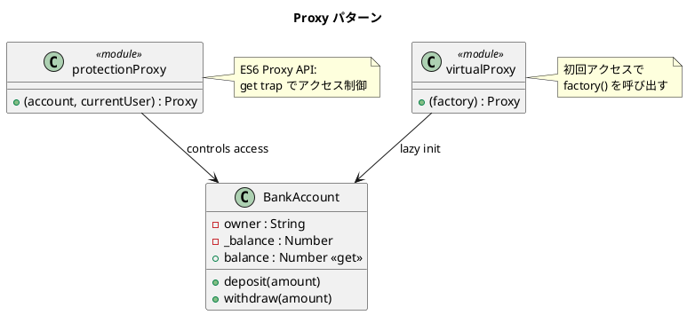

# 第 11 章: Proxy

## はじめに

銀行口座へのアクセスを制御したい。所有者以外の操作を禁止する「保護プロキシ」や、重い初期化を遅延させる「仮想プロキシ」が必要です。

**Proxy パターン**は、別のオブジェクトへのアクセスを制御する代理オブジェクトを提供するパターンです。JavaScript では **ES6 Proxy API** により、言語レベルで透過的なプロキシを実装できます。

---

## パターンの構造



**登場人物**:

- **RealSubject（BankAccount）**: 実際の処理を行うオブジェクト
- **Protection Proxy**: アクセス権を検査するプロキシ
- **Virtual Proxy**: 遅延初期化を行うプロキシ

---

## TDD で作る

### Red: テストを書く

```javascript
import { describe, it, expect } from '@jest/globals';
import { BankAccount, protectionProxy, virtualProxy } from '../src/proxy.js';

describe('Proxy パターン', () => {
  it('所有者は操作できる', () => {
    const account = new BankAccount('田中', 1000);
    const proxy = protectionProxy(account, '田中');
    proxy.deposit(500);
    expect(proxy.balance).toBe(1500);
  });

  it('他人は操作できない', () => {
    const account = new BankAccount('田中', 1000);
    const proxy = protectionProxy(account, '鈴木');
    expect(() => proxy.deposit(500)).toThrow();
  });

  it('Virtual Proxy はアクセスまでインスタンスを生成しない', () => {
    let created = false;
    const proxy = virtualProxy(() => {
      created = true;
      return new BankAccount('仮想', 5000);
    });
    expect(created).toBe(false);
    expect(proxy.balance).toBe(5000);
    expect(created).toBe(true);
  });
});
```

### Green: 実装する

```javascript
export function protectionProxy(account, currentUser) {
  return new Proxy(account, {
    get(target, prop, receiver) {
      if (prop === 'balance') return target.balance;
      if (typeof target[prop] === 'function') {
        if (currentUser !== target.owner) {
          throw new Error(`${currentUser} は ${target.owner} のアカウントを操作できません`);
        }
        return target[prop].bind(target);
      }
      return Reflect.get(target, prop, receiver);
    },
  });
}

export function virtualProxy(factory) {
  let instance = null;
  return new Proxy({}, {
    get(_target, prop, _receiver) {
      if (instance === null) instance = factory();
      const value = instance[prop];
      return typeof value === 'function' ? value.bind(instance) : value;
    },
  });
}
```

### Refactor: 振り返り

- ES6 `Proxy` の `get` トラップにより、プロパティアクセスとメソッド呼び出しの両方をインターセプトしています。
- `Reflect.get` を使うことで、プロキシ以外の動作はデフォルトに委譲しています。
- `bind(target)` で、メソッド内の `this` が正しく実オブジェクトを指すようにしています。

---

## Ruby / Java / Python との比較

| 観点 | Ruby | Java | Python | JavaScript |
|------|------|------|--------|------------|
| Proxy の実装 | `method_missing` | `InvocationHandler` | `__getattr__` | **ES6 Proxy API** |
| 透過性 | 高い（動的委譲） | 中（インターフェース必須） | 高い（動的委譲） | 最高（言語レベルのトラップ） |
| トラップの種類 | メソッド呼び出しのみ | メソッド呼び出しのみ | 属性アクセス | get, set, has, apply, construct 等 |
| 型の透過性 | `respond_to?` | `instanceof` 対応 | `isinstance` | `typeof`, プロパティアクセス |

**JavaScript の特徴**: ES6 Proxy API は **13 種類のトラップ**（`get`, `set`, `has`, `apply`, `construct` 等）を提供し、あらゆる操作をインターセプトできます。これは他の言語にない強力な機能です。

---

## まとめ

| 観点 | 内容 |
|------|------|
| **意図** | 別のオブジェクトへのアクセスを制御する代理を提供する |
| **適用場面** | アクセス制御、遅延初期化、リモートプロキシ、ログ記録 |
| **メリット** | クライアントが本物とプロキシを区別する必要がない |
| **注意点** | Proxy のオーバーヘッド。デバッグ時のスタックトレースが複雑になる |
| **関連パターン** | Adapter（インターフェース変換）、Decorator（機能追加） |
