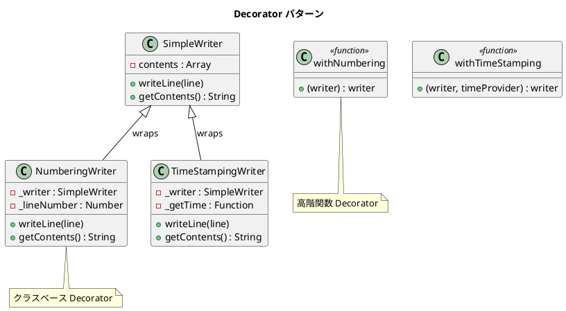

# 第 12 章: Decorator

## はじめに

`SimpleWriter` に行番号やタイムスタンプを付与したいが、サブクラスを作ると組み合わせが爆発します。

**Decorator パターン**は、オブジェクトに動的に責務（機能）を追加するパターンです。JavaScript では、クラスベースの Decorator に加え、高階関数による関数的なアプローチも利用できます。

---

## パターンの構造



**登場人物**:

- **Component（SimpleWriter）**: 基本的な振る舞いを提供する
- **Decorator（NumberingWriter / TimeStampingWriter）**: Component をラップして機能を追加する

---

## TDD で作る

### Red: テストを書く

```javascript
import { describe, it, expect } from '@jest/globals';
import { SimpleWriter, NumberingWriter, TimeStampingWriter } from '../src/decorator.js';

describe('Decorator パターン', () => {
  it('NumberingWriter が行番号を付与する', () => {
    const writer = new NumberingWriter(new SimpleWriter());
    writer.writeLine('hello');
    writer.writeLine('world');
    expect(writer.getContents()).toBe('1: hello\n2: world');
  });

  it('Decorator を重ねがけできる', () => {
    const writer = new NumberingWriter(new SimpleWriter());
    const timestamped = new TimeStampingWriter(writer);
    timestamped.setTimeProvider(() => '2025-01-01');
    timestamped.writeLine('hello');
    expect(timestamped.getContents()).toBe('1: 2025-01-01 hello');
  });
});
```

### Green: 実装する

```javascript
export class NumberingWriter {
  constructor(writer) {
    this._writer = writer;
    this._lineNumber = 1;
  }

  writeLine(line) {
    this._writer.writeLine(`${this._lineNumber}: ${line}`);
    this._lineNumber++;
  }

  getContents() { return this._writer.getContents(); }
}

// 高階関数版
export function withNumbering(writer) {
  let lineNumber = 1;
  const originalWriteLine = writer.writeLine.bind(writer);
  writer.writeLine = (line) => {
    originalWriteLine(`${lineNumber}: ${line}`);
    lineNumber++;
  };
  return writer;
}
```

#### TimeStampingWriter の setTimeProvider() メソッド

`TimeStampingWriter` はデフォルトで `new Date().toISOString()` を時刻プロバイダとして使用します。`setTimeProvider(fn)` メソッドにより、テスト時に時刻を固定できます。

```javascript
export class TimeStampingWriter {
  constructor(writer) {
    this._writer = writer;
    this._getTime = () => new Date().toISOString();  // デフォルトの時刻プロバイダ
  }

  setTimeProvider(fn) {
    this._getTime = fn;  // テスト用に時刻を差し替え可能
  }

  writeLine(line) {
    this._writer.writeLine(`${this._getTime()} ${line}`);
  }

  getContents() { return this._writer.getContents(); }
}
```

#### withTimeStamping 関数の timeProvider パラメータ

高階関数版の `withTimeStamping` は、第 2 引数に `timeProvider` を受け取ります。デフォルトは `() => new Date().toISOString()` で、テスト時にはカスタムの時刻関数を渡せます。

```javascript
export function withTimeStamping(writer, timeProvider = () => new Date().toISOString()) {
  const originalWriteLine = writer.writeLine.bind(writer);
  writer.writeLine = (line) => {
    originalWriteLine(`${timeProvider()} ${line}`);
  };
  return writer;
}
```

```javascript
it('withTimeStamping がタイムスタンプを付与する', () => {
  const writer = withTimeStamping(
    new SimpleWriter(),
    () => '2025-01-01T00:00:00Z'  // テスト用の固定時刻
  );
  writer.writeLine('hello');
  expect(writer.getContents()).toBe('2025-01-01T00:00:00Z hello');
});
```

### Refactor: 振り返り

- クラスベースの Decorator は、同じインターフェース（`writeLine` / `getContents`）を持つラッパーです。
- `TimeStampingWriter` の `setTimeProvider()` と `withTimeStamping` の `timeProvider` 引数は、テスタビリティのための依存性注入（DI）パターンです。時刻のような非決定的な依存を外部から差し替え可能にしています。
- 高階関数版は、`writeLine` メソッドを直接置き換えます。新しいクラスを作らずに機能を追加できますが、元のオブジェクトを変更する副作用があります。

---

## Ruby / Java / Python との比較

| 観点 | Ruby | Java | Python | JavaScript |
|------|------|------|--------|------------|
| クラスベース | 委譲パターン | インターフェース + 委譲 | 委譲パターン | 委譲パターン |
| 動的 Decorator | `Module#prepend` | 不可 | `@decorator` 構文 | 高階関数 / Proxy |
| 関数 Decorator | Proc 合成 | 不可 | `@` 構文 | 高階関数 |
| メソッド置換 | `define_method` | 不可 | monkey patching | メソッド直接置換 |

**JavaScript の特徴**: 高階関数によるデコレーションは JavaScript の第一級関数の強みを活かしたアプローチです。クラスベースとは異なり、新しいクラスを定義せずに機能を追加できます。

---

## まとめ

| 観点 | 内容 |
|------|------|
| **意図** | オブジェクトに動的に責務を追加する |
| **適用場面** | 機能の組み合わせが多く、サブクラスの爆発を避けたい場合 |
| **メリット** | 機能の追加・削除が実行時に可能。組み合わせが自由 |
| **注意点** | ラッパーの層が深くなるとデバッグが困難 |
| **関連パターン** | Adapter（インターフェース変換）、Proxy（アクセス制御）、Composite（木構造） |
