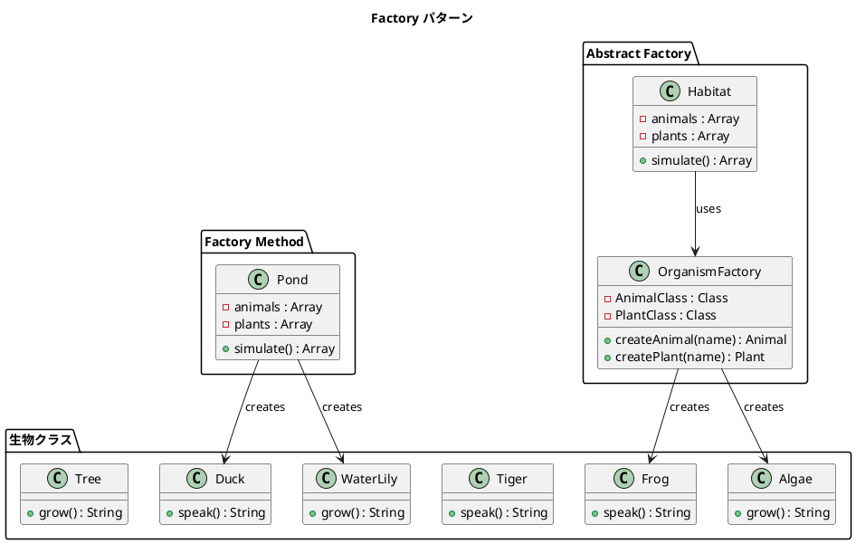

# 第 14 章: Factory

## はじめに

池にはカエルと睡蓮、ジャングルには虎と木。生態系の種類が増えるたびに生成ロジックを書き直したくない。

**Factory パターン**は、オブジェクトの生成をサブクラスや別のオブジェクトに委ねるパターンです。Factory Method と Abstract Factory の 2 つのバリエーションがあります。

---

## パターンの構造



**登場人物**:

- **Product（Duck, Frog 等）**: 生成されるオブジェクト
- **Factory Method（Pond）**: クラス参照をコンストラクタで受け取り、生成を委譲する
- **Abstract Factory（OrganismFactory）**: 関連するオブジェクト群を生成するファクトリ
- **Client（Habitat）**: ファクトリを通じてオブジェクトを生成する

---

## TDD で作る

### Red: テストを書く

```javascript
import { describe, it, expect } from '@jest/globals';
import { Duck, Frog, WaterLily, Pond, OrganismFactory, Habitat, Tiger, Tree } from '../src/factory.js';

describe('Factory パターン', () => {
  it('カエルの池を作れる', () => {
    const pond = new Pond(2, 3, Frog, WaterLily);
    const result = pond.simulate();
    expect(result).toHaveLength(5);
    expect(result[0]).toContain('ゲロゲロ');
  });

  it('Abstract Factory で異なる生態系を作れる', () => {
    const pondFactory = new OrganismFactory(Duck, WaterLily);
    const jungleFactory = new OrganismFactory(Tiger, Tree);

    const pond = new Habitat(1, 1, pondFactory);
    const jungle = new Habitat(1, 1, jungleFactory);

    expect(pond.simulate()[0]).toContain('ガーガー');
    expect(jungle.simulate()[0]).toContain('ガオー');
  });
});
```

### Green: 実装する

```javascript
export class Pond {
  constructor(numberOfAnimals, numberOfPlants, AnimalClass, PlantClass) {
    this.animals = [];
    this.plants = [];
    for (let i = 0; i < numberOfAnimals; i++) {
      this.animals.push(new AnimalClass(`動物${i + 1}`));
    }
    for (let i = 0; i < numberOfPlants; i++) {
      this.plants.push(new PlantClass(`植物${i + 1}`));
    }
  }

  simulate() {
    return [
      ...this.animals.map((a) => a.speak()),
      ...this.plants.map((p) => p.grow()),
    ];
  }
}

export class OrganismFactory {
  constructor(AnimalClass, PlantClass) {
    this.AnimalClass = AnimalClass;
    this.PlantClass = PlantClass;
  }
  createAnimal(name) { return new this.AnimalClass(name); }
  createPlant(name) { return new this.PlantClass(name); }
}
```

### Refactor: 振り返り

- JavaScript ではクラスが第一級オブジェクトなので、`AnimalClass` を変数として渡し、`new AnimalClass(name)` で生成できます。
- `Pond`（Factory Method）はクラス参照を直接受け取り、`OrganismFactory`（Abstract Factory）は生成メソッドを提供します。

---

## Ruby / Java / Python との比較

| 観点 | Ruby | Java | Python | JavaScript |
|------|------|------|--------|------------|
| クラス参照の渡し方 | クラスオブジェクト | `Class<T>` or ジェネリクス | クラスオブジェクト | クラスオブジェクト |
| Factory Method | サブクラスでオーバーライド | 抽象メソッド | サブクラスでオーバーライド | コンストラクタ引数 |
| Abstract Factory | 別オブジェクト | インターフェース + 実装 | 別オブジェクト | 別オブジェクト |
| 動的生成 | `Object.const_get` | リフレクション | `globals()` | `new Class()` |

**JavaScript の特徴**: クラスが値として渡せるため、ファクトリの実装が非常にシンプルです。

---

## まとめ

| 観点 | 内容 |
|------|------|
| **意図** | オブジェクト生成をサブクラスや別オブジェクトに委ねる |
| **適用場面** | 生成するオブジェクトの型を実行時に決定したい場合 |
| **メリット** | 生成と利用の分離。新しい型の追加が容易 |
| **注意点** | ファクトリクラスが増えすぎないこと |
| **関連パターン** | Template Method（生成ステップ）、Builder（複雑な生成プロセス）、Singleton（唯一の生成） |
