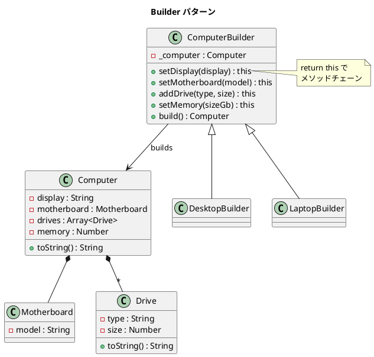

# 第 15 章: Builder

## はじめに

コンピュータを構築する際、ディスプレイ、マザーボード、メモリ、ドライブなど多くの構成要素があります。コンストラクタの引数が増えると管理が困難です。

**Builder パターン**は、複雑なオブジェクトの構築過程をカプセル化し、同じ構築プロセスで異なる構成のオブジェクトを生成するパターンです。

---

## パターンの構造



**登場人物**:

- **Product（Computer）**: 構築される複雑なオブジェクト
- **Builder（ComputerBuilder）**: 構築のステップを定義する
- **ConcreteBuilder（DesktopBuilder / LaptopBuilder）**: 事前構成された Builder

---

## TDD で作る

### Red: テストを書く

```javascript
import { describe, it, expect } from '@jest/globals';
import { ComputerBuilder, DesktopBuilder, LaptopBuilder } from '../src/builder.js';

describe('Builder パターン', () => {
  it('ComputerBuilder でメソッドチェーンを使って構築できる', () => {
    const computer = new ComputerBuilder()
      .setDisplay('24-inch')
      .setMotherboard('Z790')
      .setMemory(16)
      .addDrive('ssd', 512)
      .build();

    expect(computer.display).toBe('24-inch');
    expect(computer.motherboard.model).toBe('Z790');
    expect(computer.memory).toBe(16);
  });

  it('マザーボードなしで build すると例外が発生する', () => {
    expect(() => {
      new ComputerBuilder().setMemory(16).build();
    }).toThrow('マザーボードは必須です');
  });
});
```

### Green: 実装する

```javascript
export class ComputerBuilder {
  constructor() { this._computer = new Computer(); }

  setDisplay(display) {
    this._computer.display = display;
    return this;  // メソッドチェーンの鍵
  }

  setMotherboard(model) {
    this._computer.motherboard = new Motherboard(model);
    return this;
  }

  addDrive(type, size) {
    this._computer.drives.push(new Drive(type, size));
    return this;
  }

  setMemory(sizeGb) {
    this._computer.memory = sizeGb;
    return this;
  }

  build() {
    if (!this._computer.motherboard) throw new Error('マザーボードは必須です');
    if (!this._computer.memory) throw new Error('メモリは必須です');
    return this._computer;
  }
}
```

#### toString() メソッド

`Computer`、`Motherboard`、`Drive` の各クラスには `toString()` メソッドがあり、構成情報を文字列として返します。

```javascript
export class Drive {
  constructor(type, size) {
    this.type = type;    // 'hdd' | 'ssd'
    this.size = size;    // GB
  }
  toString() {
    return `${this.type.toUpperCase()} ${this.size}GB`;
  }
}

export class Motherboard {
  constructor(model) { this.model = model; }
  toString() {
    return `Motherboard: ${this.model}`;
  }
}

export class Computer {
  // ...
  toString() {
    const parts = [];
    if (this.display) parts.push(`Display: ${this.display}`);
    if (this.motherboard) parts.push(this.motherboard.toString());
    if (this.memory) parts.push(`Memory: ${this.memory}GB`);
    for (const drive of this.drives) {
      parts.push(`Drive: ${drive.toString()}`);
    }
    return parts.join(', ');
  }
}
```

```javascript
it('Computer の toString が全構成を返す', () => {
  const computer = new DesktopBuilder().build();
  const str = computer.toString();

  expect(str).toContain('Display: 27-inch 4K');
  expect(str).toContain('Motherboard: ATX-Z790');
  expect(str).toContain('Memory: 32GB');
});
```

#### DesktopBuilder / LaptopBuilder のデフォルト構成

`DesktopBuilder` と `LaptopBuilder` はコンストラクタで事前構成された値を設定します。

| 項目 | DesktopBuilder | LaptopBuilder |
|------|---------------|---------------|
| ディスプレイ | 27-inch 4K | 15-inch Retina |
| マザーボード | ATX-Z790 | Mobile-M2 |
| メモリ | 32GB | 16GB |
| ドライブ | SSD 1000GB + HDD 4000GB | SSD 512GB |

```javascript
export class DesktopBuilder extends ComputerBuilder {
  constructor() {
    super();
    this.setDisplay('27-inch 4K')
      .setMotherboard('ATX-Z790')
      .setMemory(32)
      .addDrive('ssd', 1000)
      .addDrive('hdd', 4000);
  }
}

export class LaptopBuilder extends ComputerBuilder {
  constructor() {
    super();
    this.setDisplay('15-inch Retina')
      .setMotherboard('Mobile-M2')
      .setMemory(16)
      .addDrive('ssd', 512);
  }
}
```

### Refactor: 振り返り

- 各メソッドが `return this` を返すことで、メソッドチェーン（Fluent Interface）が実現できます。
- `build()` でバリデーションを行い、不完全な構築を防ぎます。
- `DesktopBuilder` / `LaptopBuilder` は事前構成された Builder で、よく使う構成を簡単に作れます。
- `toString()` メソッドにより、構築結果を可読な文字列として確認できます。`Computer` は内部の `Motherboard` や `Drive` の `toString()` を委譲的に呼び出します。

---

## Ruby / Java / Python との比較

| 観点 | Ruby | Java | Python | JavaScript |
|------|------|------|--------|------------|
| メソッドチェーン | `tap` / `self` 返し | `return this` | `return self` | **`return this`** |
| バリデーション | `build` 時 | `build` 時 | `build` 時 | `build` 時 |
| 動的構築 | `method_missing` | 型安全な Builder | kwargs | メソッドチェーン |
| 不変オブジェクト | `freeze` | final フィールド | `@dataclass(frozen)` | `Object.freeze` |

**JavaScript の特徴**: `return this` によるメソッドチェーンは JavaScript で広く使われるイディオムです（jQuery, Express, Sequelize 等）。

---

## まとめ

| 観点 | 内容 |
|------|------|
| **意図** | 複雑なオブジェクトの構築過程をカプセル化する |
| **適用場面** | コンストラクタの引数が多い場合。構成のバリエーションがある場合 |
| **メリット** | 構築ステップの明確化。バリデーション付きの段階的構築 |
| **注意点** | Builder 自体が複雑になりすぎないこと |
| **関連パターン** | Factory（生成の委譲）、Composite（複雑な構造の構築） |
