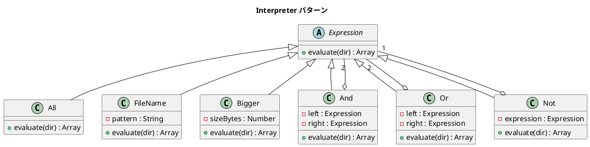

# 第 16 章: Interpreter

## はじめに

ファイル検索で「`.txt` ファイルかつ 100 バイト以上」や「`.png` ファイルまたは `.csv` ファイル」のように、条件を組み合わせて表現したい。

**Interpreter パターン**は、文法規則をクラス階層で表現し、文（式）を解釈・評価するパターンです。

---

## パターンの構造



**登場人物**:

- **AbstractExpression（Expression）**: 式の共通インターフェース
- **TerminalExpression（All, FileName, Bigger）**: 末端の式（直接ファイルシステムを参照する）
- **NonterminalExpression（And, Or, Not）**: 複合式（他の式を組み合わせる）

---

## TDD で作る

### Red: テストを書く

```javascript
import { describe, it, expect, beforeEach, afterEach } from '@jest/globals';
import { mkdtempSync, writeFileSync, rmSync } from 'fs';
import { join } from 'path';
import { tmpdir } from 'os';
import { All, FileName, Bigger, And, Or, Not } from '../src/interpreter.js';

describe('Interpreter パターン', () => {
  let tempDir;

  beforeEach(() => {
    tempDir = mkdtempSync(join(tmpdir(), 'interp-'));
    writeFileSync(join(tempDir, 'report.txt'), 'A'.repeat(100));
    writeFileSync(join(tempDir, 'data.csv'), 'B'.repeat(5000));
    writeFileSync(join(tempDir, 'image.png'), 'C'.repeat(200));
    writeFileSync(join(tempDir, 'readme.txt'), 'D'.repeat(50));
  });

  afterEach(() => {
    rmSync(tempDir, { recursive: true, force: true });
  });

  it('And が両方の条件を満たすファイルを返す', () => {
    const expr = new And(new FileName('\\.txt$'), new Bigger(60));
    const result = expr.evaluate(tempDir);
    expect(result).toEqual(['report.txt']);
  });

  it('複合式を組み合わせられる', () => {
    const expr = new Or(
      new And(new FileName('\\.txt$'), new Not(new Bigger(60))),
      new FileName('\\.png$')
    );
    const result = expr.evaluate(tempDir);
    expect(result).toContain('readme.txt');
    expect(result).toContain('image.png');
  });
});
```

### Green: 実装する

```javascript
export class FileName extends Expression {
  constructor(pattern) {
    super();
    this.pattern = pattern;
  }

  evaluate(dir) {
    const regex = new RegExp(this.pattern);
    return readdirSync(dir).filter((file) => regex.test(file));
  }
}

export class And extends Expression {
  constructor(left, right) {
    super();
    this.left = left;
    this.right = right;
  }

  evaluate(dir) {
    const leftResult = new Set(this.left.evaluate(dir));
    return this.right.evaluate(dir).filter((file) => leftResult.has(file));
  }
}
```

### Refactor: 振り返り

- `Set` を使った集合演算（積集合、和集合、差集合）で And, Or, Not を実装しています。
- 各式クラスは `evaluate(dir)` メソッドを持ち、ファイル名の配列を返します。Composite パターンと同様に、再帰的な構造です。
- `FileName` は正規表現パターンを受け取り、Node.js の `readdirSync` で実際のファイルシステムを参照します。

---

## Ruby / Java / Python との比較

| 観点 | Ruby | Java | Python | JavaScript |
|------|------|------|--------|------------|
| 正規表現 | `/pattern/` | `Pattern.compile()` | `re.compile()` | `new RegExp()` |
| 集合演算 | `Array#&`, `Array#|` | `Set` | `set` | **`Set` + `filter`** |
| ファイル操作 | `Dir.entries` | `Files.list()` | `os.listdir()` | `readdirSync()` |
| 式の組み合わせ | メソッドチェーン | 型安全な合成 | 演算子オーバーロード | クラス合成 |

**JavaScript の特徴**: `Set` と配列メソッド（`filter`, `has`）を組み合わせた集合演算が簡潔です。

---

## まとめ

| 観点 | 内容 |
|------|------|
| **意図** | 文法規則をクラス階層で表現し、文を解釈・評価する |
| **適用場面** | DSL（ドメイン固有言語）の実装、検索条件の組み合わせ |
| **メリット** | 文法の拡張が容易（新しい式クラスを追加するだけ） |
| **注意点** | 文法が複雑になると、パーサーが必要になる |
| **関連パターン** | Composite（再帰的な構造）、Strategy（評価ロジックの差し替え） |
