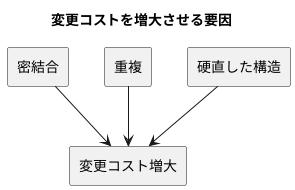
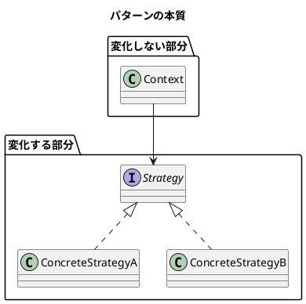

# 第 1 章: デザインパターンとパターン思考

## はじめに

ソフトウェア開発において「変更」は避けられません。要件は変わり、技術は進化し、ユーザーの期待は高まり続けます。**よいソフトウェア** --- 変更を楽に安全にできて役に立つソフトウェア --- を作るためには、変化に対応できる設計が不可欠です。

**デザインパターン**は、この「変化への対応力」を高めるための再利用可能な設計の知恵です。

---

## デザインパターンとは何か

### GoF の歴史

1994 年、Erich Gamma、Richard Helm、Ralph Johnson、John Vlissides の 4 人（通称 **Gang of Four / GoF**）が『Design Patterns: Elements of Reusable Object-Oriented Software』を出版しました。この書籍は 23 のデザインパターンをカタログ化し、オブジェクト指向設計の共通語彙を確立しました。

GoF のパターンは以下の 3 カテゴリに分類されます。

| カテゴリ | 目的 | 本シリーズで扱うパターン |
|---------|------|----------------------|
| **生成（Creational）** | オブジェクトの作り方を柔軟にする | Singleton, Factory Method, Abstract Factory, Builder |
| **構造（Structural）** | オブジェクトの組み合わせ方を整理する | Adapter, Composite, Proxy, Decorator |
| **振る舞い（Behavioral）** | オブジェクト間の責務分担を明確にする | Template Method, Strategy, Observer, Iterator, Command, Interpreter |

### Russ Olsen のアプローチ

本シリーズの源流である Russ Olsen 『Design Patterns in Ruby』は、GoF の 23 パターンから **Ruby で特に有用な 13 パターン**を選び、Ruby の動的な言語機能を活かした実装を示しました。

本 PHP 編では、Olsen のアプローチを PHP 8.x の文脈に翻訳し、以下の視点を加えています。

- **型宣言（Type Declarations）** による安全なインターフェース定義
- **callable と __invoke()** による軽量な Strategy / Command
- **SplObjectStorage** による Observer の効率的な管理
- **IteratorAggregate / Countable** による PHP ネイティブな反復処理
- **Trait** による Decorator 的なコード再利用

---

## パターンが解く問題

### 変更コストの問題

ソフトウェアの寿命が長くなるほど、変更にかかるコストは増大します。この変更コストの増大を引き起こす主な原因は以下の通りです。

1. **密結合（Tight Coupling）**: あるクラスを変更すると、他の多くのクラスも変更が必要になる
2. **重複（Duplication）**: 同じロジックが複数箇所に散在し、変更漏れが起きる
3. **硬直した構造（Rigidity）**: 新しい振る舞いを追加するために、既存コードの大幅な書き換えが必要になる

デザインパターンは、これらの問題に対する **検証済みの解決策**を提供します。

### パターンの本質: 変化するものを分離する

すべてのデザインパターンに共通する核心的なアイデアは、**「変化するものを、変化しないものから分離する」**ことです。

---

## PHP とデザインパターン

PHP は Web アプリケーションの主要言語として進化を続けています。PHP 8.x 以降、以下の機能がパターン実装をより表現力豊かにしています。

| PHP 機能 | パターンへの影響 |
|---------|---------------|
| `interface` / `abstract class` | 型安全なポリモーフィズム |
| `callable` / `__invoke()` | 軽量な Strategy / Command |
| `SplObjectStorage` | Observer の管理 |
| `IteratorAggregate` | Iterator パターンのネイティブサポート |
| `readonly` / Constructor Promotion | 不変の Value Object |
| `match` 式 | 簡潔な条件分岐 |
| `Enum` (PHP 8.1+) | 型安全な定数群 |

---

## まとめ

- デザインパターンは「変更コスト」を抑えるための設計の知恵
- 核心は「変化するものを分離する」こと
- PHP 8.x の型システムと SPL が、パターン実装を強力にサポートする
- 本シリーズでは TDD で 13 パターンを段階的に実装する
