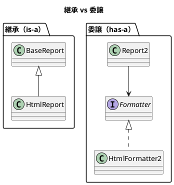

# 第 2 章: パターンを支える基本原則

## はじめに

デザインパターンは「なぜそうするのか」を理解せずに適用すると、かえって複雑さを生みます。パターンの背景にある設計原則を理解することが、パターンを適切に使いこなす鍵です。

---

## SOLID 原則

### 単一責任の原則 (SRP)

クラスは変更の理由を1つだけ持つべきです。

```php
// 悪い例: Report が「データ保持」と「出力形式」の2つの責務を持つ
class Report {
    public function getData(): array { /* ... */ }
    public function formatAsHtml(): string { /* ... */ }
    public function formatAsPlainText(): string { /* ... */ }
}

// よい例: 出力形式を分離する（Strategy パターン）
class Report {
    public function __construct(private callable $formatter) {}
    public function output(): string {
        return ($this->formatter)($this->getData());
    }
}
```

### 開放閉鎖の原則 (OCP)

拡張に対して開いていて、修正に対して閉じているべきです。

### リスコフの置換原則 (LSP)

サブタイプは、その基底型と置換可能でなければなりません。

### インターフェース分離の原則 (ISP)

クライアントが使わないメソッドへの依存を強制しないべきです。

### 依存性逆転の原則 (DIP)

高レベルモジュールは低レベルモジュールに依存すべきではなく、両者とも抽象に依存すべきです。

```php
// 具象に依存（悪い例）
class Report {
    public function output(): string {
        $formatter = new HtmlFormatter();
        return $formatter->format($this->data);
    }
}

// 抽象に依存（よい例）
class Report {
    public function __construct(private FormatterInterface $formatter) {}
    public function output(): string {
        return $this->formatter->format($this->data);
    }
}
```

---

## 3 つの設計指針

### 1. 変化するものを分離する

変更が予想される部分を特定し、安定した部分から切り離します。

### 2. インターフェースに対してプログラミングする

実装ではなく、interface や abstract class に依存することで、差し替えを容易にします。PHP では `interface` と型宣言を組み合わせることで、これを自然に実現できます。

### 3. 継承より委譲を優先する

`extends` による is-a 関係よりも、コンポジション（has-a 関係）を優先します。



---

## パターンと原則の対応

| パターン | 主に活用する原則 |
|---------|---------------|
| Template Method | OCP（フックメソッドで拡張可能） |
| Strategy | DIP, OCP（委譲で差し替え可能） |
| Observer | OCP（新しい Observer を追加可能） |
| Composite | LSP（Leaf と Composite を統一的に扱う） |
| Decorator | OCP, SRP（機能を動的に追加） |
| Factory | DIP（生成の詳細を分離） |

---

## まとめ

- SOLID 原則はパターンの「なぜ」を説明する
- 「変化するものを分離する」がすべてのパターンの核心
- PHP では interface + 型宣言でこれらの原則を自然に表現できる
- 継承より委譲を優先し、柔軟な設計を目指す
