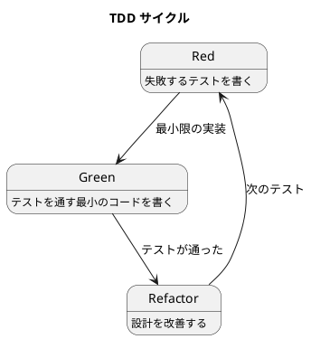

# 第 3 章: 開発環境と TDD 基盤

## はじめに

本シリーズでは PHP 8.x と PHPUnit 11 を使い、TDD（テスト駆動開発）で 13 のデザインパターンを実装します。この章では開発環境のセットアップと TDD の基本サイクルを確認します。

---

## 環境セットアップ

### 必要なツール

| ツール | バージョン | 用途 |
|-------|----------|------|
| PHP | 8.1 以上 | 実行環境 |
| Composer | 2.x | パッケージ管理 |
| PHPUnit | 11.x | テストフレームワーク |

### プロジェクトの初期化

```bash
mkdir -p apps/php/design-pattern && cd apps/php/design-pattern
mkdir -p src tests
```

### composer.json

```json
{
    "name": "design-pattern/php",
    "autoload": {
        "psr-4": { "DesignPattern\\": "src/" },
        "classmap": ["src/"]
    },
    "autoload-dev": {
        "psr-4": { "DesignPattern\\Tests\\": "tests/" }
    },
    "require-dev": {
        "phpunit/phpunit": "^11.0"
    }
}
```

### phpunit.xml

```xml
<?xml version="1.0" encoding="UTF-8"?>
<phpunit bootstrap="vendor/autoload.php" colors="true">
    <testsuites>
        <testsuite name="Design Patterns">
            <directory>tests</directory>
        </testsuite>
    </testsuites>
    <source>
        <include><directory suffix=".php">src</directory></include>
    </source>
</phpunit>
```

### 依存関係のインストール

```bash
composer install
```

---

## TDD の基本サイクル

### Red-Green-Refactor



1. **Red**: 実装したい振る舞いをテストで表現する
2. **Green**: テストを通す最小限のコードを書く
3. **Refactor**: テストが通った状態でコードを改善する

### PHPUnit テストの基本構造

```php
<?php
declare(strict_types=1);

namespace DesignPattern\Tests;

use PHPUnit\Framework\TestCase;

class ExampleTest extends TestCase
{
    public function testSomething(): void
    {
        // Arrange（準備）
        $sut = new SomeClass();

        // Act（実行）
        $result = $sut->doSomething();

        // Assert（検証）
        $this->assertSame('expected', $result);
    }
}
```

### テストの実行

```bash
# 全テスト実行
./vendor/bin/phpunit

# 特定のテストファイル
./vendor/bin/phpunit tests/TemplateMethodTest.php

# 特定のテストメソッド
./vendor/bin/phpunit --filter testHtmlReportContainsTitle
```

---

## PHP 8.x の主要機能

本シリーズで活用する PHP 8.x の機能を紹介します。

### 型宣言

```php
function add(int $a, int $b): int {
    return $a + $b;
}
```

### Constructor Promotion

```php
class Account {
    public function __construct(
        private readonly string $name,
        private float $balance
    ) {}
}
```

### Named Arguments

```php
$report = new Report(
    title: '月次報告',
    text: ['順調', '最高の調子']
);
```

### Match 式

```php
$result = match($type) {
    'html' => new HtmlFormatter(),
    'text' => new PlainTextFormatter(),
    default => throw new \InvalidArgumentException("Unknown type: {$type}"),
};
```

### Enum (PHP 8.1+)

```php
enum Color: string {
    case Red = 'red';
    case Blue = 'blue';
    case Green = 'green';
}
```

---

## ディレクトリ構成

```
apps/php/design-pattern/
├── composer.json
├── phpunit.xml
├── src/
│   ├── TemplateMethod/
│   │   ├── Report.php
│   │   ├── HtmlReport.php
│   │   └── PlainTextReport.php
│   ├── Strategy/
│   ├── Observer/
│   └── ...
├── tests/
│   ├── TemplateMethodTest.php
│   ├── StrategyTest.php
│   └── ...
└── vendor/
```

---

## まとめ

- PHP 8.x + PHPUnit 11 + Composer で TDD 環境を構築した
- Red-Green-Refactor サイクルを厳守してパターンを実装する
- PHP 8.x の型宣言、Constructor Promotion、match 式を積極活用する
- 次章から、最初のパターン「Template Method」を TDD で実装する
