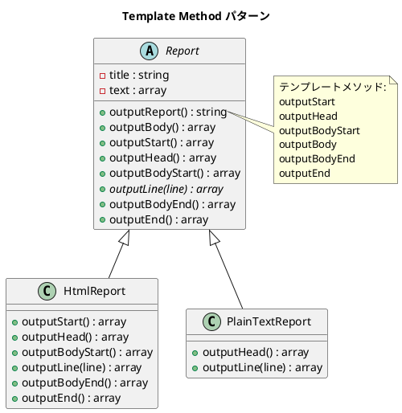

# 第 4 章: Template Method

## はじめに

レポートを HTML とプレーンテキストの 2 つの形式で出力したいとします。出力の「骨格」は同じ（タイトル → 本文 → フッター）ですが、各ステップの具体的な処理は形式ごとに異なります。

**Template Method パターン**は、アルゴリズムの骨格を基底クラスで定義し、具体的なステップをサブクラスに委ねるパターンです。

---

## パターンの構造



**登場人物**:

- **AbstractClass（Report）**: テンプレートメソッド `outputReport` でアルゴリズムの骨格を定義する
- **ConcreteClass（HtmlReport / PlainTextReport）**: 各ステップ（フックメソッド）をオーバーライドする

---

## TDD で作る

### Red: テストを書く

まず、HTML レポートの期待出力をテストで定義します。

```php
// tests/TemplateMethodTest.php
class TemplateMethodTest extends TestCase
{
    public function testHtmlReportContainsHtmlTags(): void
    {
        $report = new HtmlReport();
        $output = $report->outputReport();

        $this->assertStringContainsString('<html>', $output);
        $this->assertStringContainsString('</html>', $output);
    }

    public function testPlainTextReportContainsTitle(): void
    {
        $report = new PlainTextReport();
        $output = $report->outputReport();

        $this->assertStringContainsString('**** 月次報告 ****', $output);
    }
}
```

### Green: 実装する

**基底クラス Report** --- テンプレートメソッドを定義します。

```php
// src/TemplateMethod/Report.php
abstract class Report
{
    protected string $title;
    protected array $text;

    public function __construct(string $title = '月次報告', array $text = ['順調', '最高の調子'])
    {
        $this->title = $title;
        $this->text = $text;
    }

    /** テンプレートメソッド: レポート出力の骨格 */
    public function outputReport(): string
    {
        $lines = [];
        $lines = array_merge($lines, $this->outputStart());
        $lines = array_merge($lines, $this->outputHead());
        $lines = array_merge($lines, $this->outputBodyStart());
        $lines = array_merge($lines, $this->outputBody());
        $lines = array_merge($lines, $this->outputBodyEnd());
        $lines = array_merge($lines, $this->outputEnd());
        return implode("\n", $lines);
    }

    /** フックメソッド（デフォルトは何もしない） */
    protected function outputStart(): array { return []; }
    protected function outputHead(): array { return $this->outputLine($this->title); }
    protected function outputBodyStart(): array { return []; }

    /** 抽象メソッド */
    abstract protected function outputLine(string $line): array;

    protected function outputBodyEnd(): array { return []; }
    protected function outputEnd(): array { return []; }
}
```

**サブクラス HtmlReport** --- HTML 固有の出力を実装します。

```php
// src/TemplateMethod/HtmlReport.php
class HtmlReport extends Report
{
    protected function outputStart(): array { return ['<html>']; }
    protected function outputHead(): array {
        return [' <head>', " <title>{$this->title}</title>", ' </head>'];
    }
    protected function outputBodyStart(): array { return ['<body>']; }
    protected function outputLine(string $line): array { return [" <p>{$line}</p>"]; }
    protected function outputBodyEnd(): array { return ['</body>']; }
    protected function outputEnd(): array { return ['</html>']; }
}
```

### Refactor: 振り返り

- PHP の `abstract` キーワードで抽象メソッドを言語レベルで強制できます。Ruby の `raise NotImplementedError` に相当するイディオムが不要です
- フックメソッドは空の配列 `[]` を返すデフォルト実装で提供し、必要な部分だけオーバーライドします
- 文字列結合ではなく配列を組み立てて最後に `implode` するアプローチで、テスト容易性を確保しています

---

## PHP らしい実装

### abstract キーワード

PHP は `abstract` キーワードをネイティブサポートしており、抽象メソッドを型安全に定義できます。サブクラスが実装を忘れるとコンパイル時にエラーになります。

### 戻り値の型宣言

`outputLine(string $line): array` のように引数と戻り値の型を明示することで、テンプレートメソッドの契約が明確になります。

---

## 他言語との比較

| 言語 | 抽象メソッドの表現 |
|------|----------------|
| PHP | `abstract protected function outputLine(string $line): array;` |
| Ruby | `raise NotImplementedError`（慣用句） |
| Java | `abstract String outputLine(String line);` |
| Python | `@abstractmethod` デコレータ |
| JavaScript | 規約ベース（言語サポートなし） |

---

## まとめ

| 観点 | 内容 |
|------|------|
| **意図** | アルゴリズムの骨格を定義し、一部のステップをサブクラスに委ねる |
| **適用場面** | 複数のバリエーションが同じ手順の骨格を共有する場合 |
| **メリット** | コードの重複を排除し、拡張ポイントを明確にする |
| **注意点** | サブクラスが増えると継承階層が深くなる → 次章の Strategy パターンで解決 |
| **関連パターン** | Strategy（委譲で差し替え）、Factory Method（生成ステップの Template Method） |
