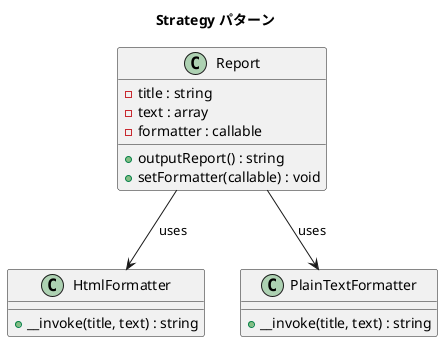

# 第 5 章: Strategy

## はじめに

前章の Template Method は継承で振る舞いを差し替えました。しかし、出力形式を実行時に切り替えたい場合はどうでしょうか？

**Strategy パターン**は、アルゴリズムをオブジェクト（または callable）として分離し、実行時に差し替え可能にするパターンです。

---

## パターンの構造



**登場人物**:

- **Context（Report）**: 戦略オブジェクトへの参照を保持する
- **Strategy（callable / __invoke）**: アルゴリズムのインターフェースを定義する
- **ConcreteStrategy（HtmlFormatter / PlainTextFormatter）**: 具体的なアルゴリズムを実装する

---

## TDD で作る

### Red: テストを書く

```php
public function testHtmlFormatterOutput(): void
{
    $report = new Report(new HtmlFormatter());
    $output = $report->outputReport();

    $this->assertStringContainsString('<html>', $output);
    $this->assertStringContainsString('<title>月次報告</title>', $output);
}

public function testSwitchFormatterAtRuntime(): void
{
    $report = new Report(new HtmlFormatter());
    $this->assertStringContainsString('<html>', $report->outputReport());

    $report->setFormatter(new PlainTextFormatter());
    $this->assertStringContainsString('****', $report->outputReport());
}
```

### Green: 実装する

```php
// src/Strategy/Report.php
class Report
{
    private $formatter;

    public function __construct(
        callable $formatter,
        private string $title = '月次報告',
        private array $text = ['順調', '最高の調子']
    ) {
        $this->formatter = $formatter;
    }

    public function outputReport(): string
    {
        return ($this->formatter)($this->title, $this->text);
    }

    public function setFormatter(callable $formatter): void
    {
        $this->formatter = $formatter;
    }
}
```

```php
// src/Strategy/HtmlFormatter.php
class HtmlFormatter
{
    public function __invoke(string $title, array $text): string
    {
        $lines = ['<html>', ' <head>', " <title>{$title}</title>", ' </head>', '<body>'];
        foreach ($text as $line) {
            $lines[] = " <p>{$line}</p>";
        }
        $lines[] = '</body>';
        $lines[] = '</html>';
        return implode("\n", $lines);
    }
}
```

### Refactor: 振り返り

- PHP の `callable` 型ヒントにより、クラス、クロージャ、関数のいずれも Strategy として使えます
- `__invoke()` マジックメソッドでオブジェクトを関数のように呼び出せます

---

## PHP らしい実装

### クロージャを直接 Strategy として使う

```php
$upper = fn(string $title, array $text): string =>
    strtoupper($title) . "\n" . implode("\n", array_map('strtoupper', $text));

$report = new Report($upper, 'Test', ['hello']);
// => "TEST\nHELLO"
```

PHP のアロー関数 `fn() =>` を使えば、Strategy クラスを作るまでもない軽量な戦略を即座に定義できます。

---

## 他言語との比較

| 言語 | Strategy の表現 |
|------|---------------|
| PHP | `callable` + `__invoke()` |
| Ruby | ブロック / Proc / lambda |
| Java | `interface` + ラムダ式 (Java 8+) |
| Python | ファーストクラス関数 |
| JavaScript | 関数オブジェクト |

---

## まとめ

| 観点 | 内容 |
|------|------|
| **意図** | アルゴリズムをカプセル化し、実行時に差し替え可能にする |
| **Template Method との違い** | 継承ではなく委譲で振る舞いを差し替える |
| **メリット** | 実行時の柔軟性、クラス爆発の回避 |
| **注意点** | 戦略が多すぎると管理が煩雑になる |
| **関連パターン** | Template Method（継承版）、Command（操作のオブジェクト化） |
