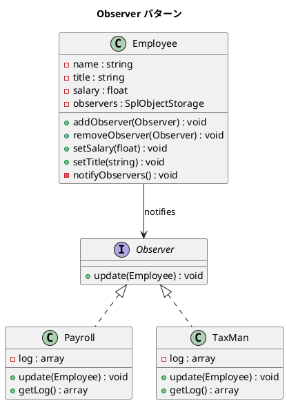

# 第 6 章: Observer

## はじめに

従業員の給与が変更されたとき、給与システムと税務署の両方に通知する必要があります。しかし Employee クラスが Payroll や TaxMan を直接知っていると密結合になります。

**Observer パターン**は、オブジェクトの状態変化を、依存オブジェクトに自動的に通知する仕組みを提供します。

---

## パターンの構造



**登場人物**:

- **Subject（Employee）**: 状態を保持し、Observer のリストを管理する。`setSalary()` と `setTitle()` の両方で通知を発行する
- **Observer（Observer interface）**: 通知を受けるインターフェース
- **ConcreteObserver（Payroll / TaxMan）**: 通知に応じた処理を実装する

---

## TDD で作る

### Red: テストを書く

```php
public function testPayrollIsNotifiedOnSalaryChange(): void
{
    $employee = new Employee('田中', 'エンジニア', 500000);
    $payroll = new Payroll();
    $employee->addObserver($payroll);

    $employee->setSalary(600000);

    $this->assertCount(1, $payroll->getLog());
    $this->assertStringContainsString('田中', $payroll->getLog()[0]);
}
```

### Green: 実装する

```php
class Employee
{
    private \SplObjectStorage $observers;

    public function __construct(
        private string $name,
        private string $title,
        private float $salary
    ) {
        $this->observers = new \SplObjectStorage();
    }

    public function setSalary(float $salary): void
    {
        $this->salary = $salary;
        $this->notifyObservers();
    }

    public function setTitle(string $title): void
    {
        $this->title = $title;
        $this->notifyObservers();
    }

    public function addObserver(Observer $observer): void
    {
        $this->observers->offsetSet($observer);
    }

    private function notifyObservers(): void
    {
        foreach ($this->observers as $observer) {
            $observer->update($this);
        }
    }
}
```

#### 役職変更による通知のテスト

給与変更だけでなく、役職（title）の変更でも Observer に通知されます。

```php
public function testTitleChangeNotifiesObservers(): void
{
    $employee = new Employee('山田', 'ジュニア', 400000);
    $payroll = new Payroll();
    $employee->addObserver($payroll);

    $employee->setTitle('シニア');

    $this->assertCount(1, $payroll->getLog());
    $this->assertSame('シニア', $employee->getTitle());
}
```

`setTitle()` は `setSalary()` と同様に内部で `notifyObservers()` を呼び出すため、状態変更の種類に関わらず Observer に通知されます。

### Refactor: 振り返り

- `SplObjectStorage` はオブジェクトをキーとするコレクションで、同一 Observer の重複登録を自然に防ぎます
- `foreach` で直接イテレーションできるため、Observer の走査がシンプルです
- `setSalary()` と `setTitle()` の両方で `notifyObservers()` を呼ぶことで、あらゆる状態変更を Observer に通知します

---

## PHP らしい実装

### SplObjectStorage

PHP 標準の `SplObjectStorage` は Observer 管理に最適です。配列とは異なり、オブジェクトの同一性（identity）で管理するため、`===` 比較が自動的に行われます。

### PHP 8.5 対応

PHP 8.5 では `attach()` / `detach()` が非推奨になりました。代わりに `offsetSet()` / `offsetUnset()` を使用します。

---

## 他言語との比較

| 言語 | Observer の管理 |
|------|---------------|
| PHP | `SplObjectStorage` + `offsetSet()` |
| Ruby | 配列 + `<<` / `delete` |
| Java | `ArrayList<Observer>` |
| Python | `set` / `list` |
| JavaScript | `Set` / `Array` |

---

## まとめ

| 観点 | 内容 |
|------|------|
| **意図** | オブジェクトの状態変化を依存オブジェクトに自動通知する |
| **適用場面** | イベント駆動の通知、MVC のモデル → ビュー更新 |
| **メリット** | Subject と Observer の疎結合、Observer の動的追加・削除 |
| **注意点** | 通知の順序保証がない、循環参照に注意 |
| **関連パターン** | Mediator（通知の中心を設ける）、Event Dispatcher |
