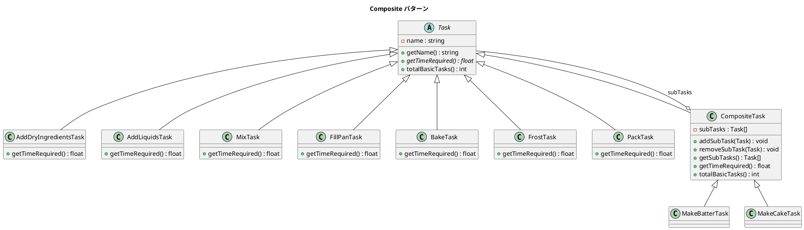

# 第 7 章: Composite

## はじめに

ケーキを作るタスクは、「生地を作る」「焼く」「デコレーションする」などの小さなタスクから構成されます。さらに「生地を作る」は「粉を混ぜる」「卵を加える」などに分解できます。このような再帰的なツリー構造で、部分と全体を統一的に扱いたいとき、**Composite パターン**が有効です。

---

## パターンの構造



**登場人物**:

- **Component（Task）**: Leaf と Composite に共通するインターフェース
- **Leaf（AddDryIngredientsTask 等）**: 末端のタスク
- **Composite（CompositeTask）**: 子タスクを持つコンテナ

---

## TDD で作る

### Red: テストを書く

```php
public function testMakeCakeCompositeTime(): void
{
    $task = new MakeCakeTask();
    // MakeBatter(4.5) + FillPan(0.5) + Bake(25.0) + Frost(10.0) + Pack(5.0) = 45.0
    $this->assertSame(45.0, $task->getTimeRequired());
}

public function testMakeCakeBasicTaskCount(): void
{
    $task = new MakeCakeTask();
    $this->assertSame(7, $task->totalBasicTasks());
}
```

### Green: 実装する

```php
class CompositeTask extends Task
{
    protected array $subTasks = [];

    public function addSubTask(Task $task): void
    {
        $this->subTasks[] = $task;
    }

    public function getTimeRequired(): float
    {
        return array_sum(array_map(fn(Task $t) => $t->getTimeRequired(), $this->subTasks));
    }

    public function totalBasicTasks(): int
    {
        return array_sum(array_map(fn(Task $t) => $t->totalBasicTasks(), $this->subTasks));
    }
}
```

`CompositeTask` は子タスクを取得するための `getSubTasks()` メソッドも提供しています。

```php
/** @return Task[] */
public function getSubTasks(): array
{
    return $this->subTasks;
}
```

#### リーフタスクの一覧

各リーフタスクは固有の所要時間を持ちます。

| クラス | タスク名 | 所要時間（分） |
|--------|----------|--------------|
| `AddDryIngredientsTask` | 小麦粉と砂糖を加える | 1.0 |
| `AddLiquidsTask` | 卵とバターを加える | 0.5 |
| `MixTask` | 混ぜる | 3.0 |
| `FillPanTask` | 型に入れる | 0.5 |
| `BakeTask` | 焼く | 25.0 |
| `FrostTask` | デコレーションする | 10.0 |
| `PackTask` | 箱詰めする | 5.0 |

コンポジットタスク `MakeBatterTask`（生地を作る）は AddDryIngredients + AddLiquids + Mix = **4.5 分**、`MakeCakeTask`（ケーキを作る）は全体で **45.0 分** です。

### Refactor: 振り返り

- `array_map` + `array_sum` の組み合わせで再帰的な集計をシンプルに表現できます
- Leaf の `totalBasicTasks()` は常に 1 を返し、Composite は子の合計を返します
- `getSubTasks()` でコンポジットの内部構造を外部から参照でき、ツリーの走査が可能になります

---

## PHP らしい実装

PHP の `array_map` と `array_sum` 関数を活用することで、ループを書かずに再帰的な集計が可能です。また、`array_filter` と `array_values` を組み合わせることで、子タスクの削除も簡潔に実装できます。

---

## 他言語との比較

| 言語 | 集計処理のイディオム |
|------|-----------------|
| PHP | `array_sum(array_map(fn($t) => $t->getTimeRequired(), $this->subTasks))` |
| Ruby | `sub_tasks.sum(&:time_required)` |
| Java | `subTasks.stream().mapToDouble(Task::getTimeRequired).sum()` |
| Python | `sum(t.get_time_required() for t in self.sub_tasks)` |

---

## まとめ

| 観点 | 内容 |
|------|------|
| **意図** | 部分と全体を統一的に扱う再帰的なツリー構造を構築する |
| **適用場面** | ファイルシステム、GUI ウィジェット、組織図、タスク分解 |
| **メリット** | クライアントが Leaf と Composite を区別せずに操作できる |
| **注意点** | 型安全性の課題（Leaf に addSubTask を呼ぶことはできない） |
| **関連パターン** | Iterator（ツリーの走査）、Visitor（ツリーの操作） |
