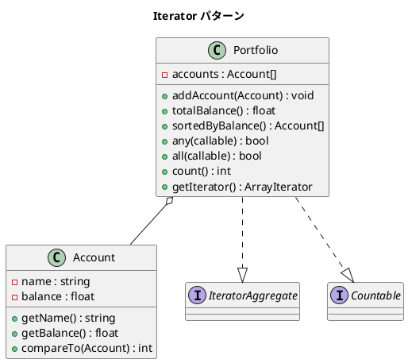

# 第 8 章: Iterator

## はじめに

ポートフォリオ（口座の集合）に対して、残高の合計やソート、条件検索を行いたいとします。PHP の `foreach` で直接イテレーションできれば、使い勝手が格段に良くなります。

**Iterator パターン**は、コレクションの内部構造を公開せずに、要素への順次アクセスを提供するパターンです。

---

## パターンの構造



---

## TDD で作る

### Red: テストを書く

```php
public function testIteration(): void
{
    $names = [];
    foreach ($this->portfolio as $account) {
        $names[] = $account->getName();
    }
    $this->assertSame(['普通預金', '定期預金', '投資信託'], $names);
}

public function testSortedByBalance(): void
{
    $sorted = $this->portfolio->sortedByBalance();
    $this->assertSame('普通預金', $sorted[0]->getName());
    $this->assertSame('定期預金', $sorted[2]->getName());
}
```

### Green: 実装する

```php
class Portfolio implements \IteratorAggregate, \Countable
{
    private array $accounts = [];

    public function getIterator(): \ArrayIterator
    {
        return new \ArrayIterator($this->accounts);
    }

    public function count(): int
    {
        return count($this->accounts);
    }

    public function sortedByBalance(): array
    {
        $sorted = $this->accounts;
        usort($sorted, fn(Account $a, Account $b) => $a->compareTo($b));
        return $sorted;
    }
}
```

### Refactor: 振り返り

- `IteratorAggregate` を実装するだけで `foreach` に対応できます
- `Countable` を実装すると `count()` 関数が使えます

---

## PHP らしい実装

### IteratorAggregate vs Iterator

PHP では `IteratorAggregate` と `Iterator` の 2 つのインターフェースがあります。

- **IteratorAggregate**: `getIterator()` を実装するだけで済む。シンプルなケースに最適
- **Iterator**: `current()`, `key()`, `next()`, `rewind()`, `valid()` の 5 メソッドを実装。複雑な走査ロジックが必要な場合に使う

### 高階関数 any / all

PHP にはビルトインの `any` / `all` はありませんが、`callable` を受け取るメソッドとして自然に実装できます。

---

## 他言語との比較

| 言語 | Iterator の仕組み |
|------|----------------|
| PHP | `IteratorAggregate` / `Iterator` インターフェース |
| Ruby | `Enumerable` モジュール + `each` |
| Java | `Iterable<T>` + `Iterator<T>` |
| Python | `__iter__` / `__next__` |
| JavaScript | `Symbol.iterator` |

---

## まとめ

| 観点 | 内容 |
|------|------|
| **意図** | コレクションの内部構造を公開せずに要素を順次アクセスする |
| **適用場面** | カスタムコレクション、ツリーの走査 |
| **メリット** | `foreach` とネイティブに統合、内部実装の隠蔽 |
| **注意点** | PHP では `IteratorAggregate` で十分なケースが多い |
| **関連パターン** | Composite（ツリー構造の走査）、Visitor |
