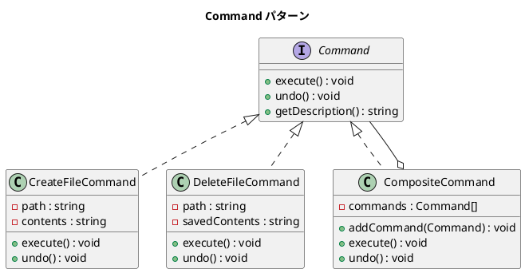

# 第 9 章: Command

## はじめに

ファイルの作成・削除といった操作を「元に戻せる」ようにしたいとします。操作をオブジェクトとしてカプセル化すれば、実行・取り消し・再実行が可能になります。

**Command パターン**は、操作をオブジェクト化し、実行（execute）と取り消し（undo）を分離するパターンです。

---

## パターンの構造



---

## TDD で作る

### Red: テストを書く

```php
public function testCreateFileCommand(): void
{
    $cmd = new CreateFileCommand($this->testDir . '/test.txt', 'hello');
    $cmd->execute();

    $this->assertFileExists($this->testDir . '/test.txt');
    $this->assertSame('hello', file_get_contents($this->testDir . '/test.txt'));
}

public function testCreateFileCommandUndo(): void
{
    $cmd = new CreateFileCommand($this->testDir . '/test.txt', 'hello');
    $cmd->execute();
    $cmd->undo();

    $this->assertFileDoesNotExist($this->testDir . '/test.txt');
}
```

### Green: 実装する

```php
class CreateFileCommand implements Command
{
    public function __construct(private string $path, private string $contents = '') {}

    public function execute(): void
    {
        file_put_contents($this->path, $this->contents);
    }

    public function undo(): void
    {
        if (file_exists($this->path)) {
            unlink($this->path);
        }
    }

    public function getDescription(): string
    {
        return "ファイル作成: {$this->path}";
    }
}
```

### Refactor: 振り返り

- `CompositeCommand` は Composite パターンと Command パターンの組み合わせです
- `undo()` では `array_reverse` を使って逆順に取り消しを行います

---

## PHP らしい実装

PHP の `file_put_contents` / `file_get_contents` / `unlink` 関数でファイル操作がシンプルに書けます。`sys_get_temp_dir()` を使えばテスト用の一時ディレクトリも簡単に確保できます。

---

## 他言語との比較

| 言語 | Command の特徴 |
|------|--------------|
| PHP | `interface Command` + 具象クラス |
| Ruby | ブロック / Proc でも表現可能 |
| Java | `Command` インターフェース + ラムダ |
| Python | ファーストクラス関数 + `functools` |

---

## まとめ

| 観点 | 内容 |
|------|------|
| **意図** | 操作をオブジェクト化し、実行・取り消し・再実行を可能にする |
| **適用場面** | Undo/Redo、マクロ記録、トランザクション |
| **メリット** | 操作の履歴管理、複合操作の構築 |
| **注意点** | undo のための状態保存が必要、メモリ消費に注意 |
| **関連パターン** | Composite（複合コマンド）、Strategy（操作の差し替え） |
