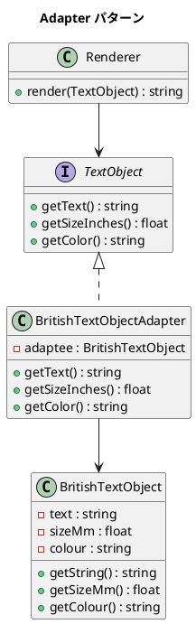

# 第 10 章: Adapter

## はじめに

イギリス製のテキストオブジェクト（サイズがミリメートル、色が colour）を、インチとアメリカ英語 color を期待するレンダラーで使いたいとします。

**Adapter パターン**は、既存のインターフェースを、クライアントが期待する別のインターフェースに変換するパターンです。

---

## パターンの構造



**登場人物**:

- **Target（TextObject）**: クライアントが期待するインターフェース
- **Adaptee（BritishTextObject）**: 適合させたい既存クラス
- **Adapter（BritishTextObjectAdapter）**: Adaptee を Target に変換する

---

## TDD で作る

### Red: テストを書く

```php
public function testAdapterConvertsMmToInches(): void
{
    $british = new BritishTextObject('Hello', 25.4, 'red');
    $adapter = new BritishTextObjectAdapter($british);

    $this->assertEqualsWithDelta(1.0, $adapter->getSizeInches(), 0.001);
}
```

### Green: 実装する

```php
class BritishTextObjectAdapter implements TextObject
{
    public function __construct(private BritishTextObject $adaptee) {}

    public function getText(): string
    {
        return $this->adaptee->getString();
    }

    public function getSizeInches(): float
    {
        return $this->adaptee->getSizeMm() / 25.4;
    }

    public function getColor(): string
    {
        return $this->adaptee->getColour();
    }
}
```

### Refactor: 振り返り

- Adapter はメソッド名の変換（getString → getText, getColour → getColor）と単位変換（mm → inches）を行います
- 既存の `BritishTextObject` には一切手を加えていません

---

## PHP らしい実装

PHP では interface を使うことで、Adapter が Target と同じ型として扱えます。Renderer の `render(TextObject $textObject)` のように型宣言できるため、コンパイル時の安全性が担保されます。

---

## 他言語との比較

| 言語 | Adapter の実装方法 |
|------|-----------------|
| PHP | `interface` 実装 + コンポジション |
| Ruby | `method_missing` でも可能 |
| Java | `interface` 実装 + コンポジション |
| Python | Duck Typing |

---

## まとめ

| 観点 | 内容 |
|------|------|
| **意図** | 互換性のないインターフェースを変換して既存コードを再利用する |
| **適用場面** | サードパーティライブラリの統合、レガシーコードのラッピング |
| **メリット** | 既存コードを修正せずに統合できる |
| **注意点** | Adapter が増えすぎると間接層が複雑になる |
| **関連パターン** | Proxy（同じインターフェースでアクセス制御）、Decorator（機能追加） |
