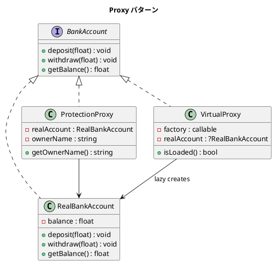

# 第 11 章: Proxy

## はじめに

銀行口座へのアクセスを制御したいとします。所有者だけが操作できる Protection Proxy や、実際のオブジェクト生成を遅延させる Virtual Proxy が考えられます。

**Proxy パターン**は、別のオブジェクトへのアクセスを制御する代理オブジェクトを提供するパターンです。

---

## パターンの構造



---

## TDD で作る

### Red: テストを書く

```php
public function testVirtualProxyLazyLoading(): void
{
    $loaded = false;
    $proxy = new VirtualProxy(function () use (&$loaded) {
        $loaded = true;
        return new RealBankAccount(10000);
    });

    $this->assertFalse($proxy->isLoaded());

    $balance = $proxy->getBalance();
    $this->assertTrue($proxy->isLoaded());
    $this->assertSame(10000.0, $balance);
}
```

### Green: 実装する

```php
class VirtualProxy implements BankAccount
{
    private $factory;
    private ?RealBankAccount $realAccount = null;

    public function __construct(callable $factory)
    {
        $this->factory = $factory;
    }

    public function getBalance(): float
    {
        return $this->getRealAccount()->getBalance();
    }

    public function isLoaded(): bool
    {
        return $this->realAccount !== null;
    }

    private function getRealAccount(): RealBankAccount
    {
        if ($this->realAccount === null) {
            $this->realAccount = ($this->factory)();
        }
        return $this->realAccount;
    }
}
```

### Refactor: 振り返り

- Virtual Proxy は `callable` をファクトリとして受け取り、最初のアクセス時にのみ実オブジェクトを生成します
- nullable 型 `?RealBankAccount` でロード状態を管理します

---

## PHP らしい実装

PHP のクロージャとクロージャの `use` キーワードにより、Virtual Proxy のファクトリを簡潔に表現できます。`use (&$loaded)` のように参照渡しすれば、テストでロード状態を外部から検証できます。

---

## 他言語との比較

| 言語 | Proxy の特徴 |
|------|------------|
| PHP | `callable` ファクトリ + nullable 型 |
| Ruby | `method_missing` による透過的 Proxy |
| Java | `java.lang.reflect.Proxy`（動的プロキシ） |
| Python | `__getattr__` によるプロキシ |

---

## まとめ

| 観点 | 内容 |
|------|------|
| **意図** | 別のオブジェクトへのアクセスを制御する代理を提供する |
| **種類** | Protection Proxy, Virtual Proxy, Remote Proxy |
| **メリット** | アクセス制御、遅延初期化、リモートアクセスの透過性 |
| **注意点** | 間接層が増えるため、デバッグが複雑になる場合がある |
| **関連パターン** | Adapter（インターフェース変換）、Decorator（機能追加） |
