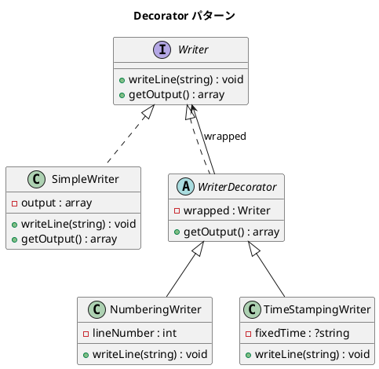

# 第 12 章: Decorator

## はじめに

テキスト出力に「行番号を付ける」「タイムスタンプを付ける」といった機能を動的に追加したいとします。継承ではなく、ラッピングによって機能を重ねていきます。

**Decorator パターン**は、オブジェクトに動的に新しい責務を追加するパターンです。サブクラス化の代替手段として柔軟な機能拡張を提供します。

---

## パターンの構造



---

## TDD で作る

### Red: テストを書く

```php
public function testNumberingWriter(): void
{
    $writer = new NumberingWriter(new SimpleWriter());
    $writer->writeLine('Hello');
    $writer->writeLine('World');

    $this->assertSame(['1: Hello', '2: World'], $writer->getOutput());
}

public function testNumberingThenTimeStamping(): void
{
    $writer = new NumberingWriter(
        new TimeStampingWriter(new SimpleWriter(), '2024-01-01 12:00:00')
    );
    $writer->writeLine('Hello');

    // Numbering が "1: Hello" を作り、TimeStamping が "[ts] 1: Hello" にする
    $this->assertSame(['[2024-01-01 12:00:00] 1: Hello'], $writer->getOutput());
}
```

### Green: 実装する

```php
abstract class WriterDecorator implements Writer
{
    public function __construct(protected Writer $wrapped) {}

    public function getOutput(): array
    {
        return $this->wrapped->getOutput();
    }
}

class NumberingWriter extends WriterDecorator
{
    private int $lineNumber = 1;

    public function writeLine(string $line): void
    {
        $this->wrapped->writeLine("{$this->lineNumber}: {$line}");
        $this->lineNumber++;
    }
}
```

### Refactor: 振り返り

- Decorator の積み重ね順序によって出力が変わります（外側の Decorator が先に処理する）
- `getOutput()` はラップされた Writer に委譲するため、最内部の SimpleWriter の出力を取得します

---

## PHP らしい実装

### Trait による代替

PHP の `trait` を使えば、Decorator パターンの一部を代替できます。

```php
trait Numbering
{
    private int $lineNumber = 1;

    public function writeNumberedLine(string $line): string
    {
        return ($this->lineNumber++) . ": {$line}";
    }
}
```

ただし、Trait はコンパイル時の静的な合成であり、実行時の動的な組み合わせはできません。実行時に「番号付き→タイムスタンプ付き」の順序を変えるような柔軟性が必要な場合は、Decorator パターンが適しています。

---

## 他言語との比較

| 言語 | Decorator の表現 |
|------|----------------|
| PHP | 抽象クラス + コンポジション / Trait |
| Ruby | Module の `prepend` / Decorator クラス |
| Java | 抽象クラス + コンポジション |
| Python | デコレータ構文 `@decorator` |

---

## まとめ

| 観点 | 内容 |
|------|------|
| **意図** | オブジェクトに動的に新しい責務を追加する |
| **適用場面** | ログ出力、認証、キャッシュ、圧縮 |
| **メリット** | 継承による爆発的なサブクラス増加を回避、実行時の組み合わせ |
| **注意点** | ラッピングの深さが増すとデバッグが難しくなる |
| **関連パターン** | Proxy（アクセス制御）、Composite（ツリー構造） |
