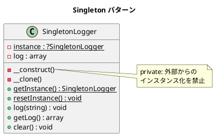

# 第 13 章: Singleton

## はじめに

アプリケーション全体で 1 つだけのロガーインスタンスを共有したいとします。グローバル変数の代わりに、インスタンスの唯一性を保証する仕組みが必要です。

**Singleton パターン**は、クラスのインスタンスが 1 つだけであることを保証し、そのグローバルなアクセスポイントを提供するパターンです。

---

## パターンの構造



---

## TDD で作る

### Red: テストを書く

```php
public function testGetInstanceReturnsSameObject(): void
{
    $logger1 = SingletonLogger::getInstance();
    $logger2 = SingletonLogger::getInstance();

    $this->assertSame($logger1, $logger2);
}

public function testSharedStateBetweenReferences(): void
{
    $logger1 = SingletonLogger::getInstance();
    $logger1->log('from logger1');

    $logger2 = SingletonLogger::getInstance();
    $logger2->log('from logger2');

    $this->assertSame(['from logger1', 'from logger2'], $logger1->getLog());
}
```

### Green: 実装する

```php
class SingletonLogger
{
    private static ?SingletonLogger $instance = null;
    private array $log = [];

    private function __construct() {}  // 外部からのインスタンス化を禁止
    private function __clone() {}      // クローンを禁止

    public static function getInstance(): self
    {
        if (self::$instance === null) {
            self::$instance = new self();
        }
        return self::$instance;
    }

    public static function resetInstance(): void
    {
        self::$instance = null;
    }

    public function log(string $message): void
    {
        $this->log[] = $message;
    }
}
```

### Refactor: 振り返り

- `private __construct()` と `private __clone()` で外部からの生成・複製を禁止
- テストのために `resetInstance()` を提供し、テスト間の状態リークを防止

---

## PHP らしい実装

PHP では `__construct` を `private` にすることで、言語レベルでインスタンス化を制限できます。さらに `__clone` も `private` にすることで `clone` による複製も防げます。

### テスタビリティ

Singleton はグローバル状態を持つため、テストが難しくなります。`resetInstance()` メソッドを用意し、`setUp()` で毎回リセットすることでテスト間の独立性を保ちます。

---

## 他言語との比較

| 言語 | Singleton の実現方法 |
|------|-------------------|
| PHP | `private __construct()` + static `getInstance()` |
| Ruby | `Singleton` モジュールの `include` |
| Java | `private` コンストラクタ + `static getInstance()` + enum |
| Python | `__new__` のオーバーライド / metaclass |

---

## まとめ

| 観点 | 内容 |
|------|------|
| **意図** | インスタンスの唯一性を保証し、グローバルなアクセスポイントを提供する |
| **適用場面** | ロガー、設定管理、コネクションプール |
| **メリット** | グローバル状態の制御、インスタンス数の制限 |
| **注意点** | テストの困難さ、隠れた依存関係。DI コンテナで代替可能な場合が多い |
| **関連パターン** | Factory（生成の制御）、Registry |
