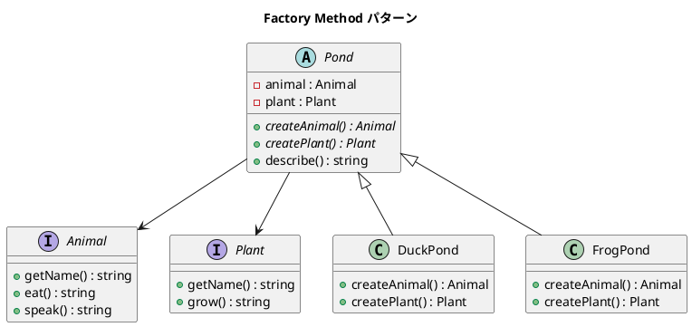
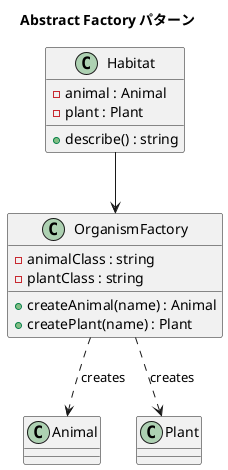

# 第 14 章: Factory

## はじめに

池の生態系をシミュレートするとします。池には動物と植物がいますが、池の種類によって生物が異なります。生成ロジックをクライアントから分離したいとき、**Factory パターン**が有効です。

本章では **Factory Method** と **Abstract Factory** の 2 つの関連パターンを扱います。

---

## パターンの構造

### Factory Method



### Abstract Factory



---

## TDD で作る

### Red: テストを書く

```php
public function testDuckPondFactoryMethod(): void
{
    $pond = new DuckPond();

    $this->assertInstanceOf(Duck::class, $pond->getAnimal());
    $this->assertStringContainsString('ドナルド', $pond->describe());
}

public function testAbstractFactoryWithTigerAndTree(): void
{
    $factory = new OrganismFactory(Tiger::class, Tree::class);
    $habitat = new Habitat($factory, 'シェレカン', '大きな木');

    $this->assertInstanceOf(Tiger::class, $habitat->getAnimal());
    $this->assertInstanceOf(Tree::class, $habitat->getPlant());
}
```

### Green: 実装する

**Factory Method** --- サブクラスが生成を決定します。

```php
abstract class Pond
{
    private Animal $animal;
    private Plant $plant;

    public function __construct()
    {
        $this->animal = $this->createAnimal();
        $this->plant = $this->createPlant();
    }

    abstract protected function createAnimal(): Animal;
    abstract protected function createPlant(): Plant;
}
```

**Abstract Factory** --- ファクトリオブジェクトが生成を担当します。

```php
class OrganismFactory
{
    public function __construct(
        private string $animalClass,
        private string $plantClass
    ) {}

    public function createAnimal(string $name): Animal
    {
        return new ($this->animalClass)($name);
    }

    public function createPlant(string $name): Plant
    {
        return new ($this->plantClass)($name);
    }
}
```

### Refactor: 振り返り

- Factory Method はテンプレートメソッドの「生成版」です
- Abstract Factory はファクトリオブジェクトを委譲で注入するため、より柔軟です
- PHP では `new ($className)($args)` で動的なインスタンス生成が可能です

---

## PHP らしい実装

### 動的インスタンス生成

PHP では変数にクラス名を格納し、`new ($className)()` で動的にインスタンスを生成できます。これは Abstract Factory パターンと非常に相性が良い機能です。

### class-string 型

PHPStan / Psalm の `class-string<T>` アノテーションを使えば、静的解析で型安全性を確保できます。

---

## 他言語との比較

| 言語 | Factory の特徴 |
|------|--------------|
| PHP | `new ($className)()` による動的生成 |
| Ruby | `Object.const_get(name).new` |
| Java | リフレクション / `Class.forName()` |
| Python | `globals()[class_name]()` |

---

## まとめ

| 観点 | 内容 |
|------|------|
| **Factory Method** | サブクラスが「何を作るか」を決定する。Template Method の生成版 |
| **Abstract Factory** | 関連するオブジェクト群の生成をファクトリオブジェクトに委譲する |
| **適用場面** | 生成ロジックの分離、テスト用のモック注入 |
| **メリット** | 生成と使用の分離、Open-Closed Principle の遵守 |
| **注意点** | パターンの選択を間違えると不要な複雑さが生まれる |
