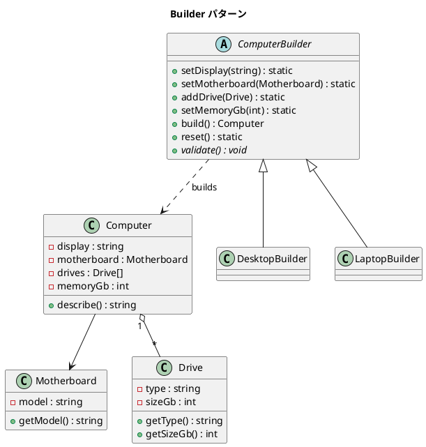

# 第 15 章: Builder

## はじめに

コンピュータを組み立てるとき、ディスプレイ、マザーボード、ドライブ、メモリなど多くのパーツが必要です。パーツの組み合わせにはバリデーションも必要です（ラップトップのドライブは 2 つまで、など）。

**Builder パターン**は、複雑なオブジェクトの構築プロセスを分離し、同じ構築プロセスで異なる表現を生成できるようにするパターンです。

---

## パターンの構造



---

## TDD で作る

### Red: テストを書く

```php
public function testBuildDesktop(): void
{
    $computer = (new DesktopBuilder())
        ->setDisplay('27インチ 4K')
        ->setMotherboard(new Motherboard('ASUS ROG'))
        ->addDrive(new Drive('SSD', 1000))
        ->setMemoryGb(32)
        ->build();

    $this->assertSame('27インチ 4K', $computer->getDisplay());
    $this->assertSame(32, $computer->getMemoryGb());
}

public function testLaptopMaxTwoDrives(): void
{
    $builder = (new LaptopBuilder())
        ->setDisplay('14インチ')
        ->setMotherboard(new Motherboard('Y'))
        ->addDrive(new Drive('SSD', 256))
        ->addDrive(new Drive('SSD', 512))
        ->addDrive(new Drive('HDD', 1000))
        ->setMemoryGb(8);

    $this->expectException(\RuntimeException::class);
    $builder->build();
}
```

### Green: 実装する

```php
abstract class ComputerBuilder
{
    protected ?string $display = null;
    protected ?Motherboard $motherboard = null;
    protected array $drives = [];
    protected ?int $memoryGb = null;

    public function setDisplay(string $display): static
    {
        $this->display = $display;
        return $this;
    }

    abstract protected function validate(): void;

    public function build(): Computer
    {
        $this->validate();
        return new Computer($this->display, $this->motherboard, $this->drives, $this->memoryGb);
    }
}

class LaptopBuilder extends ComputerBuilder
{
    protected function validate(): void
    {
        // ... 基本バリデーション ...
        if (count($this->drives) > 2) {
            throw new \RuntimeException('ラップトップのドライブは2つまでです');
        }
    }
}
```

#### Computer のゲッターメソッドと describe()

構築された `Computer` オブジェクトは、各パーツへのアクセサと自己記述メソッドを提供します。

```php
class Computer
{
    public function getDisplay(): string { return $this->display; }
    public function getMotherboard(): Motherboard { return $this->motherboard; }
    /** @return Drive[] */
    public function getDrives(): array { return $this->drives; }
    public function getMemoryGb(): int { return $this->memoryGb; }

    public function describe(): string
    {
        $driveInfo = implode(
            ', ',
            array_map(fn(Drive $d) => "{$d->getType()} {$d->getSizeGb()}GB", $this->drives)
        );
        return "Computer: {$this->display}, {$this->motherboard->getModel()}, {$this->memoryGb}GB RAM, [{$driveInfo}]";
    }
}
```

`describe()` メソッドは、コンピュータの構成を人間が読める文字列で返します。ドライブ情報は `array_map` で整形し、`implode` で結合しています。

```php
public function testComputerDescribe(): void
{
    $computer = new Computer('テスト画面', new Motherboard('テストMB'), [new Drive('SSD', 500)], 16);
    $desc = $computer->describe();

    $this->assertStringContainsString('テスト画面', $desc);
    $this->assertStringContainsString('テストMB', $desc);
    $this->assertStringContainsString('SSD 500GB', $desc);
    $this->assertStringContainsString('16GB RAM', $desc);
}
```

### Refactor: 振り返り

- `static` 戻り値型でメソッドチェーン（Fluent Interface）を実現
- バリデーションは `build()` 時に実行。構築中は自由に部品を追加・変更できます
- `reset()` でビルダーを再利用可能にします
- `Computer::describe()` はオブジェクトの自己記述を提供し、デバッグやログ出力に活用できます

---

## PHP らしい実装

### static 戻り値型

PHP 8 の `static` 戻り値型は、サブクラスでのメソッドチェーンに不可欠です。`self` と異なり、呼び出し元のクラスの型を返します。

### Named Arguments

```php
$computer = new Computer(
    display: '27インチ 4K',
    motherboard: new Motherboard('ASUS ROG'),
    drives: [new Drive('SSD', 1000)],
    memoryGb: 32
);
```

Named arguments を使えば、Builder を使わずとも明確なオブジェクト構築が可能です。Builder パターンはバリデーションが必要な場合に真価を発揮します。

---

## 他言語との比較

| 言語 | Builder の特徴 |
|------|--------------|
| PHP | `static` 戻り値型による Fluent Interface |
| Ruby | `method_missing` による動的 Builder |
| Java | 内部静的クラス + Fluent Interface |
| Python | `__setattr__` / dataclass |

---

## まとめ

| 観点 | 内容 |
|------|------|
| **意図** | 複雑なオブジェクトの構築プロセスを分離する |
| **適用場面** | 多数のパラメータを持つオブジェクトの構築、バリデーション付き構築 |
| **メリット** | 構築手順の標準化、バリデーション、不変オブジェクトの構築 |
| **注意点** | PHP 8 の Named Arguments で代替可能なケースもある |
| **関連パターン** | Abstract Factory（関連オブジェクト群の生成）、Composite（複雑な構造の構築） |
