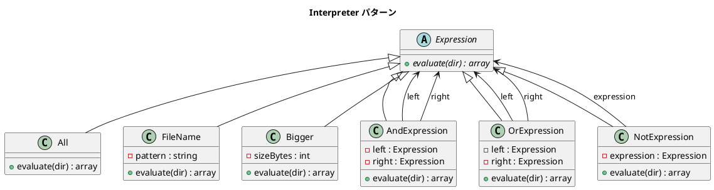

# 第 16 章: Interpreter

## はじめに

ファイル検索の条件を「*.txt かつ 100 バイトより大きい」のように組み合わせたいとします。条件を式（Expression）オブジェクトとして表現し、再帰的に組み合わせることで、柔軟な DSL（ドメイン固有言語）が構築できます。

**Interpreter パターン**は、言語の文法規則をクラス階層で表現し、その言語の文を解釈するインタプリタを提供するパターンです。

---

## パターンの構造



**登場人物**:

- **AbstractExpression（Expression）**: 式の共通インターフェース
- **TerminalExpression（All, FileName, Bigger）**: 末端の式
- **NonterminalExpression（AndExpression, OrExpression, NotExpression）**: 式の組み合わせ

---

## TDD で作る

### Red: テストを書く

```php
public function testAndExpression(): void
{
    $expr = new AndExpression(new FileName('*.txt'), new Bigger(100));
    $result = $expr->evaluate($this->testDir);

    $this->assertCount(1, $result);
    $this->assertStringContainsString('big.txt', $result[0]);
}

public function testComplexExpression(): void
{
    // txt files that are NOT bigger than 100 bytes
    $expr = new AndExpression(
        new FileName('*.txt'),
        new NotExpression(new Bigger(100))
    );
    $result = $expr->evaluate($this->testDir);

    $names = array_map('basename', $result);
    $this->assertContains('small.txt', $names);
    $this->assertNotContains('big.txt', $names);
}
```

### Green: 実装する

```php
class AndExpression extends Expression
{
    public function __construct(
        private Expression $left,
        private Expression $right
    ) {}

    public function evaluate(string $dir): array
    {
        $leftResult = $this->left->evaluate($dir);
        $rightResult = $this->right->evaluate($dir);
        return array_values(array_intersect($leftResult, $rightResult));
    }
}

class NotExpression extends Expression
{
    public function __construct(private Expression $expression) {}

    public function evaluate(string $dir): array
    {
        $all = (new All())->evaluate($dir);
        $excluded = $this->expression->evaluate($dir);
        return array_values(array_diff($all, $excluded));
    }
}
```

### Refactor: 振り返り

- PHP の配列関数 `array_intersect`, `array_diff`, `array_merge` が集合演算を簡潔に表現します
- `array_values` で再インデックスすることで、テストでの比較が容易になります
- Terminal Expression（All, FileName, Bigger）はファイルシステムに直接アクセスし、Nonterminal Expression は子の結果を組み合わせます

---

## PHP らしい実装

### 配列関数による集合演算

PHP の配列関数は Interpreter パターンの集合演算に最適です。

| 操作 | PHP 関数 |
|------|---------|
| AND（積集合） | `array_intersect()` |
| OR（和集合） | `array_merge()` + `array_unique()` |
| NOT（差集合） | `array_diff()` |

### fnmatch によるパターンマッチ

`fnmatch()` 関数はグロブパターンによるファイル名マッチングを提供します。正規表現よりもファイル検索に自然な構文です。

---

## 他言語との比較

| 言語 | Interpreter の特徴 |
|------|------------------|
| PHP | 配列関数（`array_intersect` / `array_diff`）による集合演算 |
| Ruby | `Enumerable` + `select` / `reject` |
| Java | `Stream` API + `filter` |
| Python | 集合型（`set`）の演算子 |

---

## まとめ

| 観点 | 内容 |
|------|------|
| **意図** | 言語の文法規則をクラス階層で表現し、文を解釈する |
| **適用場面** | 検索条件の構築、ルールエンジン、クエリビルダー |
| **メリット** | 式の再帰的な組み合わせによる柔軟な条件構築 |
| **注意点** | 文法が複雑になると、式ツリーが巨大化する |
| **関連パターン** | Composite（再帰的な構造）、Visitor（式ツリーの走査） |
