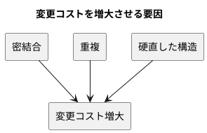
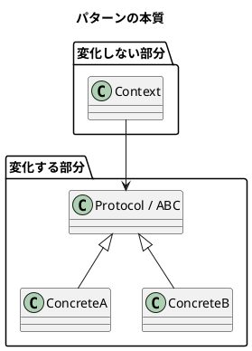

# 第 1 章: デザインパターンとパターン思考

## はじめに

ソフトウェア開発において「変更」は避けられません。要件は変わり、技術は進化し、ユーザーの期待は高まり続けます。**よいソフトウェア** --- 変更を楽に安全にできて役に立つソフトウェア --- を作るためには、変化に対応できる設計が不可欠です。

**デザインパターン**は、この「変化への対応力」を高めるための再利用可能な設計の知恵です。本シリーズでは、Python の言語特性を活かしながら、GoF の 13 デザインパターンを TDD（pytest）で実装していきます。

---

## デザインパターンとは何か

### GoF の歴史

1994 年、Erich Gamma、Richard Helm、Ralph Johnson、John Vlissides の 4 人（通称 **Gang of Four / GoF**）が『Design Patterns: Elements of Reusable Object-Oriented Software』を出版しました。この書籍は 23 のデザインパターンをカタログ化し、オブジェクト指向設計の共通語彙を確立しました。

GoF のパターンは以下の 3 カテゴリに分類されます。

| カテゴリ | 目的 | 本シリーズで扱うパターン |
|---------|------|----------------------|
| **生成（Creational）** | オブジェクトの作り方を柔軟にする | Singleton, Factory Method, Abstract Factory, Builder |
| **構造（Structural）** | オブジェクトの組み合わせ方を整理する | Adapter, Composite, Proxy, Decorator |
| **振る舞い（Behavioral）** | オブジェクト間の責務分担を明確にする | Template Method, Strategy, Observer, Iterator, Command, Interpreter |

### Russ Olsen のアプローチと Python への応用

本シリーズの源流である Russ Olsen 『Design Patterns in Ruby』は、GoF の 23 パターンから Ruby で特に有用な 13 パターンを選び、Ruby の動的な言語機能を活かした実装を示しました。

Python もまた動的型付け言語であり、Ruby と共通する特性を持ちます。しかし Python には独自の哲学「**The Zen of Python**」があり、パターンの実装にも独自のイディオムがあります。

---

## Python とパターン: ダックタイピングと型ヒント

### ダックタイピング

Python は**ダックタイピング**の言語です。「もしそれがアヒルのように歩き、アヒルのように鳴くなら、それはアヒルである」--- オブジェクトの型ではなく、オブジェクトが持つメソッドや属性で判断します。

```python
# インターフェースの宣言なしに、同じメソッドを持てばよい
class Duck:
    def speak(self) -> str:
        return "Quack!"

class Person:
    def speak(self) -> str:
        return "Hello!"

def make_it_speak(obj):
    return obj.speak()  # Duck でも Person でも動く
```

Java のように `interface` を宣言して `implements` する必要はありません。これはパターンの実装を大幅に簡潔にします。

### 型ヒントと Protocol

Python 3.5 以降、型ヒント（type hints）が導入されました。さらに Python 3.8 で `typing.Protocol` が登場し、**構造的部分型（Structural Subtyping）** が使えるようになりました。

```python
from typing import Protocol

class Speaker(Protocol):
    def speak(self) -> str: ...

# Speaker を明示的に継承しなくても、speak() を持てば Speaker として扱える
class Duck:
    def speak(self) -> str:
        return "Quack!"
```

`Protocol` はダックタイピングの柔軟さを保ちながら、静的型チェッカー（mypy）による安全性を両立させます。

---

## パターンの構造

```plantuml
@startuml
title Python のデザインパターンを支える言語機能

class <<module>> "abc" as abc {
  + ABC
  + abstractmethod()
}

class <<module>> "typing" as typing {
  + Protocol
  + Callable
}

package "パターン実装" {
  abstract class "ABC ベース" as AbcBase
  class "Protocol ベース" as ProtocolBase
  class "関数ベース" as FuncBase
}

abc --> AbcBase : 継承で強制
typing --> ProtocolBase : 構造的部分型
typing --> FuncBase : Callable 型

note bottom of AbcBase
  Template Method
  (抽象メソッドを強制)
end note

note bottom of ProtocolBase
  Observer, Adapter, Command
  (ダックタイピング + 型安全)
end note

note bottom of FuncBase
  Strategy
  (関数を第一級オブジェクトとして)
end note
@enduml
```

---

## パターンが解く問題

### 変更コストの問題

ソフトウェアの寿命が長くなるほど、変更にかかるコストは増大します。



1. **密結合（Tight Coupling）**: あるクラスを変更すると、他の多くのクラスも変更が必要になる
2. **重複（Duplication）**: 同じロジックが複数箇所に散在し、変更漏れが起きる
3. **硬直した構造（Rigidity）**: 新しい振る舞いを追加するために、既存コードの大幅な書き換えが必要になる

### パターンの本質: 変化するものを分離する

すべてのデザインパターンに共通する核心的なアイデアは、**「変化するものを、変化しないものから分離する」** ことです。



---

## Ruby / Java との比較

| 観点 | Python | Ruby | Java |
|------|--------|------|------|
| **型システム** | 動的型付け + 型ヒント | 動的型付け | 静的型付け |
| **インターフェース** | `Protocol`（構造的部分型） | ダックタイピング（宣言不要） | `interface` キーワード |
| **抽象クラス** | `ABC` + `@abstractmethod` | `raise NotImplementedError` 慣用句 | `abstract` キーワード |
| **第一級関数** | `Callable` / ラムダ | `Proc` / ブロック | `@FunctionalInterface` |
| **メタプログラミング** | メタクラス / `__getattr__` | `method_missing` / `define_method` | リフレクション / Dynamic Proxy |
| **パターン簡略化** | `@decorator` 構文、ジェネレータ | `module` の `include` / `extend` | アノテーション、ジェネリクス |

---

## まとめ

| 観点 | 内容 |
|------|------|
| **デザインパターンとは** | 変化に対応するための再利用可能な設計の知恵 |
| **Python の強み** | ダックタイピング + `Protocol` で型安全と柔軟さを両立 |
| **核心的アイデア** | 変化するものを、変化しないものから分離する |
| **本シリーズの進め方** | 各パターンを TDD（pytest）で実装し、Python イディオムを学ぶ |
