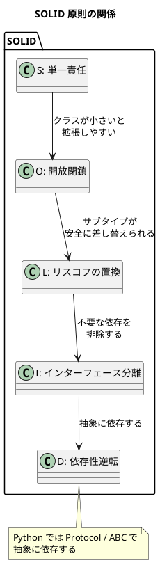
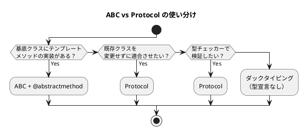

# 第 2 章: パターンを支える基本原則

## はじめに

デザインパターンは「何を作るか」のカタログですが、その背後には「なぜそう設計するか」を支える**設計原則**があります。本章では SOLID 原則を Python の文脈で解説し、`ABC`（Abstract Base Class）と `Protocol` の使い分けを明確にします。

---

## パターンの構造



---

## SOLID 原則 in Python

### S: 単一責任の原則（Single Responsibility Principle）

クラスが変更される理由は 1 つだけであるべきです。

```python
# Bad: レポートの内容とフォーマットが同じクラスに
class Report:
    def __init__(self):
        self.title = "月次報告"
    def generate(self) -> str:
        return f"<html><title>{self.title}</title></html>"

# Good: 内容とフォーマットを分離（Strategy パターン）
class Report:
    def __init__(self, formatter):
        self.title = "月次報告"
        self.formatter = formatter
    def output(self) -> str:
        return self.formatter(self)
```

### O: 開放閉鎖の原則（Open/Closed Principle）

拡張に対して開き、修正に対して閉じる。Python ではダックタイピングにより、新しいクラスを追加するだけで拡張できます。

```python
# 新しいフォーマッタを追加しても既存コードは変更不要
def markdown_formatter(report) -> str:
    return f"# {report.title}\n"
```

### L: リスコフの置換原則（Liskov Substitution Principle）

サブタイプは、そのスーパータイプと置き換え可能でなければなりません。

```python
from abc import ABC, abstractmethod

class Bird(ABC):
    @abstractmethod
    def fly(self) -> str: ...

class Penguin(Bird):  # 飛べない鳥 - LSP 違反！
    def fly(self) -> str:
        raise NotImplementedError("ペンギンは飛べません")
```

### I: インターフェース分離の原則（Interface Segregation Principle）

Python の `Protocol` は必要なメソッドだけを定義できるため、自然にインターフェース分離が実現されます。

```python
from typing import Protocol

class Readable(Protocol):
    def read(self) -> str: ...

class Writable(Protocol):
    def write(self, data: str) -> None: ...

# 読み取り専用のクラスは Writable を実装する必要がない
```

### D: 依存性逆転の原則（Dependency Inversion Principle）

上位モジュールは下位モジュールに依存せず、両者とも抽象に依存するべきです。

```python
from typing import Protocol

class Logger(Protocol):
    def log(self, message: str) -> None: ...

class Application:
    def __init__(self, logger: Logger) -> None:  # 抽象に依存
        self.logger = logger
```

---

## ABC vs Protocol: Python の 2 つの抽象化

### ABC（Abstract Base Class）

`abc` モジュールの `ABC` と `@abstractmethod` は**名目的部分型（Nominal Subtyping）** を提供します。サブクラスは明示的に継承する必要があります。

```python
from abc import ABC, abstractmethod

class Report(ABC):
    @abstractmethod
    def _output_line(self, parts: list[str], line: str) -> None:
        """サブクラスでオーバーライド必須"""

class HtmlReport(Report):  # 明示的な継承が必要
    def _output_line(self, parts: list[str], line: str) -> None:
        parts.append(f"<p>{line}</p>")
```

**使い所**: Template Method パターンのように、基底クラスにテンプレートメソッドの実装がある場合。

### Protocol

`typing.Protocol` は**構造的部分型（Structural Subtyping）** を提供します。明示的な継承は不要で、必要なメソッドを持てば適合します。

```python
from typing import Protocol

class Observer(Protocol):
    def update(self, employee: "Employee") -> None: ...

class Payroll:  # Protocol を継承しなくても OK
    def update(self, employee: "Employee") -> None:
        print(f"{employee.name} の給与が変更されました")
```

**使い所**: Strategy、Observer、Adapter のように、異なるクラスが同じインターフェースに適合すればよい場合。

### 判断基準



---

## Ruby / Java との比較

| 観点 | Python | Ruby | Java |
|------|--------|------|------|
| **抽象クラス** | `ABC` + `@abstractmethod` | `raise NotImplementedError` | `abstract class` |
| **インターフェース** | `Protocol`（構造的部分型） | 不要（ダックタイピング） | `interface` |
| **多重継承** | サポート（MRO で解決） | Mixin（`module`） | 単一継承 + `interface` |
| **抽象メソッド強制** | インスタンス化時にエラー | 実行時にエラー | コンパイル時にエラー |
| **型チェック** | mypy（オプション） | Sorbet（オプション） | コンパイラが強制 |

---

## まとめ

| 観点 | 内容 |
|------|------|
| **SOLID 原則** | パターンの「なぜ」を支える設計指針 |
| **ABC** | テンプレートメソッドのように基底実装がある場合に使う |
| **Protocol** | ダックタイピングの柔軟さを保ちつつ型安全を得る |
| **Python の強み** | ABC と Protocol の 2 つの抽象化を場面に応じて使い分けられる |
| **次章** | TDD 基盤（pytest + coverage）を構築する |
