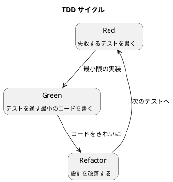

# 第 3 章: 開発環境と TDD 基盤

## はじめに

本シリーズでは、すべてのパターンを **TDD（テスト駆動開発）** で実装します。本章では Python 3.13 + pytest + coverage による TDD 基盤を構築し、Red-Green-Refactor サイクルの実践方法を確認します。

---

## パターンの構造



---

## 開発環境のセットアップ

### Python 3.13

本シリーズでは Python 3.13 を使用します。型ヒントの改善、パフォーマンスの向上が含まれています。

### プロジェクト構造

```
apps/python/design-pattern/
├── src/
│   ├── __init__.py
│   ├── template_method.py
│   ├── strategy.py
│   └── ...
├── tests/
│   ├── __init__.py
│   ├── test_template_method.py
│   ├── test_strategy.py
│   └── ...
├── pyproject.toml
└── requirements.txt
```

### pytest の設定

pytest は Python のデファクトスタンダードなテストフレームワークです。

```python
# テストの基本形
class TestGreeter:
    def test_挨拶を返す(self):
        assert greet("太郎") == "こんにちは、太郎さん"
```

**pytest の特徴**:
- `assert` 文だけでアサーションできる（特別なメソッド不要）
- テスト名に日本語が使える
- フィクスチャ（`tmp_path` など）が豊富
- プラグインによる拡張が容易

---

## TDD で作る

### Red: 失敗するテストを書く

まず、まだ存在しない関数に対するテストを書きます。

```python
# tests/test_greeter.py
from src.greeter import greet

class TestGreeter:
    def test_名前を渡すと挨拶を返す(self):
        assert greet("太郎") == "こんにちは、太郎さん"
```

テストを実行すると、`ModuleNotFoundError` で失敗します。これが **Red** の状態です。

```bash
$ pytest tests/test_greeter.py -v
FAILED - ModuleNotFoundError: No module named 'src.greeter'
```

### Green: テストを通す最小のコードを書く

テストを通すための最小限のコードを書きます。

```python
# src/greeter.py
def greet(name: str) -> str:
    return f"こんにちは、{name}さん"
```

```bash
$ pytest tests/test_greeter.py -v
PASSED
```

### Refactor: 設計を改善する

テストが通った状態で、コードの設計を改善します。この段階では改善の余地はありませんが、実際のパターン実装では重複の除去、命名の改善、責務の分離を行います。

---

## pytest の便利な機能

### パラメータ化テスト

```python
import pytest

@pytest.mark.parametrize("name, expected", [
    ("太郎", "こんにちは、太郎さん"),
    ("花子", "こんにちは、花子さん"),
])
def test_パラメータ化された挨拶(name, expected):
    assert greet(name) == expected
```

### フィクスチャ

```python
@pytest.fixture
def tmp_file(tmp_path):
    """一時ファイルを作成するフィクスチャ"""
    path = tmp_path / "test.txt"
    path.write_text("hello")
    return path
```

### 例外のテスト

```python
def test_基底クラスを直接インスタンス化できない():
    with pytest.raises(TypeError):
        Report()  # ABC なのでインスタンス化できない
```

---

## カバレッジの計測

```bash
$ pytest --cov=src --cov-report=term-missing
```

カバレッジはコード品質の指標の 1 つですが、100% カバレッジが目標ではありません。TDD で書けば自然と高いカバレッジになります。

---

## Ruby / Java との比較

| 観点 | Python (pytest) | Ruby (Minitest) | Java (JUnit 5) |
|------|----------------|-----------------|-----------------|
| **テストフレームワーク** | pytest | Minitest / RSpec | JUnit 5 |
| **アサーション** | `assert` 文 | `assert_equal` など | `assertEquals` など |
| **テスト命名** | 日本語メソッド名 OK | 日本語メソッド名 OK | `@DisplayName` で日本語 |
| **フィクスチャ** | `@pytest.fixture` | `setup` / `teardown` | `@BeforeEach` / `@AfterEach` |
| **パラメータ化** | `@pytest.mark.parametrize` | ループで代用 | `@ParameterizedTest` |
| **カバレッジ** | pytest-cov | SimpleCov | JaCoCo |
| **実行コマンド** | `pytest` | `rake test` | `./gradlew test` |

---

## まとめ

| 観点 | 内容 |
|------|------|
| **TDD サイクル** | Red（失敗するテスト） → Green（最小の実装） → Refactor（設計改善） |
| **テストフレームワーク** | pytest --- `assert` 文だけでシンプルにテストを書ける |
| **Python の強み** | 日本語テスト名、豊富なフィクスチャ、`tmp_path` による一時ファイル管理 |
| **カバレッジ** | pytest-cov で計測。TDD なら自然と高カバレッジになる |
| **次章** | Template Method パターンで最初のパターンを TDD で実装する |
