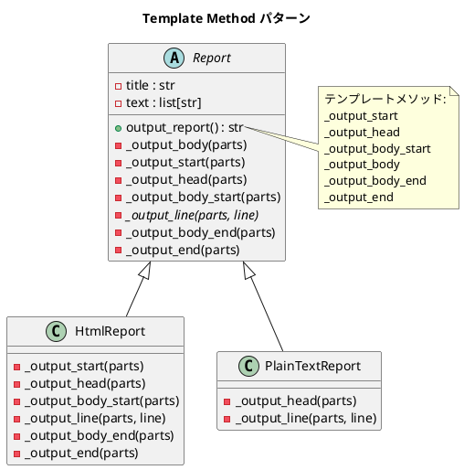

# 第 4 章: Template Method

## はじめに

レポートを HTML とプレーンテキストの 2 つの形式で出力したいとします。出力の「骨格」は同じ（タイトル → 本文 → フッター）ですが、各ステップの具体的な処理は形式ごとに異なります。

**Template Method パターン**は、アルゴリズムの骨格を基底クラスで定義し、具体的なステップをサブクラスに委ねるパターンです。Python では `ABC` + `@abstractmethod` でこれを実現します。

---

## パターンの構造



**登場人物**:

- **AbstractClass（Report）**: テンプレートメソッド `output_report` でアルゴリズムの骨格を定義する
- **ConcreteClass（HtmlReport / PlainTextReport）**: 各ステップ（フックメソッド）をオーバーライドする

---

## TDD で作る

### Red: テストを書く

まず、HTML レポートの期待出力をテストで定義します。

```python
# tests/test_template_method.py
import pytest
from src.template_method import HtmlReport, PlainTextReport, Report


class TestHtmlReport:
    def test_html形式でレポートを出力する(self):
        report = HtmlReport()
        result = report.output_report()
        assert "<html>" in result
        assert "</html>" in result

    def test_htmlヘッダーにタイトルを含む(self):
        report = HtmlReport()
        result = report.output_report()
        assert "<title>月次報告</title>" in result

    def test_html本文にテキストをp要素で含む(self):
        report = HtmlReport()
        result = report.output_report()
        assert "<p>順調</p>" in result
        assert "<p>最高の調子</p>" in result


class TestPlainTextReport:
    def test_プレーンテキスト形式でレポートを出力する(self):
        report = PlainTextReport()
        result = report.output_report()
        assert "***** 月次報告 *****" in result

    def test_プレーンテキストにテキスト行を含む(self):
        report = PlainTextReport()
        result = report.output_report()
        assert "順調" in result
        assert "最高の調子" in result


class TestReportBaseClass:
    def test_基底クラスを直接インスタンス化できない(self):
        with pytest.raises(TypeError):
            Report()
```

### Green: 実装する

**基底クラス Report** --- `ABC` と `@abstractmethod` でテンプレートメソッドを定義します。

```python
# src/template_method.py
from abc import ABC, abstractmethod


class Report(ABC):
    """基底レポートクラス（Template Method パターン）"""

    def __init__(self) -> None:
        self.title: str = "月次報告"
        self.text: list[str] = ["順調", "最高の調子"]

    def output_report(self) -> str:
        """テンプレートメソッド: レポート出力の骨格"""
        parts: list[str] = []
        self._output_start(parts)
        self._output_head(parts)
        self._output_body_start(parts)
        self._output_body(parts)
        self._output_body_end(parts)
        self._output_end(parts)
        return "".join(parts)

    def _output_body(self, parts: list[str]) -> None:
        for line in self.text:
            self._output_line(parts, line)

    # フックメソッド（デフォルトは何もしない）
    def _output_start(self, parts: list[str]) -> None:
        pass

    def _output_head(self, parts: list[str]) -> None:
        self._output_line(parts, self.title)

    def _output_body_start(self, parts: list[str]) -> None:
        pass

    @abstractmethod
    def _output_line(self, parts: list[str], line: str) -> None:
        """抽象メソッド: サブクラスでオーバーライド必須"""

    def _output_body_end(self, parts: list[str]) -> None:
        pass

    def _output_end(self, parts: list[str]) -> None:
        pass
```

**サブクラス HtmlReport** --- HTML 固有の出力を実装します。

```python
class HtmlReport(Report):
    def _output_start(self, parts: list[str]) -> None:
        parts.append("<html>\n")

    def _output_head(self, parts: list[str]) -> None:
        parts.append(f"  <head><title>{self.title}</title></head>\n")

    def _output_body_start(self, parts: list[str]) -> None:
        parts.append("  <body>\n")

    def _output_line(self, parts: list[str], line: str) -> None:
        parts.append(f"    <p>{line}</p>\n")

    def _output_body_end(self, parts: list[str]) -> None:
        parts.append("  </body>\n")

    def _output_end(self, parts: list[str]) -> None:
        parts.append("</html>\n")
```

**サブクラス PlainTextReport** --- 必要なメソッドだけオーバーライドします。

```python
class PlainTextReport(Report):
    def _output_head(self, parts: list[str]) -> None:
        parts.append(f"***** {self.title} *****\n")

    def _output_line(self, parts: list[str], line: str) -> None:
        parts.append(f"{line}\n")
```

### Refactor: 振り返り

- `PlainTextReport` は `_output_start` や `_output_end` をオーバーライドしていません。基底クラスの空メソッド（フックメソッド）がデフォルト動作を提供しているため、必要な部分だけ上書きすればよいのです。
- `@abstractmethod` により、`_output_line` を実装しないサブクラスはインスタンス化時に `TypeError` が発生します。これは Ruby の `raise NotImplementedError`（実行時エラー）よりも早い段階でエラーを検出できます。

---

## Ruby / Java との比較

| 観点 | Python | Ruby | Java |
|------|--------|------|------|
| **抽象メソッド** | `@abstractmethod` | `raise NotImplementedError` | `abstract` キーワード |
| **エラー検出タイミング** | インスタンス化時 | メソッド呼び出し時 | コンパイル時 |
| **フックメソッド** | `pass`（空メソッド） | `def method; end` | 空メソッド |
| **テンプレートメソッドの可視性** | `_` プレフィックス（慣習） | `protected` / `private` | `protected` / `final` |
| **出力方法** | 文字列リストに `append` | `puts` で標準出力 | `StringBuilder` |

---

## まとめ

| 観点 | 内容 |
|------|------|
| **意図** | アルゴリズムの骨格を定義し、一部のステップをサブクラスに委ねる |
| **Python の実装** | `ABC` + `@abstractmethod` で抽象メソッドを強制 |
| **適用場面** | 複数のバリエーションが同じ手順の骨格を共有する場合 |
| **メリット** | コードの重複を排除し、拡張ポイントを明確にする |
| **注意点** | サブクラスが増えると継承階層が深くなる → 次章の Strategy パターンで解決 |
| **関連パターン** | Strategy（委譲で差し替え）、Factory Method（生成ステップの Template Method） |
