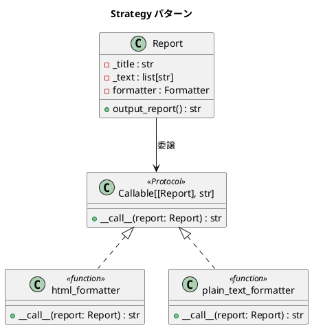

# 第 5 章: Strategy

## はじめに

前章の Template Method パターンでは、継承で出力形式のバリエーションを実現しました。しかし、フォーマットを切り替えるたびに別のサブクラスを作る必要があり、柔軟性に限界があります。

**Strategy パターン**は、アルゴリズムをオブジェクト（または関数）としてカプセル化し、実行時に差し替え可能にするパターンです。Python では**関数が第一級オブジェクト**であるため、クラスを定義せずに関数やラムダで Strategy を表現できます。

---

## パターンの構造



**登場人物**:

- **Context（Report）**: フォーマッタへの参照を持ち、出力処理を委譲する
- **Strategy（Formatter）**: `Callable[[Report], str]` 型エイリアス
- **ConcreteStrategy（html_formatter / plain_text_formatter）**: 具体的なフォーマット関数

---

## TDD で作る

### Red: テストを書く

```python
# tests/test_strategy.py
from src.strategy import Report, html_formatter, plain_text_formatter


class TestHtmlFormatter:
    def test_html形式でレポートを出力する(self):
        report = Report(html_formatter)
        result = report.output_report()
        assert "<html>" in result
        assert "</html>" in result

    def test_htmlにタイトルを含む(self):
        report = Report(html_formatter)
        result = report.output_report()
        assert "<title>月次報告</title>" in result


class TestPlainTextFormatter:
    def test_プレーンテキスト形式でレポートを出力する(self):
        report = Report(plain_text_formatter)
        result = report.output_report()
        assert "***** 月次報告 *****" in result


class TestStrategySwap:
    def test_実行時にフォーマッタを切り替えられる(self):
        report = Report(html_formatter)
        assert "<html>" in report.output_report()

        report.formatter = plain_text_formatter
        assert "***** 月次報告 *****" in report.output_report()

    def test_ラムダをフォーマッタとして使える(self):
        custom = lambda r: f"CUSTOM: {r.title}"
        report = Report(custom)
        assert report.output_report() == "CUSTOM: 月次報告"
```

### Green: 実装する

```python
# src/strategy.py
from typing import Callable, Protocol


class Report:
    """レポートクラス（Strategy パターン）"""

    def __init__(self, formatter: "Formatter") -> None:
        self._title: str = "月次報告"
        self._text: list[str] = ["順調", "最高の調子"]
        self.formatter = formatter

    @property
    def title(self) -> str:
        return self._title

    @property
    def text(self) -> list[str]:
        return list(self._text)

    def output_report(self) -> str:
        return self.formatter(self)


Formatter = Callable[["Report"], str]


def html_formatter(report: Report) -> str:
    """HTML フォーマット戦略"""
    lines = [
        "<html>",
        f"  <head><title>{report.title}</title></head>",
        "  <body>",
    ]
    for line in report.text:
        lines.append(f"    <p>{line}</p>")
    lines.append("  </body>")
    lines.append("</html>")
    return "\n".join(lines) + "\n"


def plain_text_formatter(report: Report) -> str:
    """プレーンテキストフォーマット戦略"""
    lines = [f"***** {report.title} *****"]
    for line in report.text:
        lines.append(line)
    return "\n".join(lines) + "\n"
```

### Refactor: 振り返り

- 関数が第一級オブジェクトであるため、Strategy インターフェース用のクラスを定義する必要がありません。`Callable[[Report], str]` という型エイリアスだけで十分です。
- ラムダ式で即席の Strategy を作れるため、テスト時のモックも容易です。
- `report.formatter = plain_text_formatter` で実行時に切り替え可能です。

---

## Ruby / Java との比較

| 観点 | Python | Ruby | Java |
|------|--------|------|------|
| **Strategy の表現** | 関数 / `Callable` | ブロック / `Proc` | `@FunctionalInterface` |
| **クラス不要** | 関数だけで OK | ブロックだけで OK | ラムダ式で OK（Java 8+） |
| **型安全** | `Callable[[Report], str]` | 型なし | `Function<Report, String>` |
| **切り替え** | 属性の再代入 | 属性の再代入 | setter メソッド |
| **即席 Strategy** | `lambda r: ...` | `-> (r) { ... }` | `r -> ...` |

---

## まとめ

| 観点 | 内容 |
|------|------|
| **意図** | アルゴリズムをカプセル化し、実行時に差し替え可能にする |
| **Python の実装** | 関数（第一級オブジェクト）+ `Callable` 型エイリアス |
| **Template Method との違い** | 継承ではなく委譲。クラス爆発を避けられる |
| **適用場面** | フォーマット、ソート、バリデーションなど複数のアルゴリズムを切り替えたい場合 |
| **Python らしさ** | クラスを定義せず関数やラムダで Strategy を表現できる |
| **関連パターン** | Template Method（継承で実現）、Command（操作のカプセル化） |
