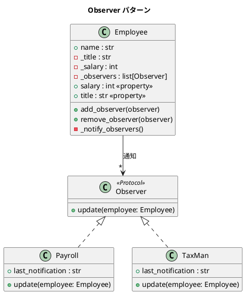

# 第 6 章: Observer

## はじめに

従業員の給与やタイトルが変更されたとき、給与計算システムや税務システムに自動的に通知したいとします。変更のたびに通知先を if 文で列挙するのは、密結合で変更に弱い設計です。

**Observer パターン**は、あるオブジェクト（Subject）の状態が変化したとき、依存するオブジェクト（Observer）に自動的に通知するパターンです。Python では `@property` の setter でプロパティ変更時のコールバックを自然に実現できます。

---

## パターンの構造



**登場人物**:

- **Subject（Employee）**: オブザーバーのリストを管理し、状態変更時に通知する
- **Observer（Protocol）**: `update` メソッドを定義するプロトコル
- **ConcreteObserver（Payroll / TaxMan）**: 通知を受けて処理を行う

---

## TDD で作る

### Red: テストを書く

```python
# tests/test_observer.py
from src.observer import Employee, Payroll, TaxMan


class TestEmployee:
    def test_従業員の初期状態(self):
        emp = Employee("田中", "エンジニア", 500000)
        assert emp.name == "田中"
        assert emp.title == "エンジニア"
        assert emp.salary == 500000

    def test_給与変更でオブザーバーに通知される(self):
        emp = Employee("田中", "エンジニア", 500000)
        payroll = Payroll()
        emp.add_observer(payroll)

        emp.salary = 600000
        assert "田中" in payroll.last_notification
        assert "600000" in payroll.last_notification

    def test_複数のオブザーバーが通知を受け取る(self):
        emp = Employee("田中", "エンジニア", 500000)
        payroll = Payroll()
        taxman = TaxMan()
        emp.add_observer(payroll)
        emp.add_observer(taxman)

        emp.salary = 700000
        assert payroll.last_notification != ""
        assert taxman.last_notification != ""

    def test_タイトル変更でオブザーバーに通知される(self):
        emp = Employee("田中", "エンジニア", 500000)
        taxman = TaxMan()
        emp.add_observer(taxman)

        emp.title = "シニアエンジニア"
        assert "田中" in taxman.last_notification

    def test_オブザーバーを削除できる(self):
        emp = Employee("田中", "エンジニア", 500000)
        payroll = Payroll()
        emp.add_observer(payroll)
        emp.remove_observer(payroll)

        emp.salary = 600000
        assert payroll.last_notification == ""
```

`title` プロパティの setter も `salary` と同様に `_notify_observers()` を呼び出します。これにより、役職変更時にも全オブザーバーに通知が届きます。

### Green: 実装する

```python
# src/observer.py
from typing import Protocol


class Observer(Protocol):
    """オブザーバープロトコル"""
    def update(self, employee: "Employee") -> None: ...


class Employee:
    """従業員クラス（Observer パターン - Subject）"""

    def __init__(self, name: str, title: str, salary: int) -> None:
        self.name = name
        self._title = title
        self._salary = salary
        self._observers: list[Observer] = []

    def add_observer(self, observer: Observer) -> None:
        self._observers.append(observer)

    def remove_observer(self, observer: Observer) -> None:
        self._observers.remove(observer)

    def _notify_observers(self) -> None:
        for observer in self._observers:
            observer.update(self)

    @property
    def salary(self) -> int:
        return self._salary

    @salary.setter
    def salary(self, new_salary: int) -> None:
        self._salary = new_salary
        self._notify_observers()

    @property
    def title(self) -> str:
        return self._title

    @title.setter
    def title(self, new_title: str) -> None:
        self._title = new_title
        self._notify_observers()
```

```python
class Payroll:
    """給与計算オブザーバー"""
    def __init__(self) -> None:
        self.last_notification: str = ""

    def update(self, employee: Employee) -> None:
        self.last_notification = (
            f"{employee.name} の給与が {employee.salary} に変更されました"
        )


class TaxMan:
    """税務担当オブザーバー"""
    def __init__(self) -> None:
        self.last_notification: str = ""

    def update(self, employee: Employee) -> None:
        self.last_notification = (
            f"{employee.name} に新しい税金の請求書を送付します"
        )
```

### Refactor: 振り返り

- `@property` の setter に通知ロジックを組み込むことで、`emp.salary = 600000` や `emp.title = "シニアエンジニア"` という自然な代入構文で Observer への通知が発火します。`salary` と `title` の両方が setter を持ち、変更時に `_notify_observers()` を呼び出す設計です。
- `Observer` は `Protocol` で定義しているため、`Payroll` や `TaxMan` は明示的に `Observer` を継承する必要がありません。`update` メソッドを持つだけで適合します。

---

## Ruby / Java との比較

| 観点 | Python | Ruby | Java |
|------|--------|------|------|
| **Subject の通知** | `@property` setter | `Observable` モジュール / 手動 | `PropertyChangeSupport` |
| **Observer の定義** | `Protocol` | ダックタイピング | `interface Observer` / リスナー |
| **プロパティ変更** | `emp.salary = 600000` | `emp.salary = 600000` | `emp.setSalary(600000)` |
| **通知の仕組み** | setter 内で `_notify_observers()` | `changed` + `notify_observers` | `firePropertyChange` |
| **Observer の登録** | `add_observer(obs)` | `add_observer(obs)` | `addPropertyChangeListener(l)` |

---

## まとめ

| 観点 | 内容 |
|------|------|
| **意図** | オブジェクトの状態変化を、依存オブジェクトに自動通知する |
| **Python の実装** | `@property` setter + `Protocol` でコールバックを実現 |
| **適用場面** | 1 つのオブジェクトの変更が複数のオブジェクトに影響する場合 |
| **メリット** | Subject と Observer が疎結合。Observer の追加・削除が容易 |
| **Python らしさ** | `@property` setter で自然な代入構文を維持しつつ通知を発火 |
| **関連パターン** | Mediator（多対多の通知を仲介）、Event（イベント駆動アーキテクチャ） |
