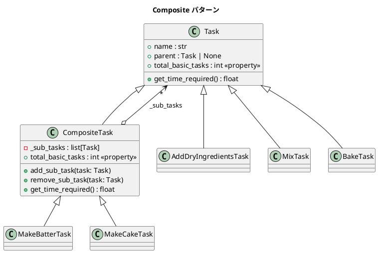

# 第 7 章: Composite

## はじめに

ケーキを作るプロセスは、「生地を作る」「焼く」「アイシングする」などのタスクで構成されます。「生地を作る」はさらに「乾燥材料を加える」「液体を加える」「混ぜる」に分解できます。個々のタスクも複合タスクも、同じ「タスク」として扱いたい場面です。

**Composite パターン**は、個々のオブジェクト（Leaf）と複合オブジェクト（Composite）を同一のインターフェースで扱えるようにするパターンです。Python ではダックタイピングにより、共通インターフェースの宣言が不要です。

---

## パターンの構造



**登場人物**:

- **Component（Task）**: リーフとコンポジットの共通インターフェース
- **Leaf（AddDryIngredientsTask 等）**: 末端のタスク
- **Composite（CompositeTask / MakeBatterTask / MakeCakeTask）**: 子タスクを持つ複合タスク

---

## TDD で作る

### Red: テストを書く

```python
# tests/test_composite.py
from src.composite import (
    AddDryIngredientsTask, CompositeTask,
    MakeBatterTask, MakeCakeTask,
)


class TestLeafTask:
    def test_リーフタスクの名前(self):
        task = AddDryIngredientsTask()
        assert task.name == "乾燥材料を加える"

    def test_リーフタスクの時間(self):
        task = AddDryIngredientsTask()
        assert task.get_time_required() == 1.0

    def test_リーフタスクの基本タスク数は1(self):
        task = AddDryIngredientsTask()
        assert task.total_basic_tasks == 1


class TestCompositeTask:
    def test_サブタスクを追加できる(self):
        composite = CompositeTask("テスト")
        task = AddDryIngredientsTask()
        composite.add_sub_task(task)
        assert len(composite.sub_tasks) == 1
        assert task.parent is composite


class TestMakeCakeTask:
    def test_ケーキ作りの合計時間(self):
        cake = MakeCakeTask()
        assert cake.get_time_required() == 22.0  # 5 + 2 + 10 + 4 + 1

    def test_ケーキ作りの基本タスク数(self):
        cake = MakeCakeTask()
        assert cake.total_basic_tasks == 7
```

### Green: 実装する

```python
# src/composite.py
from __future__ import annotations


class Task:
    """基底タスククラス（Component）"""

    def __init__(self, name: str) -> None:
        self.name = name
        self.parent: Task | None = None

    def get_time_required(self) -> float:
        return 0.0

    @property
    def total_basic_tasks(self) -> int:
        return 1


class CompositeTask(Task):
    """複合タスククラス（Composite）"""

    def __init__(self, name: str) -> None:
        super().__init__(name)
        self._sub_tasks: list[Task] = []

    def add_sub_task(self, task: Task) -> None:
        self._sub_tasks.append(task)
        task.parent = self

    def remove_sub_task(self, task: Task) -> None:
        self._sub_tasks.remove(task)
        task.parent = None

    def get_time_required(self) -> float:
        return sum(t.get_time_required() for t in self._sub_tasks)

    @property
    def total_basic_tasks(self) -> int:
        return sum(t.total_basic_tasks for t in self._sub_tasks)
```

リーフタスクは `get_time_required()` をオーバーライドするだけです。

```python
class AddDryIngredientsTask(Task):
    def __init__(self) -> None:
        super().__init__("乾燥材料を加える")

    def get_time_required(self) -> float:
        return 1.0
```

### Refactor: 振り返り

- Python のダックタイピングにより、`Task` と `CompositeTask` が同じメソッド `get_time_required()` を持つだけで、コンポジットのクライアントは個々のタスクと複合タスクを区別せずに扱えます。
- `sum(t.get_time_required() for t in self._sub_tasks)` というジェネレータ式で、再帰的な集計を簡潔に表現しています。

---

## Ruby / Java との比較

| 観点 | Python | Ruby | Java |
|------|--------|------|------|
| **共通インターフェース** | 継承（ダックタイピングでも可） | ダックタイピング | `interface Component` |
| **子の管理** | `list[Task]` | `Array` | `List<Component>` |
| **再帰集計** | `sum(t.method() for t in ...)` | `inject(:+)` | `stream().mapToDouble().sum()` |
| **親への参照** | `task.parent = self` | `task.parent = self` | `task.setParent(this)` |
| **型安全** | 型ヒントでオプション | なし | ジェネリクスで強制 |

---

## まとめ

| 観点 | 内容 |
|------|------|
| **意図** | 個々のオブジェクトと複合オブジェクトを同一視する |
| **Python の実装** | 継承 + ダックタイピング。ジェネレータ式で再帰集計 |
| **適用場面** | ツリー構造（ファイルシステム、組織図、タスク分解） |
| **メリット** | クライアントが Leaf と Composite を区別せずに扱える |
| **注意点** | Composite に不要な操作（`add_sub_task` など）が Leaf に漏れないよう注意 |
| **関連パターン** | Iterator（ツリーの走査）、Visitor（ツリーへの操作の追加） |
