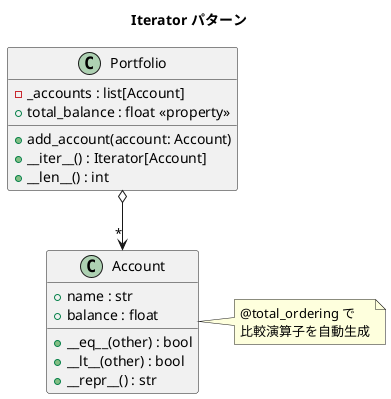

# 第 8 章: Iterator

## はじめに

ポートフォリオ（口座の集合）を `for` ループで回したいとします。Python では `__iter__` メソッドを実装するだけで、あらゆるオブジェクトが `for-in` ループの対象になります。Iterator パターンは Python の言語機能そのものに組み込まれています。

**Iterator パターン**は、コレクションの内部構造を公開せずに、要素を順番にアクセスする手段を提供するパターンです。Python では `__iter__` / `__next__` プロトコルとジェネレータで実現します。

---

## パターンの構造



**登場人物**:

- **Aggregate（Portfolio）**: `__iter__` を実装してイテラブルになる
- **Iterator**: `iter()` が返すイテレータオブジェクト（Python の組み込み機能）
- **Element（Account）**: `@total_ordering` で比較可能なデータオブジェクト

---

## TDD で作る

### Red: テストを書く

```python
# tests/test_iterator.py
from src.iterator_pattern import Account, Portfolio


class TestAccount:
    def test_口座の初期状態(self):
        account = Account("普通預金", 1000.0)
        assert account.name == "普通預金"
        assert account.balance == 1000.0

    def test_口座の比較(self):
        a = Account("A", 1000.0)
        b = Account("B", 2000.0)
        assert a < b
        assert b > a

    def test_口座のソート(self):
        accounts = [
            Account("C", 3000.0),
            Account("A", 1000.0),
            Account("B", 2000.0),
        ]
        sorted_accounts = sorted(accounts)
        assert [a.name for a in sorted_accounts] == ["A", "B", "C"]


class TestPortfolio:
    def test_forループでイテレートできる(self):
        portfolio = Portfolio()
        portfolio.add_account(Account("A", 1000.0))
        portfolio.add_account(Account("B", 2000.0))

        names = [a.name for a in portfolio]
        assert names == ["A", "B"]

    def test_合計残高を計算できる(self):
        portfolio = Portfolio()
        portfolio.add_account(Account("A", 1000.0))
        portfolio.add_account(Account("B", 2000.0))
        assert portfolio.total_balance == 3000.0
```

### Green: 実装する

```python
# src/iterator_pattern.py
from __future__ import annotations
from functools import total_ordering
from typing import Iterator


@total_ordering
class Account:
    """口座クラス"""

    def __init__(self, name: str, balance: float) -> None:
        self.name = name
        self.balance = balance

    def __eq__(self, other: object) -> bool:
        if not isinstance(other, Account):
            return NotImplemented
        return self.balance == other.balance

    def __lt__(self, other: object) -> bool:
        if not isinstance(other, Account):
            return NotImplemented
        return self.balance < other.balance

    def __repr__(self) -> str:
        return f"Account({self.name!r}, {self.balance})"


class Portfolio:
    """ポートフォリオクラス（Iterable）"""

    def __init__(self) -> None:
        self._accounts: list[Account] = []

    def add_account(self, account: Account) -> None:
        self._accounts.append(account)

    def __iter__(self) -> Iterator[Account]:
        return iter(self._accounts)

    def __len__(self) -> int:
        return len(self._accounts)

    @property
    def total_balance(self) -> float:
        return sum(a.balance for a in self._accounts)
```

### Refactor: 振り返り

- `__iter__` を実装するだけで、`for a in portfolio` が使えます。リスト内包表記やジェネレータ式とも組み合わせ可能です。
- `@total_ordering` デコレータにより、`__eq__` と `__lt__` だけ定義すれば、`>`, `>=`, `<=` も自動生成されます。
- `sum(a.balance for a in self._accounts)` というジェネレータ式で合計を簡潔に計算しています。

---

## Ruby / Java との比較

| 観点 | Python | Ruby | Java |
|------|--------|------|------|
| **イテラブル** | `__iter__` / `__next__` | `Enumerable` + `each` | `Iterable<T>` + `Iterator<T>` |
| **for ループ** | `for x in obj` | `obj.each { |x| }` | `for (var x : obj)` |
| **ジェネレータ** | `yield` 式 | `Enumerator` | `Stream<T>`（類似） |
| **ソート** | `sorted()` + `__lt__` | `sort` + `<=>` | `Comparable<T>` + `compareTo` |
| **比較演算子の自動生成** | `@total_ordering` | `Comparable` include | なし（全メソッド実装） |
| **リスト内包表記** | `[a.name for a in portfolio]` | `portfolio.map(&:name)` | `stream().map().toList()` |

---

## まとめ

| 観点 | 内容 |
|------|------|
| **意図** | コレクションの内部構造を公開せずに要素を順番にアクセスする |
| **Python の実装** | `__iter__` プロトコル + `@total_ordering` |
| **適用場面** | カスタムコレクションを for ループで走査したい場合 |
| **Python らしさ** | `__iter__` だけでリスト内包表記、`sorted()`、`sum()` すべてが使える |
| **メリット** | Python の組み込み機能と完全に統合される |
| **関連パターン** | Composite（ツリー構造の走査）、Visitor（走査中の操作） |
