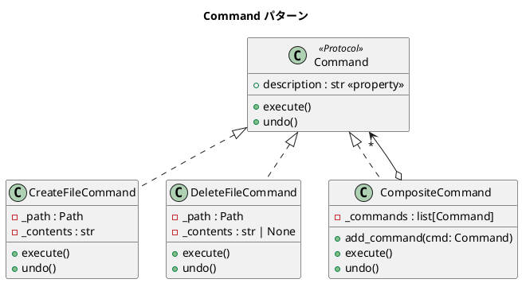

# 第 9 章: Command

## はじめに

ファイルの作成・削除といった操作を「実行」するだけでなく、「取り消し（undo）」もサポートしたいとします。操作をオブジェクトとしてカプセル化すれば、実行履歴の管理や undo が容易になります。

**Command パターン**は、操作をオブジェクトとしてカプセル化し、実行・取り消し・再実行を可能にするパターンです。Python では `Protocol` で Command インターフェースを定義し、callable オブジェクトとしても扱えます。

---

## パターンの構造



**登場人物**:

- **Command（Protocol）**: `execute` / `undo` メソッドを持つプロトコル
- **ConcreteCommand（CreateFileCommand / DeleteFileCommand）**: 具体的な操作
- **MacroCommand（CompositeCommand）**: 複数のコマンドをまとめて実行・取り消し

---

## TDD で作る

### Red: テストを書く

```python
# tests/test_command.py
import os
from src.command import CompositeCommand, CreateFileCommand, DeleteFileCommand


class TestCreateFileCommand:
    def test_ファイルを作成できる(self, tmp_path):
        path = str(tmp_path / "test.txt")
        cmd = CreateFileCommand(path, "hello")
        cmd.execute()
        assert os.path.exists(path)
        with open(path) as f:
            assert f.read() == "hello"

    def test_作成をundoできる(self, tmp_path):
        path = str(tmp_path / "test.txt")
        cmd = CreateFileCommand(path, "hello")
        cmd.execute()
        cmd.undo()
        assert not os.path.exists(path)


class TestCompositeCommand:
    def test_複合コマンドをundoできる(self, tmp_path):
        path1 = str(tmp_path / "file1.txt")
        path2 = str(tmp_path / "file2.txt")

        composite = CompositeCommand()
        composite.add_command(CreateFileCommand(path1, "aaa"))
        composite.add_command(CreateFileCommand(path2, "bbb"))
        composite.execute()
        composite.undo()

        assert not os.path.exists(path1)
        assert not os.path.exists(path2)
```

### Green: 実装する

```python
# src/command.py
from __future__ import annotations
from pathlib import Path
from typing import Protocol


class Command(Protocol):
    """コマンドプロトコル"""
    @property
    def description(self) -> str: ...
    def execute(self) -> None: ...
    def undo(self) -> None: ...


class CreateFileCommand:
    """ファイル作成コマンド"""

    def __init__(self, path: str, contents: str) -> None:
        self._path = Path(path)
        self._contents = contents

    @property
    def description(self) -> str:
        return f"Create file: {self._path}"

    def execute(self) -> None:
        self._path.write_text(self._contents, encoding="utf-8")

    def undo(self) -> None:
        if self._path.exists():
            self._path.unlink()


class DeleteFileCommand:
    """ファイル削除コマンド"""

    def __init__(self, path: str) -> None:
        self._path = Path(path)
        self._contents: str | None = None

    @property
    def description(self) -> str:
        return f"Delete file: {self._path}"

    def execute(self) -> None:
        if self._path.exists():
            self._contents = self._path.read_text(encoding="utf-8")
            self._path.unlink()

    def undo(self) -> None:
        if self._contents is not None:
            self._path.write_text(self._contents, encoding="utf-8")


class CompositeCommand:
    """複合コマンド"""

    def __init__(self) -> None:
        self._commands: list[Command] = []

    def add_command(self, cmd: Command) -> None:
        self._commands.append(cmd)

    @property
    def description(self) -> str:
        return "\n".join(c.description for c in self._commands)

    def execute(self) -> None:
        for cmd in self._commands:
            cmd.execute()

    def undo(self) -> None:
        for cmd in reversed(self._commands):
            cmd.undo()
```

### Refactor: 振り返り

- `undo()` で `reversed(self._commands)` を使い、逆順に取り消します。これにより、依存関係のある操作も正しく undo できます。
- `pathlib.Path` を使うことで、ファイル操作がオブジェクト指向的に記述でき、`os.path` よりも可読性が高くなっています。
- pytest の `tmp_path` フィクスチャにより、テスト後の一時ファイルの掃除が自動化されています。

---

## Ruby / Java との比較

| 観点 | Python | Ruby | Java |
|------|--------|------|------|
| **Command インターフェース** | `Protocol` | ダックタイピング | `interface Command` |
| **ファイル操作** | `pathlib.Path` | `File` クラス | `java.nio.file.Files` |
| **undo の逆順** | `reversed(list)` | `reverse_each` | `Collections.reverse()` |
| **一時ファイルテスト** | `tmp_path` フィクスチャ | `Tempfile` | `@TempDir` |
| **callable** | `__call__` で関数的に呼べる | `call` メソッド | `Runnable` / `Callable<T>` |

---

## まとめ

| 観点 | 内容 |
|------|------|
| **意図** | 操作をオブジェクトとしてカプセル化し、実行・取り消しを可能にする |
| **Python の実装** | `Protocol` + `pathlib.Path` でファイル操作コマンドを実装 |
| **適用場面** | undo/redo、マクロ記録、トランザクション |
| **メリット** | 操作の履歴管理、複合コマンドによるバッチ処理 |
| **Python らしさ** | `pathlib` でファイル操作を簡潔に。`reversed()` で逆順 undo |
| **関連パターン** | Composite（複合コマンド）、Memento（状態の保存と復元） |
