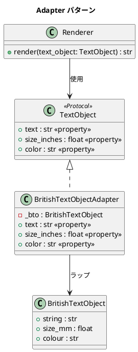

# 第 10 章: Adapter

## はじめに

英国式のテキストオブジェクト（ミリメートル単位、`colour` プロパティ）を、インチ単位・`color` プロパティを期待するシステムで使いたいとします。既存のクラスを変更せずに、インターフェースの不一致を解決するのが Adapter パターンです。

**Adapter パターン**は、既存クラスのインターフェースを、クライアントが期待するインターフェースに変換するラッパーです。Python ではダックタイピングにより、`Protocol` に適合するプロパティを持つラッパークラスを作るだけで実現できます。

---

## パターンの構造



**登場人物**:

- **Target（TextObject Protocol）**: クライアントが期待するインターフェース
- **Adaptee（BritishTextObject）**: 適合させたい既存クラス
- **Adapter（BritishTextObjectAdapter）**: Adaptee を Target に変換するラッパー
- **Client（Renderer）**: Target インターフェースを使用する

---

## TDD で作る

### Red: テストを書く

```python
# tests/test_adapter.py
import pytest
from src.adapter import BritishTextObject, BritishTextObjectAdapter, Renderer


class TestBritishTextObjectAdapter:
    def test_textプロパティがstringを返す(self):
        bto = BritishTextObject("Hello", 25.4, "red")
        adapter = BritishTextObjectAdapter(bto)
        assert adapter.text == "Hello"

    def test_size_inchesがmmからインチに変換する(self):
        bto = BritishTextObject("Hello", 25.4, "red")
        adapter = BritishTextObjectAdapter(bto)
        assert adapter.size_inches == pytest.approx(1.0)

    def test_colorプロパティがcolourを返す(self):
        bto = BritishTextObject("Hello", 25.4, "red")
        adapter = BritishTextObjectAdapter(bto)
        assert adapter.color == "red"

    def test_レンダラーがアダプターを使用できる(self):
        bto = BritishTextObject("Hello", 50.8, "blue")
        adapter = BritishTextObjectAdapter(bto)
        renderer = Renderer()
        result = renderer.render(adapter)
        assert "text:Hello" in result
        assert "size:2.0" in result
        assert "color:blue" in result
```

### Green: 実装する

```python
# src/adapter.py
from typing import Protocol


class TextObject(Protocol):
    """テキストオブジェクトプロトコル（Target）"""
    @property
    def text(self) -> str: ...
    @property
    def size_inches(self) -> float: ...
    @property
    def color(self) -> str: ...


class BritishTextObject:
    """英国式テキストオブジェクト（Adaptee）"""

    def __init__(self, string: str, size_mm: float, colour: str) -> None:
        self.string = string
        self.size_mm = size_mm
        self.colour = colour


class BritishTextObjectAdapter:
    """Adapter: BritishTextObject を TextObject に適合させる"""

    def __init__(self, bto: BritishTextObject) -> None:
        self._bto = bto

    @property
    def text(self) -> str:
        return self._bto.string

    @property
    def size_inches(self) -> float:
        return self._bto.size_mm / 25.4

    @property
    def color(self) -> str:
        return self._bto.colour


class Renderer:
    """レンダラー（Client）"""

    def render(self, text_object: TextObject) -> str:
        return (
            f"text:{text_object.text} "
            f"size:{text_object.size_inches} "
            f"color:{text_object.color}"
        )
```

### Refactor: 振り返り

- `Protocol` で Target インターフェースを定義し、Adapter がそのプロパティを持つだけで適合します。明示的な継承は不要です。
- `@property` で読み取り専用プロパティを定義し、変換ロジック（mm → inches）をカプセル化しています。
- `Renderer` は `TextObject` プロトコルに依存しており、`BritishTextObjectAdapter` の存在を知りません。

---

## Ruby / Java との比較

| 観点 | Python | Ruby | Java |
|------|--------|------|------|
| **Target の定義** | `Protocol` | ダックタイピング（宣言不要） | `interface` |
| **Adapter の実装** | プロパティのラッパー | `method_missing` or 明示的委譲 | `implements` + 委譲 |
| **プロパティ変換** | `@property` | メソッド定義 | getter メソッド |
| **型チェック** | mypy で検証可能 | なし | コンパイラが強制 |
| **Adaptee の変更** | 不要 | 不要 | 不要 |

---

## まとめ

| 観点 | 内容 |
|------|------|
| **意図** | 既存クラスのインターフェースを、期待されるインターフェースに変換する |
| **Python の実装** | `Protocol` + `@property` ラッパーでダックタイピング適合 |
| **適用場面** | 既存のライブラリやレガシーコードを新しいシステムに統合する場合 |
| **メリット** | 既存コードを変更せずにインターフェースの不一致を解決 |
| **Python らしさ** | `Protocol` による構造的部分型で、Adapter が Target を明示的に継承しなくてよい |
| **関連パターン** | Proxy（同じインターフェース）、Decorator（機能を追加） |
