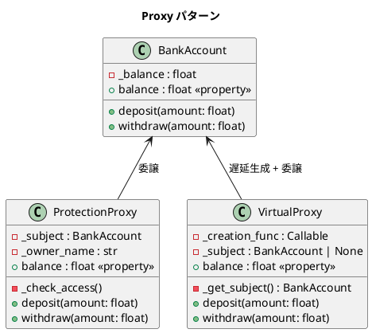

# 第 11 章: Proxy

## はじめに

銀行口座へのアクセスを制御したいとします。オーナーだけがアクセスできる「保護プロキシ」、実際に使われるまでオブジェクト生成を遅延する「仮想プロキシ」など、実際のオブジェクトの代理として振る舞うのが Proxy パターンです。

**Proxy パターン**は、別のオブジェクトへのアクセスを制御する代理オブジェクトを提供するパターンです。Python では `__getattr__` による動的な委譲で汎用的なプロキシを実現できます。

---

## パターンの構造



**登場人物**:

- **RealSubject（BankAccount）**: 実際のオブジェクト
- **ProtectionProxy**: アクセス権をチェックする保護プロキシ
- **VirtualProxy**: 遅延初期化を行う仮想プロキシ

---

## TDD で作る

### Red: テストを書く

```python
# tests/test_proxy.py
import getpass
import pytest
from src.proxy import BankAccount, ProtectionProxy, VirtualProxy


class TestProtectionProxy:
    def test_オーナーはアクセスできる(self):
        account = BankAccount(100)
        proxy = ProtectionProxy(account, getpass.getuser())
        assert proxy.balance == 100

    def test_非オーナーはアクセスできない(self):
        account = BankAccount(100)
        proxy = ProtectionProxy(account, "unauthorized_user")
        with pytest.raises(PermissionError):
            _ = proxy.balance


class TestVirtualProxy:
    def test_遅延初期化される(self):
        created = {"count": 0}

        def create():
            created["count"] += 1
            return BankAccount(100)

        proxy = VirtualProxy(create)
        assert created["count"] == 0  # まだ作られていない

        _ = proxy.balance
        assert created["count"] == 1  # 初アクセスで作成

    def test_二回目以降は再作成されない(self):
        created = {"count": 0}

        def create():
            created["count"] += 1
            return BankAccount(100)

        proxy = VirtualProxy(create)
        _ = proxy.balance
        _ = proxy.balance
        assert created["count"] == 1
```

### Green: 実装する

```python
# src/proxy.py
from __future__ import annotations
import getpass
from typing import Callable


class BankAccount:
    """銀行口座（Real Subject）"""

    def __init__(self, starting_balance: float = 0) -> None:
        self._balance = starting_balance

    @property
    def balance(self) -> float:
        return self._balance

    def deposit(self, amount: float) -> None:
        self._balance += amount

    def withdraw(self, amount: float) -> None:
        self._balance -= amount


class ProtectionProxy:
    """保護プロキシ: オーナーのみアクセスを許可"""

    def __init__(self, real_account: BankAccount, owner_name: str) -> None:
        self._subject = real_account
        self._owner_name = owner_name

    def _check_access(self) -> None:
        current_user = getpass.getuser()
        if current_user != self._owner_name:
            raise PermissionError(
                f"Illegal access: {current_user} cannot access account."
            )

    @property
    def balance(self) -> float:
        self._check_access()
        return self._subject.balance

    def deposit(self, amount: float) -> None:
        self._check_access()
        self._subject.deposit(amount)

    def withdraw(self, amount: float) -> None:
        self._check_access()
        self._subject.withdraw(amount)


class VirtualProxy:
    """仮想プロキシ: 遅延初期化"""

    def __init__(self, creation_func: Callable[[], BankAccount]) -> None:
        self._creation_func = creation_func
        self._subject: BankAccount | None = None

    def _get_subject(self) -> BankAccount:
        if self._subject is None:
            self._subject = self._creation_func()
        return self._subject

    @property
    def balance(self) -> float:
        return self._get_subject().balance

    def deposit(self, amount: float) -> None:
        self._get_subject().deposit(amount)

    def withdraw(self, amount: float) -> None:
        self._get_subject().withdraw(amount)
```

### Refactor: 振り返り

- `ProtectionProxy` は各メソッドで `_check_access()` を呼び出し、アクセス制御を一元化しています。
- `VirtualProxy` は `Callable[[], BankAccount]` をファクトリとして受け取り、初回アクセスまで生成を遅延します。
- Python では `__getattr__` を使えば、すべてのメソッド呼び出しを動的に委譲する汎用プロキシも作れます。ただし本実装では明示的な委譲を採用し、型安全性を重視しています。

---

## Ruby / Java との比較

| 観点 | Python | Ruby | Java |
|------|--------|------|------|
| **動的委譲** | `__getattr__` | `method_missing` | `java.lang.reflect.Proxy` |
| **保護プロキシ** | `getpass.getuser()` でチェック | 手動チェック | セキュリティマネージャ |
| **遅延初期化** | `Callable` ファクトリ | ブロック / `Proc` | `Supplier<T>` |
| **型安全** | 明示的委譲 or `__getattr__` | `method_missing` | Dynamic Proxy + `InvocationHandler` |
| **透過性** | `__getattr__` で RealSubject と同じ API | `method_missing` で透過的 | `Proxy.newProxyInstance` |

---

## まとめ

| 観点 | 内容 |
|------|------|
| **意図** | 別のオブジェクトへのアクセスを制御する代理を提供する |
| **Python の実装** | 明示的委譲。汎用的には `__getattr__` で動的委譲も可能 |
| **バリエーション** | Protection Proxy（アクセス制御）、Virtual Proxy（遅延初期化） |
| **適用場面** | アクセス制御、遅延ロード、ログ、キャッシュ |
| **Python らしさ** | `__getattr__` で Ruby の `method_missing` と同等の動的委譲が可能 |
| **関連パターン** | Adapter（インターフェース変換）、Decorator（機能追加） |
