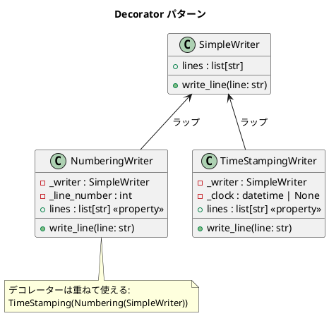

# 第 12 章: Decorator

## はじめに

テキストライターに「行番号を付ける」「タイムスタンプを付ける」といった機能を動的に追加したいとします。継承で実現すると組み合わせの数だけサブクラスが必要ですが、Decorator パターンなら既存のオブジェクトをラップするだけで機能を重ねられます。

**Decorator パターン**は、オブジェクトに動的に責務を追加するパターンです。Python には `@decorator` という**言語組み込みの構文**があり、GoF の Decorator パターンとは異なるアプローチも可能です。本章ではクラスベースと関数ベースの両方を扱います。

---

## パターンの構造



**登場人物**:

- **Component（SimpleWriter）**: 基本機能を持つクラス
- **Decorator（NumberingWriter / TimeStampingWriter）**: Component をラップし、機能を追加する

---

## TDD で作る

### Red: テストを書く

```python
# tests/test_decorator.py
from datetime import datetime
from src.decorator_pattern import (
    NumberingWriter, SimpleWriter, TimeStampingWriter, with_numbering,
)


class TestNumberingWriter:
    def test_行番号が付加される(self):
        writer = SimpleWriter()
        numbering = NumberingWriter(writer)
        numbering.write_line("Hello")
        assert numbering.lines == ["1: Hello"]

    def test_行番号がインクリメントされる(self):
        writer = SimpleWriter()
        numbering = NumberingWriter(writer)
        numbering.write_line("First")
        numbering.write_line("Second")
        assert numbering.lines == ["1: First", "2: Second"]


class TestDecoratorComposition:
    def test_デコレーターを重ねて使える(self):
        writer = SimpleWriter()
        fixed_time = datetime(2024, 1, 15, 10, 30, 0)
        numbered = NumberingWriter(writer)
        timestamped = TimeStampingWriter(numbered, clock=fixed_time)
        timestamped.write_line("Hello")
        assert writer.lines == ["1: 2024-01-15T10:30:00: Hello"]


class TestFunctionDecorator:
    def test_関数デコレーターで行番号を付加できる(self):
        numbering = with_numbering(None)
        assert numbering("Hello") == "1: Hello"
        assert numbering("World") == "2: World"
```

### Green: 実装する

**クラスベースのデコレーター（GoF スタイル）**:

```python
# src/decorator_pattern.py
from __future__ import annotations
from datetime import datetime


class SimpleWriter:
    """シンプルライター（Component）"""

    def __init__(self) -> None:
        self.lines: list[str] = []

    def write_line(self, line: str) -> None:
        self.lines.append(line)


class NumberingWriter:
    """行番号付きデコレーター"""

    def __init__(self, writer: SimpleWriter) -> None:
        self._writer = writer
        self._line_number = 1

    def write_line(self, line: str) -> None:
        self._writer.write_line(f"{self._line_number}: {line}")
        self._line_number += 1

    @property
    def lines(self) -> list[str]:
        return self._writer.lines


class TimeStampingWriter:
    """タイムスタンプ付きデコレーター"""

    def __init__(self, writer: SimpleWriter, *, clock: datetime | None = None) -> None:
        self._writer = writer
        self._clock = clock

    def _get_timestamp(self) -> str:
        ts = self._clock if self._clock else datetime.now()
        return ts.isoformat()

    def write_line(self, line: str) -> None:
        self._writer.write_line(f"{self._get_timestamp()}: {line}")

    @property
    def lines(self) -> list[str]:
        return self._writer.lines
```

**関数ベースのデコレーター（Python 構文）**:

```python
def with_numbering(write_func):
    """行番号を付加するデコレーター"""
    counter = {"n": 1}

    def wrapper(line: str) -> str:
        result = f"{counter['n']}: {line}"
        counter["n"] += 1
        return result

    return wrapper
```

### Refactor: 振り返り

- クラスベースのデコレーターはダックタイピングで動作します。`NumberingWriter` と `SimpleWriter` は同じ `write_line` メソッドを持つため、デコレーターを何層でも重ねられます。
- Python の `@decorator` 構文は関数を変換する仕組みで、GoF の Decorator パターンとは異なる概念です。しかし「既存の振る舞いを拡張する」という本質は共通しています。
- テスト容易性のため、`clock` パラメータを注入可能にしています（依存性の注入）。
- `TimeStampingWriter` ではタイムスタンプ取得ロジックを `_get_timestamp()` メソッドに抽出しています。これにより、タイムスタンプの生成方法を変更したい場合にサブクラスでオーバーライドでき、`write_line` の責務が明確になります。

---

## Python の `@decorator` 構文

Python 独自の `@decorator` 構文は、GoF の Decorator パターンとは別の概念ですが、同じ目的を達成できます。

```python
import functools

def log_calls(func):
    @functools.wraps(func)
    def wrapper(*args, **kwargs):
        print(f"Calling {func.__name__}")
        return func(*args, **kwargs)
    return wrapper

@log_calls  # Python 独自の構文
def greet(name: str) -> str:
    return f"Hello, {name}"
```

この `@log_calls` は `greet = log_calls(greet)` の糖衣構文です。

---

## Ruby / Java との比較

| 観点 | Python | Ruby | Java |
|------|--------|------|------|
| **言語サポート** | `@decorator` 構文（関数変換） | なし | なし |
| **GoF スタイル** | クラスラッピング | クラスラッピング | クラスラッピング |
| **Mixin 代替** | 多重継承 / デコレータ | `Module#extend` | なし（継承のみ） |
| **動的な追加** | ダックタイピング | `extend` で動的追加 | 実行時は不可 |
| **関数デコレーター** | `@decorator` 構文 | なし（ブロックで類似） | なし |

---

## まとめ

| 観点 | 内容 |
|------|------|
| **意図** | オブジェクトに動的に責務を追加する |
| **Python の実装** | クラスベース（GoF スタイル）+ 関数ベース（`@decorator` 構文） |
| **適用場面** | ログ、認証、キャッシュなど横断的関心事の追加 |
| **メリット** | 継承を使わずに機能を重ねられる。組み合わせが自由 |
| **Python らしさ** | `@decorator` 構文は Python 独自。GoF パターンと関数デコレーターの両方が使える |
| **関連パターン** | Proxy（同じインターフェースで制御）、Strategy（アルゴリズムの差し替え） |
