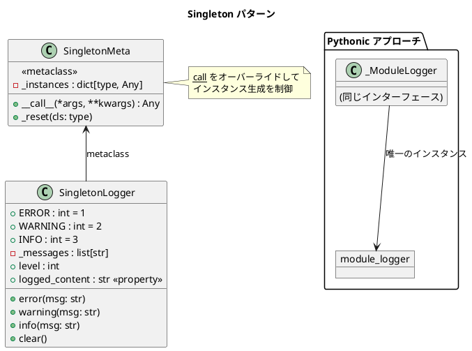

# 第 13 章: Singleton

## はじめに

アプリケーション全体で 1 つだけのロガーインスタンスを共有したいとします。どこからアクセスしても同じインスタンスが返されるようにするのが Singleton パターンです。

**Singleton パターン**は、クラスのインスタンスが 1 つだけであることを保証し、そのインスタンスへのグローバルなアクセスポイントを提供するパターンです。Python では**メタクラス**と**モジュールレベルインスタンス**の 2 つのアプローチがあります。

---

## パターンの構造



**2 つのアプローチ**:

- **メタクラス（SingletonMeta）**: `__call__` をオーバーライドしてインスタンス生成を制御
- **モジュールレベル（module_logger）**: Python のモジュールシステムを利用した Pythonic な Singleton

---

## TDD で作る

### Red: テストを書く

```python
# tests/test_singleton.py
from src.singleton import SingletonLogger, SingletonMeta, module_logger


class TestSingletonLogger:
    def setup_method(self):
        """各テスト前にインスタンスをリセット"""
        SingletonMeta._reset(SingletonLogger)

    def test_同じインスタンスが返される(self):
        logger1 = SingletonLogger()
        logger2 = SingletonLogger()
        assert logger1 is logger2

    def test_infoメッセージを記録できる(self):
        logger = SingletonLogger()
        logger.info("テストメッセージ")
        assert "[INFO] テストメッセージ" in logger.logged_content

    def test_レベル以下のメッセージは記録されない(self):
        logger = SingletonLogger()
        logger.level = SingletonLogger.ERROR
        logger.info("無視される")
        logger.error("記録される")
        assert "無視される" not in logger.logged_content
        assert "[ERROR] 記録される" in logger.logged_content


class TestModuleLogger:
    def setup_method(self):
        module_logger.clear()
        module_logger.level = module_logger.INFO

    def test_モジュールレベルのロガーが使える(self):
        module_logger.info("テスト")
        assert "[INFO] テスト" in module_logger.logged_content

    def test_モジュールレベルのロガーは同一インスタンス(self):
        from src.singleton import module_logger as logger2
        assert module_logger is logger2
```

### Green: 実装する

**メタクラスによる Singleton**:

```python
# src/singleton.py
from __future__ import annotations
from typing import Any


class SingletonMeta(type):
    """Singleton メタクラス"""

    _instances: dict[type, Any] = {}

    def __call__(cls, *args: Any, **kwargs: Any) -> Any:
        if cls not in cls._instances:
            cls._instances[cls] = super().__call__(*args, **kwargs)
        return cls._instances[cls]

    @classmethod
    def _reset(mcs, cls: type) -> None:
        """テスト用: インスタンスをリセット"""
        mcs._instances.pop(cls, None)


class SingletonLogger(metaclass=SingletonMeta):
    """メタクラスベースの Singleton ロガー"""

    ERROR = 1
    WARNING = 2
    INFO = 3

    def __init__(self) -> None:
        self._messages: list[str] = []
        self.level: int = self.INFO

    def error(self, msg: str) -> None:
        if self.level >= self.ERROR:
            self._messages.append(f"[ERROR] {msg}")

    def warning(self, msg: str) -> None:
        if self.level >= self.WARNING:
            self._messages.append(f"[WARNING] {msg}")

    def info(self, msg: str) -> None:
        if self.level >= self.INFO:
            self._messages.append(f"[INFO] {msg}")

    @property
    def logged_content(self) -> str:
        return "\n".join(self._messages)

    def clear(self) -> None:
        self._messages.clear()
```

**モジュールレベル Singleton（Pythonic アプローチ）**:

```python
class _ModuleLogger:
    """モジュールレベルのロガー実装"""
    # ... （同じインターフェース）

# モジュールレベルの唯一のインスタンス
module_logger = _ModuleLogger()
```

Python のモジュールは初回 `import` 時に一度だけ実行されるため、`module_logger` は自然に Singleton になります。

### Refactor: 振り返り

- **メタクラスアプローチ**: `SingletonMeta` はクラスの生成過程（`__call__`）を制御します。`_reset` メソッドはテスト用にインスタンスをリセットするためのものです。
- **モジュールアプローチ**: Python では「モジュールは Singleton である」という事実を利用するのが最も Pythonic です。クラス名を `_` プレフィックスで非公開にし、公開するのはインスタンスだけです。
- 実務では**モジュールアプローチ**が推奨されます。メタクラスは仕組みが複雑で、テストのリセットにも工夫が必要です。

---

## Ruby / Java との比較

| 観点 | Python | Ruby | Java |
|------|--------|------|------|
| **Singleton の実現** | メタクラス / モジュール | `Singleton` モジュール `include` | `enum` / `static` |
| **Pythonic な方法** | モジュールレベルインスタンス | --- | --- |
| **テストのリセット** | `_reset` メソッド | `instance` の再生成 | リフレクション |
| **スレッドセーフ** | GIL で基本安全 | `Mutex` が必要 | `enum` なら安全 |
| **メタプログラミング** | `type.__call__` | `Singleton` モジュール | なし（静的） |

---

## まとめ

| 観点 | 内容 |
|------|------|
| **意図** | クラスのインスタンスを 1 つだけに制限する |
| **Python の実装** | メタクラス（`SingletonMeta`）またはモジュールレベルインスタンス |
| **推奨** | モジュールレベルインスタンスが最も Pythonic |
| **適用場面** | ロガー、設定マネージャー、コネクションプールなど |
| **注意点** | グローバル状態はテストを困難にする。依存性の注入を検討 |
| **関連パターン** | Factory（生成の制御）、Monostate（状態の共有） |
