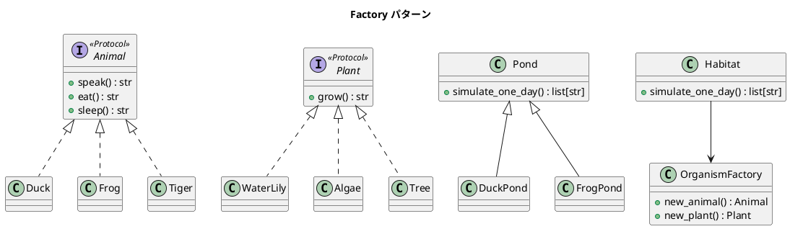

# 第 14 章: Factory

## はじめに

池にはアヒルとスイレンがいて、別の池にはカエルと藻がいます。新しい生態系（ジャングル = トラと木）を追加するとき、既存のコードを変更せずに対応したい --- **Factory パターン**はこの問題を解決します。

本章では **Factory Method**（Pond サブクラス）と **Abstract Factory**（OrganismFactory + Habitat）の 2 段階で進化させます。

---

## パターンの構造



**具象クラス**:

- **動物**（`Animal` プロトコル: `speak()`, `eat()`, `sleep()`）
    - `Duck` — `"Quack!"` / `"Duck is eating."` / `"Duck is sleeping."`
    - `Frog` — `"Croak!"` / `"Frog is eating."` / `"Frog is sleeping."`
    - `Tiger` — `"Roar!"` / `"Tiger is eating."` / `"Tiger is sleeping."`
- **植物**（`Plant` プロトコル: `grow()`）
    - `WaterLily` — `"WaterLily is growing."`
    - `Algae` — `"Algae is growing."`
    - `Tree` — `"Tree is growing."`

---

## TDD で作る

### Red: テストを書く

```python
def test_duck_pond_simulates_one_day():
    pond = DuckPond(number_animals=2, number_plants=1)
    output = pond.simulate_one_day()
    assert "WaterLily is growing." in output
    assert "Quack!" in output

def test_habitat_with_abstract_factory():
    jungle = OrganismFactory(plant_class=Tree, animal_class=Tiger)
    habitat = Habitat(1, 2, jungle)
    output = habitat.simulate_one_day()
    assert "Tree is growing." in output
    assert "Roar!" in output
```

### Green: 実装する

**動物と植物の具象クラス**:

```python
class Animal(Protocol):
    def speak(self) -> str: ...
    def eat(self) -> str: ...
    def sleep(self) -> str: ...


class Duck:
    def speak(self) -> str: return "Quack!"
    def eat(self) -> str: return "Duck is eating."
    def sleep(self) -> str: return "Duck is sleeping."


class Frog:
    def speak(self) -> str: return "Croak!"
    def eat(self) -> str: return "Frog is eating."
    def sleep(self) -> str: return "Frog is sleeping."


class Tiger:
    def speak(self) -> str: return "Roar!"
    def eat(self) -> str: return "Tiger is eating."
    def sleep(self) -> str: return "Tiger is sleeping."


class Plant(Protocol):
    def grow(self) -> str: ...


class WaterLily:
    def grow(self) -> str: return "WaterLily is growing."


class Algae:
    def grow(self) -> str: return "Algae is growing."


class Tree:
    def grow(self) -> str: return "Tree is growing."
```

**Factory Method（クラスオブジェクトを渡す）**:

```python
class Pond:
    def __init__(self, number_animals, animal_class, number_plants, plant_class):
        self._animals = [animal_class() for _ in range(number_animals)]
        self._plants = [plant_class() for _ in range(number_plants)]

    def simulate_one_day(self) -> list[str]:
        output = []
        for plant in self._plants:
            output.append(plant.grow())
        for animal in self._animals:
            output.append(animal.speak())
            output.append(animal.eat())
            output.append(animal.sleep())
        return output

class DuckPond(Pond):
    def __init__(self, number_animals=3, number_plants=2):
        super().__init__(number_animals, Duck, number_plants, WaterLily)
```

**Abstract Factory**:

```python
class OrganismFactory:
    def __init__(self, plant_class: type, animal_class: type):
        self._plant_class = plant_class
        self._animal_class = animal_class

    def new_animal(self): return self._animal_class()
    def new_plant(self): return self._plant_class()

class Habitat:
    def __init__(self, number_animals, number_plants, organism_factory):
        self._animals = [organism_factory.new_animal() for _ in range(number_animals)]
        self._plants = [organism_factory.new_plant() for _ in range(number_plants)]
```

---

## Ruby / Java との比較

| 観点 | Ruby | Java | Python |
|------|------|------|--------|
| ファクトリ引数 | クラスオブジェクト | `Supplier<T>` / メソッド参照 | クラスオブジェクト（`type`） |
| 生成 | `@animal_class.new(name)` | `animalFactory.get()` | `animal_class()` |
| 型安全性 | なし（Duck Typing） | ジェネリクスで保証 | `Protocol` で構造的型付け |

Python ではクラスそのものが第一級オブジェクトのため、Ruby と同様にクラスを直接渡して `()` で呼ぶだけでインスタンス化できます。

---

## まとめ

| 観点 | 内容 |
|------|------|
| **意図** | オブジェクト生成のロジックをクライアントから分離する |
| **Factory Method** | Pond サブクラスが生成するクラスを固定する |
| **Abstract Factory** | OrganismFactory が動物 + 植物の組み合わせを一括管理 |
| **Python の強み** | クラスが第一級オブジェクト。`type` を引数に渡すだけ |
| **関連パターン** | Template Method（生成ステップの Template）、Builder（段階的構築） |
