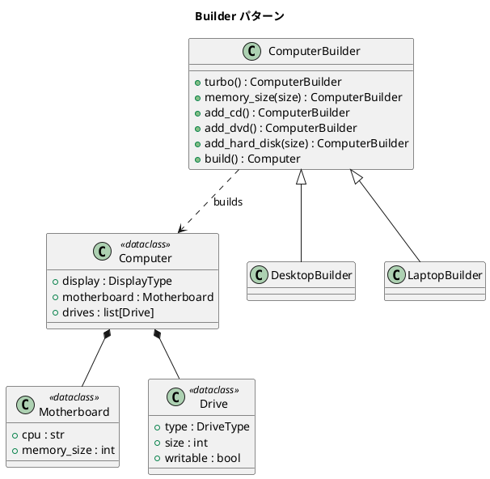

# 第 15 章: Builder

## はじめに

コンピュータを組み立てるとき、CPU、メモリ、ドライブ、ディスプレイの組み合わせは多岐にわたります。コンストラクタの引数が膨大になると可読性が落ちます。

**Builder パターン**は、複雑なオブジェクトの構築プロセスを段階的に行い、同じ構築手順で異なる表現を作れるようにするパターンです。Python では `@dataclass` と流暢なインターフェース（メソッドチェーン）で簡潔に実現できます。

---

## パターンの構造



---

## TDD で作る

### Red: テストを書く

```python
def test_desktop_builder():
    computer = (DesktopBuilder()
        .turbo()
        .add_cd(writable=True)
        .add_hard_disk(100000)
        .build())
    assert computer.display == DisplayType.CRT
    assert computer.motherboard.cpu == "TurboCPU"
    assert len(computer.drives) == 2

def test_validation_no_hard_disk():
    with pytest.raises(ValueError, match="hard disk"):
        DesktopBuilder().add_cd().build()
```

### Green: 実装する

```python
@dataclass(frozen=True)
class Computer:
    display: DisplayType
    motherboard: Motherboard
    drives: list[Drive] = field(default_factory=list)

class ComputerBuilder:
    def __init__(self):
        self._turbo = False
        self._memory_size = 512
        self._drives = []
        self._display = DisplayType.CRT

    def turbo(self, has_turbo=True):
        self._turbo = has_turbo
        return self

    def add_hard_disk(self, size):
        self._drives.append(Drive(DriveType.HARD_DISK, size, True))
        return self

    def _validate(self):
        if self._memory_size < 250:
            raise ValueError(f"Not enough memory: {self._memory_size}")
        if len(self._drives) > 4:
            raise ValueError(f"Too many drives: {len(self._drives)}")
        if not any(d.type == DriveType.HARD_DISK for d in self._drives):
            raise ValueError("Must have at least one hard disk")

    def build(self):
        self._validate()
        cpu = "TurboCPU" if self._turbo else "BasicCPU"
        motherboard = Motherboard(cpu=cpu, memory_size=self._memory_size)
        return Computer(display=self._display, motherboard=motherboard, drives=list(self._drives))
```

---

## Ruby / Java との比較

| 観点 | Ruby | Java | Python |
|------|------|------|--------|
| 値オブジェクト | 通常のクラス | `record` | `@dataclass(frozen=True)` |
| メソッドチェーン | `method_missing` DSL | 流暢なインターフェース | `return self` |
| バリデーション | `computer` メソッド内 | `build()` 内 | `_validate()` + `build()` |
| イミュータビリティ | 手動 | `record`（自動） | `frozen=True`（自動） |

---

## まとめ

| 観点 | 内容 |
|------|------|
| **意図** | 複雑なオブジェクトの構築プロセスを段階的に行う |
| **適用場面** | コンストラクタの引数が多い、構成にバリエーションがある場合 |
| **Python の強み** | `@dataclass(frozen=True)` で不変の値オブジェクトを簡潔に定義 |
| **メソッドチェーン** | `return self` で流暢なインターフェースを実現 |
| **関連パターン** | Factory（生成の委譲）、Composite（再帰的構築） |
