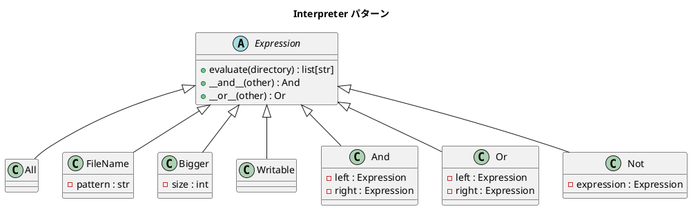

# 第 16 章: Interpreter

## はじめに

「100 バイト以上の `.txt` ファイルで、書き込み可能なもの」を検索したいとします。この検索条件を式ツリー（AST）として表現し、評価するのが **Interpreter パターン**です。

Python では `__and__` / `__or__` 演算子オーバーロードにより、`Bigger(100) & FileName("*.txt") & Writable()` のような直感的な DSL を構築できます。

---

## パターンの構造



---

## TDD で作る

### Red: テストを書く

```python
def test_all_expression_finds_all_files(tmp_path):
    (tmp_path / "test.txt").write_text("hello")
    (tmp_path / "data.csv").write_text("1,2,3")
    expr = All()
    results = expr.evaluate(str(tmp_path))
    assert len(results) == 2

def test_operator_dsl(tmp_path):
    (tmp_path / "big.txt").write_text("x" * 200)
    (tmp_path / "small.txt").write_text("x")
    expr = Bigger(100) & FileName("*.txt")
    results = expr.evaluate(str(tmp_path))
    assert len(results) == 1
```

### Green: 実装する

```python
class Expression:
    def evaluate(self, directory: str) -> list[str]:
        raise NotImplementedError

    def __and__(self, other):
        return And(self, other)

    def __or__(self, other):
        return Or(self, other)

class All(Expression):
    def evaluate(self, directory):
        return sorted(str(p) for p in Path(directory).rglob("*") if p.is_file())

class FileName(Expression):
    def __init__(self, pattern):
        self._pattern = pattern

    def evaluate(self, directory):
        return sorted(str(p) for p in Path(directory).rglob(self._pattern) if p.is_file())

class Writable(Expression):
    """書き込み可能なファイル"""

    def evaluate(self, directory):
        import os
        return sorted(
            str(p) for p in Path(directory).rglob("*")
            if p.is_file() and os.access(p, os.W_OK)
        )


class And(Expression):
    """AND 複合式（集合の積集合）"""

    def __init__(self, left, right):
        self._left = left
        self._right = right

    def evaluate(self, directory):
        left_set = set(self._left.evaluate(directory))
        right_set = set(self._right.evaluate(directory))
        return sorted(left_set & right_set)


class Or(Expression):
    """OR 複合式（集合の和集合）"""

    def __init__(self, left, right):
        self._left = left
        self._right = right

    def evaluate(self, directory):
        left_set = set(self._left.evaluate(directory))
        right_set = set(self._right.evaluate(directory))
        return sorted(left_set | right_set)


class Not(Expression):
    """NOT 式（全体集合との差集合）"""

    def __init__(self, expression):
        self._expression = expression

    def evaluate(self, directory):
        all_files = set(All().evaluate(directory))
        excluded = set(self._expression.evaluate(directory))
        return sorted(all_files - excluded)
```

複合式はすべて集合演算で実装されています。

- `And` — `set` の `&`（積集合: intersection）で両方の条件を満たすファイルを返す
- `Or` — `set` の `|`（和集合: union）でいずれかの条件を満たすファイルを返す
- `Not` — `set` の `-`（差集合: difference）で `All` の結果から除外対象を引く

---

## Ruby / Java との比較

| 観点 | Ruby | Java | Python |
|------|------|------|--------|
| 演算子 DSL | `\|` / `&` メソッド | メソッドチェーン | `__or__` / `__and__` |
| ファイル走査 | `Find.find` | `Files.walk` | `pathlib.Path.rglob` |
| 集合演算 | 配列の `&` / `+` | `retainAll` / `addAll` | `set` の `&` / `\|` |
| テスト | 実ディレクトリ | `@TempDir` | `tmp_path` fixture |

Python の `__and__` / `__or__` は `&` / `|` 演算子にマッピングされ、Ruby と同様に自然な DSL を記述できます。`pathlib` の `rglob` は `Find.find` より Pythonic です。

---

## まとめ

| 観点 | 内容 |
|------|------|
| **意図** | 言語の文法を定義し、その文法に沿った文を解釈する |
| **適用場面** | 検索条件、設定ファイル、ルールエンジンなど |
| **Python の強み** | `__and__` / `__or__` で演算子 DSL、`pathlib` で Pythonic なファイル走査 |
| **Composite との関係** | 式ツリーは Composite 構造そのもの |
| **関連パターン** | Composite（再帰構造）、Visitor（式の走査） |
