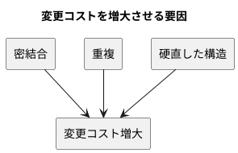
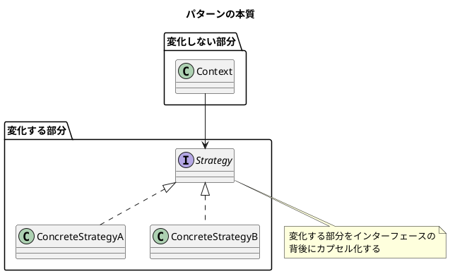
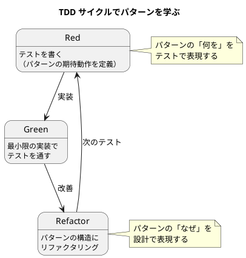

# 第 1 章: デザインパターンとパターン思考

## はじめに

ソフトウェア開発において「変更」は避けられません。要件は変わり、技術は進化し、ユーザーの期待は高まり続けます。**よいソフトウェア** --- 変更を楽に安全にできて役に立つソフトウェア --- を作るためには、変化に対応できる設計が不可欠です。

**デザインパターン**は、この「変化への対応力」を高めるための再利用可能な設計の知恵です。

---

## デザインパターンとは何か

### GoF の歴史

1994 年、Erich Gamma、Richard Helm、Ralph Johnson、John Vlissides の 4 人（通称 **Gang of Four / GoF**）が『Design Patterns: Elements of Reusable Object-Oriented Software』を出版しました。この書籍は 23 のデザインパターンをカタログ化し、オブジェクト指向設計の共通語彙を確立しました。

GoF のパターンは以下の 3 カテゴリに分類されます。

| カテゴリ | 目的 | 本シリーズで扱うパターン |
|---------|------|----------------------|
| **生成（Creational）** | オブジェクトの作り方を柔軟にする | Singleton, Factory Method, Abstract Factory, Builder |
| **構造（Structural）** | オブジェクトの組み合わせ方を整理する | Adapter, Composite, Proxy, Decorator |
| **振る舞い（Behavioral）** | オブジェクト間の責務分担を明確にする | Template Method, Strategy, Observer, Iterator, Command, Interpreter |

### Russ Olsen のアプローチ

本シリーズの源流である Russ Olsen 『Design Patterns in Ruby』は、GoF の 23 パターンから **Ruby で特に有用な 13 パターン**を選び、Ruby の動的な言語機能を活かした実装を示しました。

GoF 本が C++ と Smalltalk で書かれた「古典的」な実装を示したのに対し、Olsen は以下の視点を加えています。

- **ブロックとクロージャ**による軽量な Strategy / Command
- **Module の include / extend**による Decorator の代替
- **method_missing**による透過的な Proxy / Builder
- **Duck Typing**がもたらすインターフェースの不要さ

---

## パターンが解く問題

### 変更コストの問題

ソフトウェアの寿命が長くなるほど、変更にかかるコストは増大します。この変更コストの増大を引き起こす主な原因は以下の通りです。

1. **密結合（Tight Coupling）**: あるクラスを変更すると、他の多くのクラスも変更が必要になる
2. **重複（Duplication）**: 同じロジックが複数箇所に散在し、変更漏れが起きる
3. **硬直した構造（Rigidity）**: 新しい振る舞いを追加するために、既存コードの大幅な書き換えが必要になる

デザインパターンは、これらの問題に対する **検証済みの解決策**を提供します。

### パターンの本質: 変化するものを分離する

すべてのデザインパターンに共通する核心的なアイデアは、**「変化するものを、変化しないものから分離する」**ことです。

---

## 本シリーズの読み方

### 構成

本シリーズは 4 部 16 章で構成されています。

- **第 1 部（章 1-3）**: パターンの基礎知識と開発環境のセットアップ
- **第 2 部（章 4-8）**: 振る舞い系パターン --- アルゴリズムや責務の分離
- **第 3 部（章 9-12）**: 操作と関係系パターン --- オブジェクト間の接続と変換
- **第 4 部（章 13-16）**: 生成と解釈系パターン --- オブジェクトの作り方と文法の解釈

### 学び方

各パターン章（章 4-16）は **TDD の Red-Green-Refactor サイクル**で進みます。

1. **Red**: パターンが実現すべき振る舞いをテストで書く
2. **Green**: テストを通す最小限のコードを書く
3. **Refactor**: パターンの構造に沿ってリファクタリングする

この手順により、パターンの **意図**（なぜこの構造が必要か）を体感しながら学べます。

---

## まとめ

- デザインパターンは、変化に対応できる設計の再利用可能な知恵である
- すべてのパターンの核心は「変化するものを、変化しないものから分離する」こと
- 本シリーズでは TDD サイクルを通じて 13 パターンを Ruby で実装する
- パターンは「銀の弾丸」ではなく、適切な場面で適切に使うことが重要である
