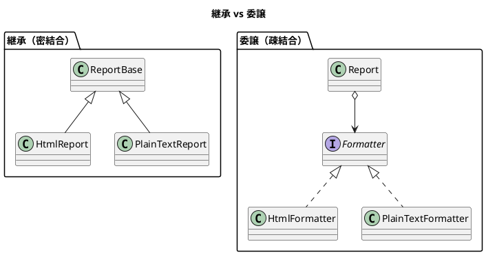
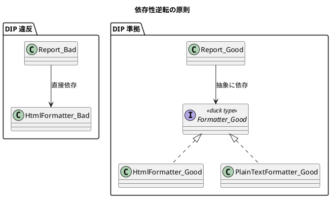

# 第 2 章: パターンを支える基本原則

## はじめに

デザインパターンは「魔法の呪文」ではありません。パターンの背後には、オブジェクト指向設計の基本原則があります。原則を理解せずにパターンだけを適用しても、かえってコードを複雑にするだけです。

本章では、デザインパターンを支える 4 つの設計原則と SOLID 原則を紹介します。

---

## 4 つの設計原則

Russ Olsen は『Design Patterns in Ruby』の中で、GoF が示した設計原則を以下の 4 つに整理しています。

### 1. 変化するものを分離する（Separate out the things that change from those that stay the same）

ソフトウェアで最も確実なことは「変化する」ということです。変化する部分を特定し、変化しない部分から切り離すことで、変更の影響範囲を最小化します。

```ruby
# 変化する部分と変化しない部分が混在（悪い例）
class Report
  def output
    # フォーマットのロジック（変化する）と
    # データの取得ロジック（変化しない）が混在
    puts "<html><head><title>#{@title}</title></head>"
    puts "<body>"
    @text.each { |line| puts "<p>#{line}</p>" }
    puts "</body></html>"
  end
end

# 変化する部分を分離（良い例）
class Report
  def initialize(formatter)
    @formatter = formatter  # 変化する部分を外部に委譲
  end

  def output
    @formatter.output_report(@title, @text)
  end
end
```

### 2. インターフェースに対してプログラムする（Program to an interface, not an implementation）

具体的なクラスではなく、抽象的なインターフェースに依存することで、実装の差し替えを容易にします。

Ruby では明示的なインターフェース宣言は不要です。**Duck Typing** により、同じメソッドに応答するオブジェクトであれば、どのクラスのインスタンスでも使えます。

```ruby
# Ruby の Duck Typing
class HtmlFormatter
  def output_report(title, text)
    puts "<html><head><title>#{title}</title></head>"
    puts "<body>"
    text.each { |line| puts "<p>#{line}</p>" }
    puts "</body></html>"
  end
end

class PlainTextFormatter
  def output_report(title, text)
    puts "***** #{title} *****"
    text.each { |line| puts line }
  end
end

# Report はどちらの formatter でも動く
report = Report.new(HtmlFormatter.new)
report.output

report = Report.new(PlainTextFormatter.new)
report.output
```

### 3. 継承より委譲を選ぶ（Prefer composition/delegation over inheritance）

継承は強力ですが、親クラスと子クラスの間に密結合を生みます。委譲（コンポジション）を使うことで、実行時に振る舞いを差し替えられる柔軟な設計になります。



### 4. あなたが必要なものだけ書く（You Ain't Gonna Need It / YAGNI）

将来必要になるかもしれない機能を先回りして実装しないことです。必要になった時点で追加するほうが、実際の要件に合った設計になります。

---

## SOLID 原則

Robert C. Martin（Uncle Bob）が提唱した 5 つの設計原則です。

### S - 単一責任の原則（Single Responsibility Principle）

> クラスを変更する理由は、ただ 1 つであるべきだ

```ruby
# 悪い例: Report が「データ管理」と「出力」の 2 つの責務を持つ
class Report
  def initialize
    @title = "月次報告"
    @text = ["順調", "最高の調子"]
  end

  def output_html
    # HTML 出力のロジック
  end

  def output_plain_text
    # テキスト出力のロジック
  end
end

# 良い例: 責務を分離
class Report
  attr_reader :title, :text

  def initialize
    @title = "月次報告"
    @text = ["順調", "最高の調子"]
  end
end

class HtmlReportPrinter
  def print(report)
    # HTML 出力のロジック
  end
end
```

### O - 開放閉鎖の原則（Open-Closed Principle）

> ソフトウェアのエンティティは、拡張に対して開いていて、修正に対して閉じているべきだ

新しいフォーマットを追加する際に、既存の `Report` クラスを修正する必要がない設計を目指します。Strategy パターン（第 5 章）はこの原則の代表例です。

### L - リスコフの置換原則（Liskov Substitution Principle）

> サブタイプは、そのスーパータイプと置換可能でなければならない

Template Method パターン（第 4 章）では、基底クラスの `Report` を使う側が、`HtmlReport` と `PlainTextReport` を区別せずに使えることが重要です。

### I - インターフェース分離の原則（Interface Segregation Principle）

> クライアントが使わないメソッドに依存することを強制してはならない

Ruby では Duck Typing により自然に実現されます。必要なメソッドだけに応答するオブジェクトを渡せばよいのです。

### D - 依存性逆転の原則（Dependency Inversion Principle）

> 上位モジュールは下位モジュールに依存してはならない。両者は抽象に依存すべきだ



---

## パターンと原則の対応

| パターン | 主に活用する原則 |
|---------|-----------------|
| Template Method | OCP, LSP |
| Strategy | SRP, OCP, DIP |
| Observer | SRP, OCP |
| Composite | LSP |
| Iterator | SRP, ISP |
| Command | SRP, OCP |
| Adapter | DIP, ISP |
| Proxy | LSP, SRP |
| Decorator | OCP, SRP |
| Singleton | SRP |
| Factory | DIP, OCP |
| Builder | SRP |
| Interpreter | OCP |

---

## まとめ

- デザインパターンは設計原則の具体的な適用例である
- 4 つの設計原則（変化の分離、インターフェース指向、委譲優先、YAGNI）がパターンの基盤
- SOLID 原則はオブジェクト指向設計の品質を測る尺度として機能する
- Ruby の Duck Typing は、明示的なインターフェース宣言なしに多くの原則を自然に実現する
- 原則を理解した上でパターンを適用することで、過剰設計を避けられる
