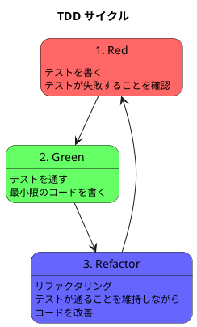

# 第 3 章: 開発環境と TDD 基盤

## はじめに

本章では、デザインパターンを TDD で実装するための Ruby 開発環境をセットアップします。前作 [テスト駆動開発から始めるプログラミング入門](../../getting-start-tdd/index.md) の Ruby 編で構築した環境を踏襲しつつ、本シリーズ用に必要な部分を補足します。

---

## 開発環境

### Ruby バージョン

本シリーズでは **Ruby 3.3** を使用します。Nix パッケージマネージャによる環境管理を推奨します。

```bash
# Nix 環境の起動
nix-shell ops/nix/environments/ruby/shell.nix

# バージョン確認
ruby --version
# => ruby 3.3.x
```

### プロジェクト構成

```
apps/ruby/design-pattern/
├── Gemfile              # 依存関係の定義
├── Rakefile             # タスクランナー設定
├── test/
│   └── test_helper.rb   # テスト共通設定
├── 04-template-method/
│   ├── lib/             # パターン実装
│   └── test/            # テストファイル
├── 05-strategy/
│   ├── lib/
│   └── test/
└── ...
```

### 依存関係（Gemfile）

```ruby
source "https://rubygems.org"

gem "minitest", "~> 5.25"
gem "minitest-reporters", "~> 1.7"
gem "simplecov", "~> 0.22", require: false
gem "rake", "~> 13.2"
```

### セットアップ

```bash
cd apps/ruby/design-pattern
bundle install
```

---

## テスティングフレームワーク: minitest

### なぜ minitest か

- Ruby 標準ライブラリに含まれている（外部依存が最小）
- シンプルで高速
- Russ Olsen 本の一次資料が minitest で書かれている

### テストの書き方

```ruby
# test/test_helper.rb
require "simplecov"
SimpleCov.start do
  add_filter "/test/"
  enable_coverage :branch
  minimum_coverage 80
end

require "minitest/autorun"
require "minitest/reporters"
Minitest::Reporters.use! [Minitest::Reporters::SpecReporter.new]
```

```ruby
# test/example_test.rb
require_relative "test_helper"
require_relative "../lib/example"

class ExampleTest < Minitest::Test
  def test_something
    result = Example.new.do_something
    assert_equal "expected", result
  end
end
```

### テスト実行

```bash
# 全テスト実行
bundle exec rake test

# 特定のファイルだけ実行
bundle exec ruby test/example_test.rb
```

---

## TDD サイクル

本シリーズでは、各パターンを以下の TDD サイクルで実装します。

### Red-Green-Refactor



1. **Red**: パターンの期待動作をテストで表現する（テストは失敗する）
2. **Green**: テストを通す最小限の実装を書く
3. **Refactor**: パターンの構造に沿ってリファクタリングする（テストは通り続ける）

### パターン実装の進め方

各パターン章では、以下の順で TDD サイクルを回します。

1. **素朴な実装**: まず最もシンプルな形でテストを通す
2. **問題の発見**: 要件の追加により、素朴な実装の限界が見える
3. **パターンの適用**: リファクタリングでパターンの構造に変換する
4. **Ruby 固有の改善**: ブロック、Module 等の Ruby 機能で更に改善する

---

## カバレッジ測定: simplecov

### 設定

`test_helper.rb` の冒頭で SimpleCov を起動しています。テスト実行後に `coverage/index.html` が生成されます。

```bash
# テスト実行後にカバレッジレポートを確認
bundle exec rake test
open coverage/index.html
```

### 目標

- **行カバレッジ**: 80% 以上
- **ブランチカバレッジ**: 80% 以上（`enable_coverage :branch` で有効化済み）

---

## Rake タスク

```ruby
# Rakefile
require "rake/testtask"

Rake::TestTask.new(:test) do |t|
  t.libs << "lib"
  t.libs << "test"
  t.test_files = FileList["**/test/**/*_test.rb"]
  t.warning = false
end

task default: :test
```

`bundle exec rake` で全テストを実行できます。

---

## まとめ

- Ruby 3.3 + minitest + simplecov の環境を構築した
- テストは `*_test.rb` の命名規則で、`test/` ディレクトリに配置する
- TDD の Red-Green-Refactor サイクルでパターンを段階的に実装する
- カバレッジ目標は行・ブランチとも 80% 以上
- 次章からは、この環境を使って最初のパターン **Template Method** を実装する
