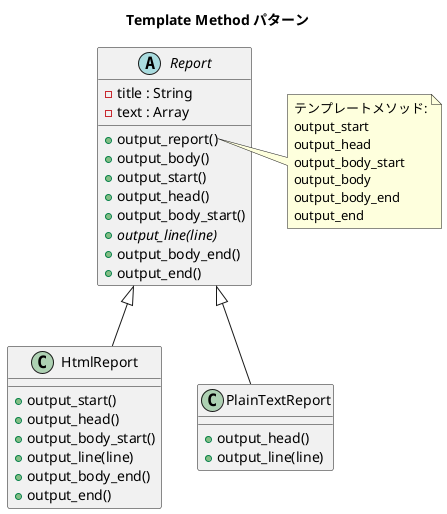

# 第 4 章: Template Method

## はじめに

レポートを HTML とプレーンテキストの 2 つの形式で出力したいとします。出力の「骨格」は同じ（タイトル → 本文 → フッター）ですが、各ステップの具体的な処理は形式ごとに異なります。

**Template Method パターン**は、アルゴリズムの骨格を基底クラスで定義し、具体的なステップをサブクラスに委ねるパターンです。

---

## パターンの構造



**登場人物**:

- **AbstractClass（Report）**: テンプレートメソッド `output_report` でアルゴリズムの骨格を定義する
- **ConcreteClass（HtmlReport / PlainTextReport）**: 各ステップ（フックメソッド）をオーバーライドする

---

## TDD で作る

### Red: テストを書く

まず、HTML レポートの期待出力をテストで定義します。

```ruby
# test/template_method_test.rb
require_relative "test_helper"
require_relative "../lib/html_report"
require_relative "../lib/plain_text_report"

class TemplateMethodTest < Minitest::Test
  def test_html_report_output
    report = TemplateMethod::HtmlReport.new

    expected = <<~HTML
      <html>
       <head>
       <title>月次報告</title>
       </head>
      <body>
       <p>順調</p>
       <p>最高の調子</p>
      </body>
      </html>
    HTML

    assert_output(expected) { report.output_report }
  end

  def test_plain_text_report_output
    report = TemplateMethod::PlainTextReport.new

    expected = <<~TEXT
      **** 月次報告 ****

      順調
      最高の調子
    TEXT

    assert_output(expected) { report.output_report }
  end

  def test_base_report_raises_on_output_line
    report = TemplateMethod::Report.new
    assert_raises(NotImplementedError) { report.output_report }
  end
end
```

### Green: 実装する

**基底クラス Report** --- テンプレートメソッドを定義します。

```ruby
# lib/report.rb
module TemplateMethod
  class Report
    def initialize
      @title = "月次報告"
      @text = ["順調", "最高の調子"]
    end

    # テンプレートメソッド: レポート出力の骨格
    def output_report
      output_start
      output_head
      output_body_start
      output_body
      output_body_end
      output_end
    end

    def output_body
      @text.each { |line| output_line(line) }
    end

    # フックメソッド（デフォルトは何もしない）
    def output_start; end
    def output_head; output_line(@title); end
    def output_body_start; end

    # 抽象メソッド
    def output_line(_line)
      raise NotImplementedError, "サブクラスで output_line を実装してください"
    end

    def output_body_end; end
    def output_end; end
  end
end
```

**サブクラス HtmlReport** --- HTML 固有の出力を実装します。

```ruby
# lib/html_report.rb
module TemplateMethod
  class HtmlReport < Report
    def output_start;      puts("<html>"); end
    def output_head
      puts(" <head>")
      puts(" <title>#{@title}</title>")
      puts(" </head>")
    end
    def output_body_start; puts("<body>"); end
    def output_line(line);  puts(" <p>#{line}</p>"); end
    def output_body_end;   puts("</body>"); end
    def output_end;         puts("</html>"); end
  end
end
```

**サブクラス PlainTextReport** --- 必要なメソッドだけオーバーライドします。

```ruby
# lib/plain_text_report.rb
module TemplateMethod
  class PlainTextReport < Report
    def output_head
      puts("**** #{@title} ****")
      puts
    end

    def output_line(line)
      puts(line)
    end
  end
end
```

### Refactor: 振り返り

- `PlainTextReport` は `output_start` や `output_end` をオーバーライドしていません。基底クラスの空メソッド（フックメソッド）がデフォルト動作を提供しているため、必要な部分だけ上書きすればよいのです。
- `output_line` は `raise NotImplementedError` を使って抽象メソッドを表現しています。Ruby には言語レベルの抽象メソッドはありませんが、この慣用句で同等の効果を得ています。

---

## Ruby らしい実装

Ruby では、フックメソッドのデフォルト実装を空メソッド `def output_start; end` で提供するのが自然です。Java のような `abstract` キーワードは不要で、オーバーライドしなければデフォルト（何もしない）が適用されます。

---

## まとめ

| 観点 | 内容 |
|------|------|
| **意図** | アルゴリズムの骨格を定義し、一部のステップをサブクラスに委ねる |
| **適用場面** | 複数のバリエーションが同じ手順の骨格を共有する場合 |
| **メリット** | コードの重複を排除し、拡張ポイントを明確にする |
| **注意点** | サブクラスが増えると継承階層が深くなる → 次章の Strategy パターンで解決 |
| **関連パターン** | Strategy（委譲で差し替え）、Factory Method（生成ステップの Template Method） |
