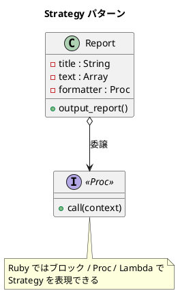

# 第 5 章: Strategy

## はじめに

前章の Template Method パターンでは、継承を使ってアルゴリズムのバリエーションを実現しました。しかし、継承には「静的」という制約があります --- 実行時にフォーマットを切り替えることができません。

**Strategy パターン**は、アルゴリズムをオブジェクトとしてカプセル化し、委譲によって実行時に差し替え可能にするパターンです。Ruby ではブロックと Proc を使って、さらに軽量に実現できます。

---

## パターンの構造



---

## TDD で作る

### Red: テストを書く

```ruby
class StrategyTest < Minitest::Test
  HTML_FORMATTER = lambda { |context|
    puts("<html>")
    puts("  <head>")
    puts("    <title>#{context.title}</title>")
    puts("  </head>")
    puts("  <body>")
    context.text.each { |line| puts("     <p>#{line}</p>") }
    puts("  </body>")
    puts("</html>")
  }

  def test_html_report_with_lambda
    report = Strategy::Report.new(&HTML_FORMATTER)
    assert_output(/html/) { report.output_report }
  end

  def test_plain_text_report_with_block
    report = Strategy::Report.new do |context|
      puts("***** #{context.title} *****")
      context.text.each { |line| puts(line) }
    end
    assert_output(/月次報告/) { report.output_report }
  end

  def test_formatter_can_be_swapped_at_runtime
    report = Strategy::Report.new(&HTML_FORMATTER)
    report.formatter = proc { |ctx| puts(ctx.title) }
    assert_output(/月次報告/) { report.output_report }
  end
end
```

### Green: 実装する

```ruby
module Strategy
  class Report
    attr_reader :title, :text
    attr_accessor :formatter

    def initialize(&formatter)
      @title = "月次報告"
      @text = ["順調", "最高の調子"]
      @formatter = formatter
    end

    def output_report
      @formatter.call(self)
    end
  end
end
```

### Refactor: Template Method との比較

| 観点 | Template Method | Strategy |
|------|----------------|----------|
| 差し替えのタイミング | コンパイル時（クラス定義時） | 実行時 |
| 実現手段 | 継承 | 委譲（Proc / ブロック） |
| 新バリエーション追加 | 新しいサブクラスを作成 | 新しい Proc を渡すだけ |
| Ruby らしさ | やや Java 的 | ブロックで自然に書ける |

---

## Ruby らしい実装

Ruby の Strategy の真骨頂は**ブロック**です。クラスを定義せずに、その場でアルゴリズムを渡せます。

```ruby
# ブロックでフォーマッタを渡す
report = Strategy::Report.new do |context|
  puts("***** #{context.title} *****")
  context.text.each { |line| puts(line) }
end

report.output_report
```

実行時に差し替えることも可能です。

```ruby
report.formatter = lambda { |ctx|
  puts("<html><body>#{ctx.title}</body></html>")
}
report.output_report
```

---

## まとめ

| 観点 | 内容 |
|------|------|
| **意図** | アルゴリズムをオブジェクトとしてカプセル化し、実行時に差し替え可能にする |
| **適用場面** | アルゴリズムのバリエーションが多く、実行時に切り替えたい場合 |
| **メリット** | 継承なしに新しいアルゴリズムを追加できる。OCP を自然に満たす |
| **Ruby の強み** | ブロック / Proc / Lambda で軽量に実現。クラス定義すら不要 |
| **関連パターン** | Template Method（継承版）、Command（操作のオブジェクト化） |
