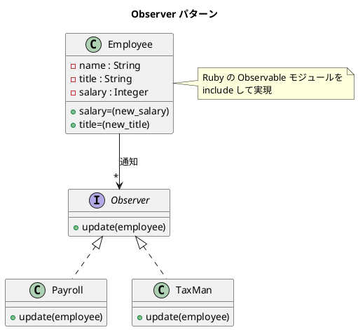

# 第 6 章: Observer

## はじめに

従業員の給与が変更されたとき、給与計算システムと税務システムの両方に通知したいとします。しかし、`Employee` クラスが `Payroll` と `TaxMan` を直接知っていると、新しい通知先が増えるたびに `Employee` を修正する必要があります。

**Observer パターン**は、オブジェクトの状態変化を、そのオブジェクトに依存する他のオブジェクト群に自動的に通知する仕組みです。

---

## パターンの構造



---

## TDD で作る

### Red: テストを書く

```ruby
class ObserverTest < Minitest::Test
  def setup
    @employee = Employee.new("田中太郎", "エンジニア", 300_000)
    @payroll = Payroll.new
    @tax_man = TaxMan.new
  end

  def test_payroll_gets_notified_on_salary_change
    @employee.add_observer(@payroll)
    assert_output(/田中太郎 の給与が 350000 に変更されました/) do
      @employee.salary = 350_000
    end
  end

  def test_multiple_observers_get_notified
    @employee.add_observer(@payroll)
    @employee.add_observer(@tax_man)
    assert_output(/田中太郎/) { @employee.salary = 400_000 }
  end

  def test_observer_can_be_removed
    @employee.add_observer(@payroll)
    @employee.add_observer(@tax_man)
    @employee.delete_observer(@tax_man)
    assert_output(/給与/) { @employee.salary = 500_000 }
    assert_nil @tax_man.last_notification
  end
end
```

### Green: 実装する

```ruby
require "observer"

class Employee
  include Observable

  attr_reader :name, :title, :salary

  def initialize(name, title, salary)
    @name = name
    @title = title
    @salary = salary
  end

  def salary=(new_salary)
    @salary = new_salary
    changed
    notify_observers(self)
  end

  def title=(new_title)
    @title = new_title
    changed
    notify_observers(self)
  end
end

class Payroll
  attr_reader :last_notification

  def update(employee)
    @last_notification = "#{employee.name} の給与が #{employee.salary} に変更されました"
    puts(@last_notification)
  end
end

class TaxMan
  attr_reader :last_notification

  def update(employee)
    @last_notification = "#{employee.name} に新しい税金の請求書を送付します"
    puts(@last_notification)
  end
end
```

---

## Ruby らしい実装

Ruby 標準ライブラリの `Observable` モジュールを `include` するだけで、`add_observer`、`delete_observer`、`notify_observers` が使えます。オブザーバー側は `update` メソッドを実装するだけです。

ポイント:
- `changed` を呼ばないと `notify_observers` は何もしない（状態変化のフラグ管理）
- `delete_observer` でオブザーバーを動的に削除できる

---

## まとめ

| 観点 | 内容 |
|------|------|
| **意図** | オブジェクトの状態変化を依存オブジェクト群に自動通知する |
| **適用場面** | 1 対多の依存関係があり、一方の変化を他方に伝播させたい場合 |
| **メリット** | Subject と Observer が疎結合。新しい Observer を自由に追加できる |
| **Ruby の強み** | `Observable` モジュールを include するだけで実装完了 |
| **関連パターン** | Mediator（通知の仲介）、Event / Pub-Sub（非同期版） |
