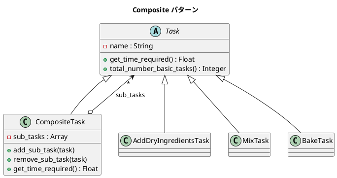

# 第 7 章: Composite

## はじめに

ケーキを作る工程を考えましょう。「ケーキを作る」は「生地を作る」「型に流し込む」「焼く」「アイシング」「スプーンをなめる」で構成され、「生地を作る」はさらに「乾燥材料を加える」「液体材料を加える」「混ぜる」に分解されます。

**Composite パターン**は、個々のオブジェクト（リーフ）とオブジェクトの集合（コンポジット）を同一のインターフェースで扱うパターンです。部分と全体を同一視できるため、再帰的な構造を自然に表現できます。

---

## パターンの構造



---

## TDD で作る

### Red: テストを書く

```ruby
class CompositeTest < Minitest::Test
  def test_make_batter_task_time
    batter = MakeBatterTask.new
    assert_equal 5.0, batter.get_time_required
  end

  def test_make_cake_task_time
    cake = MakeCakeTask.new
    assert_equal 22.0, cake.get_time_required
  end

  def test_total_number_of_basic_tasks
    cake = MakeCakeTask.new
    assert_equal 7, cake.total_number_basic_tasks
  end
end
```

### Green: 実装する

**Task（Component）**:

```ruby
class Task
  attr_reader :name
  attr_accessor :parent

  def initialize(name)
    @name = name
    @parent = nil
  end

  def get_time_required
    0.0
  end

  def total_number_basic_tasks
    1
  end
end
```

**CompositeTask（Composite）**:

```ruby
class CompositeTask < Task
  def initialize(name)
    super(name)
    @sub_tasks = []
  end

  def add_sub_task(task)
    @sub_tasks << task
    task.parent = self
  end

  def remove_sub_task(task)
    @sub_tasks.delete(task)
    task.parent = nil
  end

  def get_time_required
    @sub_tasks.sum(&:get_time_required)
  end

  def total_number_basic_tasks
    @sub_tasks.sum(&:total_number_basic_tasks)
  end
end
```

**リーフタスクと複合タスク**:

```ruby
class MakeBatterTask < CompositeTask
  def initialize
    super("生地を作る")
    add_sub_task(AddDryIngredientsTask.new)  # 1分
    add_sub_task(AddLiquidsTask.new)          # 1分
    add_sub_task(MixTask.new)                 # 3分
  end
end

class MakeCakeTask < CompositeTask
  def initialize
    super("ケーキを作る")
    add_sub_task(MakeBatterTask.new)  # 5分
    add_sub_task(FillPanTask.new)      # 2分
    add_sub_task(BakeTask.new)         # 10分
    add_sub_task(FrostTask.new)        # 4分
    add_sub_task(LickSpoonTask.new)    # 1分
  end
end
```

---

## まとめ

| 観点 | 内容 |
|------|------|
| **意図** | 部分と全体を同一のインターフェースで扱い、ツリー構造を表現する |
| **適用場面** | 再帰的な構造（タスク、ファイルシステム、UI コンポーネント） |
| **メリット** | クライアントが個々の要素と集合を区別せずに扱える |
| **注意点** | リーフに不要なメソッド（add_sub_task 等）が存在しうる |
| **関連パターン** | Iterator（ツリーの走査）、Command（コマンドの合成） |
