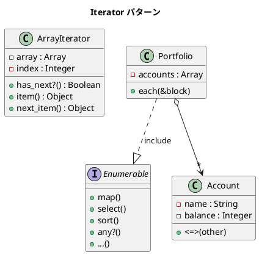

# 第 8 章: Iterator

## はじめに

コレクション（配列、ハッシュ、ファイル）の要素を順番に処理したいとします。コレクションの内部構造（配列？連結リスト？ツリー？）を知らずに走査できる仕組みが **Iterator パターン**です。

Ruby はこのパターンを言語レベルで強力にサポートしています。`Enumerable` モジュールと `each` メソッドにより、外部イテレータを自前で実装する必要はほぼありません。

---

## パターンの構造



---

## TDD で作る

### 外部イテレータ

明示的にイテレーションを制御する古典的な方法です。

```ruby
class ArrayIterator
  def initialize(array)
    @array = array
    @index = 0
  end

  def has_next?
    @index < @array.length
  end

  def item
    @array[@index]
  end

  def next_item
    value = @array[@index]
    @index += 1
    value
  end
end
```

```ruby
def test_external_iterator
  iterator = ArrayIterator.new([1, 2, 3])
  results = []
  while iterator.has_next?
    results << iterator.next_item
  end
  assert_equal [1, 2, 3], results
end
```

### 内部イテレータ（Ruby の Enumerable）

Ruby の本領は内部イテレータです。`each` を定義して `Enumerable` を include するだけで、`map`、`select`、`sort`、`any?` など 50 以上のメソッドが使えます。

```ruby
class Portfolio
  include Enumerable

  def initialize
    @accounts = []
  end

  def add_account(account)
    @accounts << account
  end

  def each(&block)
    @accounts.each(&block)
  end
end
```

```ruby
def test_portfolio_sort
  portfolio = Portfolio.new
  portfolio.add_account(Account.new("定期預金", 500_000))
  portfolio.add_account(Account.new("普通預金", 100_000))

  sorted = portfolio.sort
  assert_equal "普通預金", sorted.first.name
end
```

---

## Ruby らしい実装

Ruby の Iterator は他の言語とは一線を画します。

1. **`each` + `Enumerable`**: `each` を 1 つ定義するだけで 50 以上のメソッドが手に入る
2. **`<=>` + `Comparable`**: ソートや比較を自然に実現
3. **ブロック**: `each { |item| ... }` で内部イテレータが最も自然な形

```ruby
# Ruby らしいイテレーション
portfolio.select { |a| a.balance >= 300_000 }
portfolio.map(&:name)
portfolio.any? { |a| a.balance >= 1_000_000 }
portfolio.sort.reverse
```

---

## まとめ

| 観点 | 内容 |
|------|------|
| **意図** | コレクションの内部構造を隠蔽し、要素への順次アクセスを提供する |
| **外部 vs 内部** | 外部イテレータは制御が柔軟。内部イテレータは Ruby で自然 |
| **Ruby の強み** | `Enumerable` + `each` で外部イテレータはほぼ不要 |
| **適用場面** | カスタムコレクションに Enumerable を組み込みたい場合 |
| **関連パターン** | Composite（ツリーの走査）、Visitor（要素ごとの処理） |
