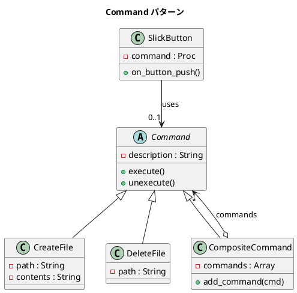

# 第 9 章: Command

## はじめに

GUI のボタンをクリックしたとき、何が起こるかはボタン自身が知るべきでしょうか。「保存」「コピー」「削除」といった操作をボタンに直接書き込むと、ボタンクラスが操作ごとに増えていきます。

**Command パターン**は、操作（リクエスト）をオブジェクトとしてカプセル化するパターンです。これにより、操作の記録、Undo/Redo、操作の合成が自然に実現できます。

---

## パターンの構造



---

## TDD で作る

### Red: テストを書く

まず、ファイル操作コマンドの振る舞いをテストで表現します。

```ruby
class CommandTest < Minitest::Test
  def test_create_and_delete_file
    path = "/tmp/command_test_#{Process.pid}.txt"
    cmd = CreateFile.new(path, "hello world\n")

    cmd.execute
    assert File.exist?(path)
    assert_equal "hello world\n", File.read(path)

    cmd.unexecute
    refute File.exist?(path)
  end

  def test_delete_file_undo
    path = "/tmp/command_undo_#{Process.pid}.txt"
    File.write(path, "original content")

    cmd = DeleteFile.new(path)
    cmd.execute
    refute File.exist?(path)

    cmd.unexecute
    assert File.exist?(path)
    assert_equal "original content", File.read(path)
  ensure
    File.delete(path) if File.exist?(path)
  end
end
```

ポイントは `unexecute` です。`DeleteFile` は削除前にファイル内容を保存しておき、Undo 時に復元します。

### Green: 実装する

**Command（基底クラス）**:

```ruby
class Command
  attr_reader :description

  def initialize(description)
    @description = description
  end

  def execute; end
  def unexecute; end
end
```

**CreateFile / DeleteFile（具象コマンド）**:

```ruby
class CreateFile < Command
  def initialize(path, contents)
    super("Create file: #{path}")
    @path = path
    @contents = contents
  end

  def execute
    File.write(@path, @contents)
  end

  def unexecute
    File.delete(@path) if File.exist?(@path)
  end
end

class DeleteFile < Command
  def initialize(path)
    super("Delete file: #{path}")
    @path = path
  end

  def execute
    @contents = File.read(@path) if File.exist?(@path)
    File.delete(@path) if File.exist?(@path)
  end

  def unexecute
    File.write(@path, @contents) if @contents
  end
end
```

### Refactor: CompositeCommand で操作を合成する

複数のコマンドをまとめて実行・取り消しできる複合コマンドを導入します。

```ruby
def test_composite_command_description
  cmds = CompositeCommand.new
  cmds.add_command(CreateFile.new("file1.txt", "hello\n"))
  cmds.add_command(DeleteFile.new("file1.txt"))

  expected = "Create file: file1.txt\nDelete file: file1.txt\n"
  assert_equal expected, cmds.description
end
```

```ruby
class CompositeCommand < Command
  def initialize
    @commands = []
  end

  def add_command(cmd)
    @commands << cmd
  end

  def execute
    @commands.each(&:execute)
  end

  def unexecute
    @commands.reverse_each(&:unexecute)
  end

  def description
    @commands.map(&:description).join("\n") + "\n"
  end
end
```

`unexecute` では `reverse_each` を使い、実行と逆順で取り消す点がポイントです。

---

## Ruby らしい実装

Ruby ではブロック（Proc）がファーストクラスオブジェクトなので、単純なコマンドはクラスを作らずにブロックで表現できます。

```ruby
class SlickButton
  attr_accessor :command

  def initialize(&block)
    @command = block
  end

  def on_button_push
    @command&.call
  end
end
```

```ruby
def test_slick_button_with_block
  output = nil
  button = SlickButton.new { output = "pushed" }
  button.on_button_push
  assert_equal "pushed", output
end
```

Undo/Redo や操作ログが不要な場面では、ブロックベースの Command が最もシンプルです。コマンドクラスを導入するかブロックで済ませるかは、「操作の記録や取り消しが必要か」で判断します。

---

## まとめ

| 観点 | 内容 |
|------|------|
| **意図** | 操作をオブジェクトとしてカプセル化し、実行・取り消し・記録を可能にする |
| **適用場面** | Undo/Redo、マクロ記録、トランザクション、GUI のボタンアクション |
| **Undo の実現** | `unexecute` で逆操作を定義。CompositeCommand は逆順で取り消す |
| **Ruby の強み** | ブロック（Proc）で軽量な Command を実現。クラス定義が不要 |
| **関連パターン** | Composite（コマンドの合成）、Strategy（アルゴリズムの差し替え） |
