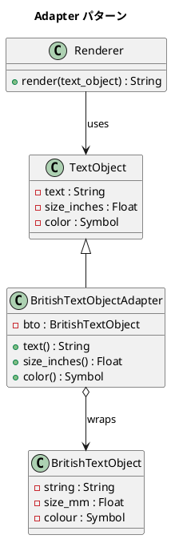

# 第 10 章: Adapter

## はじめに

アメリカで買った電化製品を日本で使うには変換プラグが必要です。プラグの形状が違うだけで、電気を流すという機能は同じです。

**Adapter パターン**は、既存のクラスのインターフェースを、クライアントが期待する別のインターフェースに変換するパターンです。互換性のないクラス同士を協調させる「変換プラグ」の役割を果たします。

---

## パターンの構造



---

## TDD で作る

### Red: テストを書く

`Renderer` は `TextObject` のインターフェース（`text`、`size_inches`、`color`）を期待しています。しかし `BritishTextObject` は `string`、`size_mm`、`colour` という異なるインターフェースを持っています。

```ruby
class AdapterTest < Minitest::Test
  def test_render_text_object
    renderer = Renderer.new
    text = TextObject.new("Hello", 1.0, :blue)
    result = renderer.render(text)
    assert_equal "text:Hello size:1.0 color:blue", result
  end

  def test_render_british_text_object_via_adapter
    renderer = Renderer.new
    bto = BritishTextObject.new("Hello", 25.4, :blue)
    adapted = BritishTextObjectAdapter.new(bto)
    result = renderer.render(adapted)
    assert_equal "text:Hello size:1.0 color:blue", result
  end
end
```

25.4mm = 1.0 inch の変換が正しく行われることを検証します。

### Green: 実装する

**TextObject（Target）と BritishTextObject（Adaptee）**:

```ruby
class TextObject
  attr_reader :text, :size_inches, :color

  def initialize(text, size_inches, color)
    @text = text
    @size_inches = size_inches
    @color = color
  end
end

class BritishTextObject
  attr_reader :string, :size_mm, :colour

  def initialize(string, size_mm, colour)
    @string = string
    @size_mm = size_mm
    @colour = colour
  end
end
```

**BritishTextObjectAdapter（Adapter）**:

```ruby
class BritishTextObjectAdapter < TextObject
  def initialize(bto)
    @bto = bto
  end

  def text
    @bto.string
  end

  def size_inches
    @bto.size_mm / 25.4
  end

  def color
    @bto.colour
  end
end
```

**Renderer（Client）**:

```ruby
class Renderer
  def render(text_object)
    "text:#{text_object.text} size:#{text_object.size_inches} color:#{text_object.color}"
  end
end
```

Adapter はメソッド名の変換（`string` -> `text`、`colour` -> `color`）と単位変換（mm -> inches）の両方を担います。

---

## Ruby らしい実装

Ruby ではクラスを作らずに、特異メソッド（singleton method）でオブジェクト単位のアダプタを実現できます。

```ruby
def test_singleton_method_adapter
  bto = BritishTextObject.new("Hello", 50.8, :red)

  def bto.text = string
  def bto.size_inches = size_mm / 25.4
  def bto.color = colour

  renderer = Renderer.new
  result = renderer.render(bto)
  assert_equal "text:Hello size:2.0 color:red", result
end
```

特異メソッドを使えば、**そのインスタンスだけ**にアダプタを適用できます。他の `BritishTextObject` インスタンスには影響しません。

この手法は Ruby のオープンクラスとダックタイピングを活かしたもので、1 回限りの適応に向いています。繰り返し使う場合はクラスベースの Adapter が適切です。

---

## まとめ

| 観点 | 内容 |
|------|------|
| **意図** | 互換性のないインターフェースを変換し、既存クラスを再利用可能にする |
| **適用場面** | 外部ライブラリの統合、レガシーコードとの接続、API の差異の吸収 |
| **クラス Adapter** | 継承で Target を満たし、Adaptee に委譲する |
| **Ruby の強み** | 特異メソッドでインスタンス単位のアダプタを動的に適用できる |
| **関連パターン** | Decorator（機能の追加）、Proxy（アクセスの制御） |
