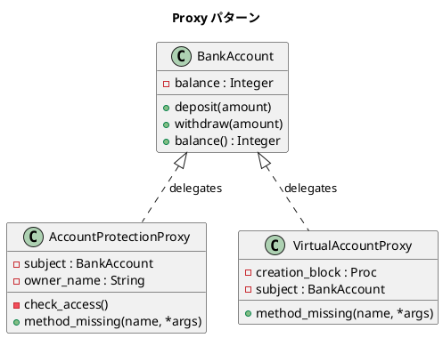

# 第 11 章: Proxy

## はじめに

銀行口座へのアクセスを考えましょう。誰でも自由に入出金できては困ります。本人確認が必要です。また、口座情報の読み込みにコストがかかる場合、実際に使われるまで遅延させたいこともあるでしょう。

**Proxy パターン**は、あるオブジェクトへのアクセスを制御する代理オブジェクトを提供するパターンです。保護（Protection Proxy）や遅延初期化（Virtual Proxy）など、さまざまな目的に応用できます。

---

## パターンの構造



---

## TDD で作る

### Red: テストを書く

まず、Real Subject である `BankAccount` の基本動作を確認し、続いて 2 種類の Proxy の振る舞いを定義します。

```ruby
class ProxyTest < Minitest::Test
  def test_bank_account_operations
    account = BankAccount.new(100)
    account.deposit(50)
    account.withdraw(10)
    assert_equal 140, account.balance
  end

  def test_protection_proxy_blocks_unauthorized
    account = BankAccount.new(100)
    proxy = AccountProtectionProxy.new(account, "unauthorized_user")
    assert_raises(RuntimeError) { proxy.deposit(50) }
  end

  def test_protection_proxy_allows_authorized
    account = BankAccount.new(100)
    proxy = AccountProtectionProxy.new(account, Etc.getlogin)
    proxy.deposit(50)
    assert_equal 150, proxy.balance
  end
end
```

### Green: 実装する

**BankAccount（Real Subject）**:

```ruby
class BankAccount
  attr_reader :balance

  def initialize(starting_balance = 0)
    @balance = starting_balance
  end

  def deposit(amount)
    @balance += amount
  end

  def withdraw(amount)
    @balance -= amount
  end
end
```

**AccountProtectionProxy（Protection Proxy）**:

```ruby
class AccountProtectionProxy
  def initialize(real_account, owner_name)
    @subject = real_account
    @owner_name = owner_name
  end

  def method_missing(name, *args)
    check_access
    @subject.send(name, *args)
  end

  def respond_to_missing?(name, include_private = false)
    @subject.respond_to?(name, include_private) || super
  end

  private

  def check_access
    if Etc.getlogin != @owner_name
      raise "Illegal access: #{Etc.getlogin} cannot access account."
    end
  end
end
```

`method_missing` を使うことで、`BankAccount` のすべてのメソッドを明示的に委譲せずに転送できます。

### Refactor: Virtual Proxy を追加する

遅延初期化の Proxy を追加します。オブジェクトの生成コストが高い場合に有効です。

```ruby
def test_virtual_proxy_lazy_initialization
  initialized = false
  proxy = VirtualAccountProxy.new do
    initialized = true
    BankAccount.new(100)
  end

  refute initialized
  proxy.deposit(50)
  assert initialized
  assert_equal 150, proxy.balance
end
```

```ruby
class VirtualAccountProxy
  def initialize(&creation_block)
    @creation_block = creation_block
  end

  def method_missing(name, *args)
    subject.send(name, *args)
  end

  def respond_to_missing?(name, include_private = false)
    subject.respond_to?(name, include_private) || super
  end

  private

  def subject
    @subject ||= @creation_block.call
  end
end
```

`@subject ||=` により、最初のメソッド呼び出し時にだけ実体が生成されます。

---

## Ruby らしい実装

Ruby の `method_missing` は Proxy パターンと非常に相性が良く、委譲先のメソッドを逐一定義する必要がありません。ポイントは以下の 2 つです。

1. **`method_missing`**: 未定義メソッドの呼び出しをキャッチし、実体に転送する
2. **`respond_to_missing?`**: `respond_to?` が正しく動作するよう、必ずペアで定義する

```ruby
# この 2 つは常にセットで定義する
def method_missing(name, *args)
  @subject.send(name, *args)
end

def respond_to_missing?(name, include_private = false)
  @subject.respond_to?(name, include_private) || super
end
```

`respond_to_missing?` を忘れると、`proxy.respond_to?(:deposit)` が `false` を返す罠にはまります。

---

## まとめ

| 観点 | 内容 |
|------|------|
| **意図** | オブジェクトへのアクセスを制御する代理を提供する |
| **Protection Proxy** | アクセス権を検証し、不正アクセスを遮断する |
| **Virtual Proxy** | 実体の生成を最初のアクセスまで遅延させる |
| **Ruby の強み** | `method_missing` + `respond_to_missing?` で汎用的な委譲を実現 |
| **関連パターン** | Adapter（インターフェース変換）、Decorator（機能追加） |
